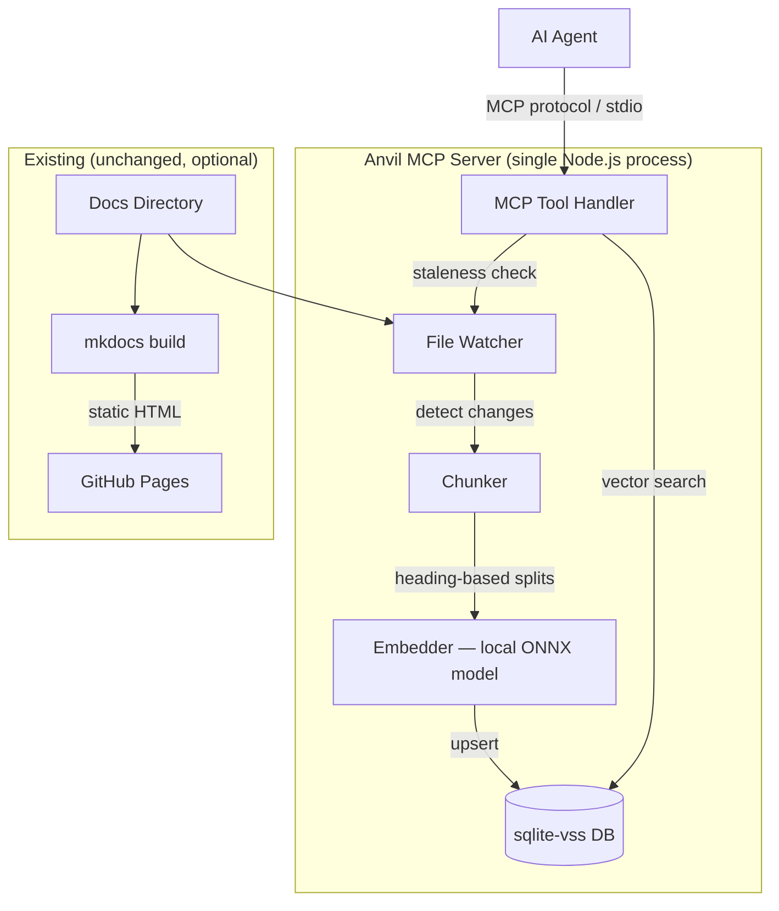
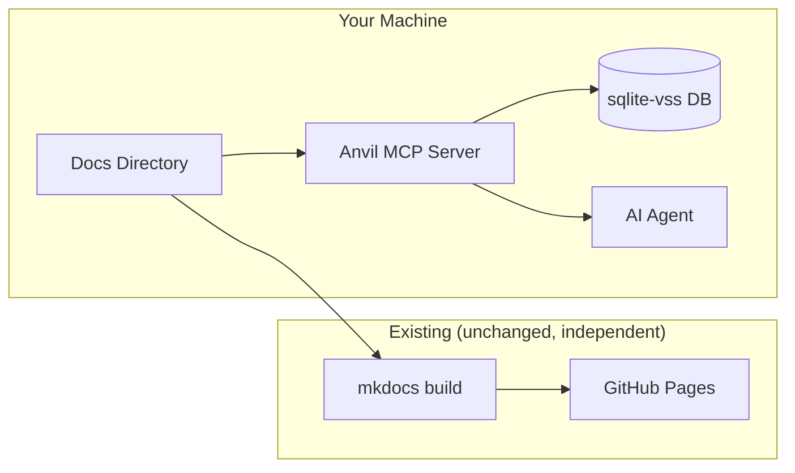

# Anvil — Project Design Doc

*Status: Draft — Step 0 Refinement*
*Created: March 28, 2026*
*Authors: Dan Hannah & Clay*

---

## Overview

### What Is This?

Anvil is an open-source MCP server that makes any document collection queryable by AI agents. Point it at a directory of markdown files (or any supported format), and it automatically chunks your content by structure, generates embeddings using a local model, and stores them in a local vector database. Agents connect via MCP and semantically search your docs on demand — no copy-pasting context, no manual curation, no external services required.

Point it at your docs → agents can query them. That's the entire promise.

While the name evokes mkdocs (and it works beautifully alongside mkdocs projects), **Anvil is not coupled to mkdocs.** It's a standalone tool that works with any directory of documents. Technical docs, manuscripts, knowledge bases, legal libraries — if it's text in files, Anvil can index it.

### Why This Exists — The Dual-Audience Problem

Written content has always served one audience: humans. Documentation sites, manuscripts, knowledge bases — they're all optimized for human consumption. Beautiful formatting, searchable web pages, nice navigation. And they're great at it.

But now there's a second audience: **AI agents.** And their needs are fundamentally different from humans.

| Need | Human | AI Agent |
|------|-------|----------|
| **Format** | Beautiful HTML, nice typography, nav sidebar | Raw text with metadata — headings, paths, structure |
| **Access pattern** | Browse, scan, read linearly | Query semantically — "find me the section about X" |
| **Volume** | Read one page at a time, skim the rest | Needs targeted chunks — 500 tokens, not 50,000 |
| **Freshness** | Checks docs when they remember to | Needs docs current as of the last build, every session |
| **Context** | Carries knowledge between reading sessions | **Starts from zero every session** — the cold start problem |

Anvil bridges this gap. **The human gets mkdocs** — the same beautiful, browsable site they've always had. **The agent gets an MCP server** — semantic search over the same content, returning exactly the chunks it needs. Both audiences consume the same source of truth, in their optimal format.

### The Collaboration Unlock

This isn't just about agents reading docs. It's about **human-AI collaboration at the documentation layer.**

When a human writes or updates documentation, the agent's knowledge updates automatically on the next build. When an agent needs context for a task, it queries the docs instead of the human copy-pasting 15,000 tokens into a prompt. The documentation becomes the **shared memory** between human and AI — bridging the gap between sessions and solving the cold start problem that plagues every AI workflow.

In the context of [CSDLC](../../methodology/process.md), this transforms **Step 2 (Agent Prompt Crafting)** from manual context curation to agent self-service. Instead of the AI Lead extracting and pasting relevant doc sections into each sub-agent's prompt, sub-agents query the docs themselves and pull exactly what they need. Estimated reduction: 15-20k tokens of pasted context → 500-1,000 tokens of targeted retrieval per query.

### Who Is It For?

**v1 — Developers & technical teams:** Teams working with AI agents who need their documentation queryable. Pain point: agents need documentation context but current options are either "paste the whole doc" (token-expensive, noisy) or "hope the agent figures it out" (unreliable). These users are comfortable with CLI tools, understand MCP, and have markdown docs.

**v2+ — Anyone with a document corpus and an AI workflow:**

| Audience | Use Case | Example |
|----------|----------|---------|
| **Authors & writers** | AI assistant that knows your entire body of work — characters, plot threads, continuity, world-building | A mystery author with 10+ books needs an AI that can answer "what color eyes did I give this character in book 3?" |
| **Legal teams** | Semantic search across contract libraries, case law, policy documents | "Find all precedents related to force majeure clauses" |
| **Enterprise** | Internal knowledge bases, SOPs, runbooks queryable by AI assistants | New hire's AI assistant can query the entire company knowledge base |
| **Research** | Paper libraries, lab notebooks, literature reviews | "What methods have been used for X in the last 5 papers?" |
| **Education** | Course materials and textbooks as AI-queryable resources | Students' AI tutors can pull relevant course content on demand |

The broader vision informs architecture decisions (format-agnostic, not hardcoded to markdown) but **v1 scope is developers with markdown docs.**

### Bootstrapping with Existing Projects

Anvil is designed to drop into any existing project with zero migration:

1. `npm install -g anvil` (or `npx anvil`)
2. `anvil --docs ./docs/`
3. MCP server starts, indexes your docs on first run, and is ready for agent queries.

No restructuring, no special frontmatter, no format changes. If it's a directory of text files, Anvil can index it. This applies to existing projects like our Routr CSDLC docs, internal documentation at work, or any markdown-based project.

**First-run experience:** The initial indexing (30-60 seconds for a large corpus) happens once on first startup. The MCP server shows progress and becomes available for queries as soon as indexing completes. Every subsequent startup is near-instant (loads existing DB, checks for changes).

### Business Model

**Open-source core (BSD or MIT license).** The CLI, local embeddings, local vector DB, and MCP server are free forever. This is the developer wedge — how people discover Anvil and prove it works.

**Monetization tiers (not v1 — informs architecture, not scope):**

| Tier | What | Who Pays | Why They Pay |
|------|------|----------|-------------|
| **Open-source CLI** | `npx anvil --docs ./path` — local everything, stdio MCP | Free forever | Adoption, community, developer trust |
| **Cloud sync** | DB auto-syncs to cloud. MCP accessible from anywhere. Team sharing. | Teams, small companies | Collaboration — multiple people/agents query the same docs |
| **Managed service** | Upload docs via web UI, get an MCP endpoint. No CLI needed. | Non-technical users (authors, legal, enterprise) | They want the value without the terminal |
| **Analytics** | "Which docs do agents query most?" "Which sections have low retrieval quality?" | Anyone optimizing docs for AI | Data-driven doc improvement |
| **Custom embeddings** | Fine-tuned models for specific domains (legal, medical, etc.) | Enterprise, specialized verticals | Domain-specific accuracy |

**v1 is free, open-source, local-only.** The goal is adoption and validation. Revenue comes after product-market fit.

---

## Competitive Landscape

The core idea of "MCP server that indexes markdown for AI agents" is **validated, not novel.** Multiple tools exist in this space. We're building Anvil anyway — here's what exists and why our approach is different.

### Existing Tools

| Tool | What It Does | Language | Key Strengths | Key Weaknesses |
|------|-------------|----------|--------------|----------------|
| **markdown-vault-mcp** | Generic markdown MCP server, FTS5 + semantic + hybrid search, read/write | Python | Most mature. Write tools, Docker, systemd, frontmatter-aware. 13 MCP tools. | Python-only. Generic "search your files" — no awareness of doc structure or project relationships. |
| **mkdocs-mcp-plugin** | mkdocs-specific MCP with keyword + vector + hybrid search | Python | Tight mkdocs integration, auto-detects mkdocs.yml | Coupled to mkdocs — requires dev server running. Not standalone. |
| **MCP-Markdown-RAG** | Markdown RAG via Milvus vector DB | Python | Solid incremental indexing | Requires Milvus (heavy infrastructure). Not zero-config. |
| **document-mcp** | Multi-format local doc indexer with LanceDB + Ollama | Python | Supports PDF, Word, RTF, not just markdown | Requires Ollama running. Heavy dependencies. Personal tool, not team-ready. |

### Why We're Still Building This

**1. Supply chain ownership.** Anvil is foundational to CSDLC — our entire sub-agent workflow depends on agents querying docs. We can't have that dependency on an external PyPI package with uncertain maintenance. Owning the tool means we control our own process.

**2. TypeScript / zero-config.** Every existing tool is Python. The MCP ecosystem is TypeScript-first. `npx anvil --docs ./path` with zero Python dependency is a meaningful DX gap.

**3. CSDLC-native intelligence (v2+).** Existing tools are generic document search — "find stuff in my files." We're building toward project-aware context retrieval:
- Understanding design doc → epic → story hierarchy
- Serving different context depth for different agent roles (architecture overview vs. implementation detail)
- Knowing that a sub-agent on E2 needs E1 context but not E3
- Integration with standup rituals, cross-cutting concerns, session bootstrapping

These features are only possible because we own the tool and built it for our workflow.

**4. Heading-based chunking.** Most tools use fixed token windows or paragraph splitting. Our heading-hierarchy chunking with breadcrumb metadata is a genuine quality differentiator for structured documentation.

**5. Self-managing server.** File watching + staleness checks + auto-reindexing. Most tools require manual index triggers or separate rebuild steps.

### Our Position

We're not inventing the mousetrap — we're building a better one, purpose-built for our workflow. The existing tools prove market demand. Our differentiation is DX (TypeScript, zero-config, `npx`), quality (heading-based chunking), and vision (CSDLC-aware documentation intelligence layer, not generic file search).

If the open-source community gets value from it, that's a bonus. But **the primary consumer is us.**

---

## Tech Stack

| Layer | Technology | Rationale |
|-------|-----------|-----------|
| Runtime | Node.js (TypeScript) | Single language for the entire product. MCP ecosystem is TS-first. |
| Markdown Parsing | `unified` / `remark` | Mature markdown AST parser — heading extraction, structure awareness |
| Chunking | Custom (TypeScript) | Heading-hierarchy-aware splitting — no off-the-shelf chunker does this well |
| Embeddings (default) | `all-MiniLM-L6-v2` via `@huggingface/transformers` (ONNX) | **Zero API keys required.** Local ONNX model, ~80MB, runs anywhere Node.js runs. |
| Embeddings (optional) | OpenAI `text-embedding-3-small` | Higher quality, requires API key. Configurable upgrade path. |
| Vector DB | sqlite-vss via `better-sqlite3` | Zero infrastructure — SQLite extension. DB is a single file. |
| MCP Protocol | `@modelcontextprotocol/sdk` | Standard MCP, stdio transport for v1. |
| File Watching | `chokidar` (or Node.js `fs.watch`) | Detects doc changes for auto-re-indexing |

### Key Libraries & Dependencies

| Library | Purpose | Notes |
|---------|---------|-------|
| `@modelcontextprotocol/sdk` | MCP server implementation | stdio transport, tool registration |
| `@huggingface/transformers` | Local ONNX embedding inference | Runs `all-MiniLM-L6-v2` without Python |
| `better-sqlite3` | SQLite driver with extension loading | Reads/writes sqlite-vss DB |
| `sqlite-vss` | Vector similarity search | Native SQLite extension |
| `unified` / `remark` | Markdown parsing | AST-level heading extraction and content splitting |
| `chokidar` | File system watching | Triggers re-indexing on doc changes |

### Architecture Decision: All TypeScript, Single Process

The entire product — file watching, chunking, embedding, vector storage, and MCP serving — runs in a single Node.js process. No Python dependency, no multi-process coordination, no shared file contracts.

**Why this works now:** `@huggingface/transformers` runs ONNX-optimized models directly in Node.js. The same `all-MiniLM-L6-v2` model that previously required Python + PyTorch now runs natively in JavaScript with comparable performance. This eliminates the two-language split entirely.

**Previous approach (rejected):** Python mkdocs plugin for chunking/embedding + TypeScript MCP server. Rejected because: two languages, two install steps, shared state via DB file was fragile, and decoupling from mkdocs made the plugin unnecessary.

### Architecture Decision: Local-First Embeddings

The default embedding model runs locally — no API key, no network calls, no cost per query. This is a deliberate choice:

- **Zero friction adoption:** `npx anvil --docs ./path` and you're done. No OpenAI account, no API key management, no billing surprises.
- **Good enough for docs:** You're searching within a bounded corpus (your own docs), not the entire internet. The quality difference between MiniLM and OpenAI embeddings matters less when the search space is small and well-structured.
- **Upgrade path exists:** Users who want higher quality can switch to OpenAI (or Bedrock, or any provider) with one config line.

### Architecture Decision: Self-Managing MCP Server

The MCP server is not a passive query layer — it **owns the entire indexing pipeline.** On startup, it indexes the docs directory. While running, it watches for file changes and re-indexes automatically. Agents always get fresh results without manual rebuilds or external tooling.

This means:
- No separate build step (no `mkdocs build` dependency for the DB)
- No CI pipeline needed for the vector DB
- No git hooks or manual rebuild rituals
- The MCP server IS the product — one process does everything

---

## System Architecture

### Architecture Diagram



### Layer Descriptions

**File Watcher**
Monitors the docs directory for changes (new files, edits, deletions). On startup, performs a full scan to detect any changes since the last index. While running, uses filesystem events for near-instant change detection.

**Chunker**
Parses markdown into semantically meaningful chunks based on heading hierarchy using `remark` (markdown AST parser). Each chunk carries metadata: source file path, heading breadcrumb (e.g., `Architecture > Data Flow > Event System`), heading level, position in document, and last-modified timestamp. Chunks are the atomic unit — one chunk = one retrievable piece of context.

**Embedder**
Takes chunks and generates vector embeddings. Default: `all-MiniLM-L6-v2` via ONNX runtime (local, no API key, ~80MB model). Abstracted behind an interface — OpenAI, Bedrock, or any provider can be swapped in via config.

**Vector DB**
sqlite-vss database file. Contains the chunks table (text, metadata, embedding vector) and the VSS index. Fully managed by the MCP server — no external process reads or writes it.

**MCP Tool Handler**
Receives agent queries via MCP protocol (stdio transport). Before each query, checks if the docs source has changed. If stale, triggers a targeted re-index (only changed files) before returning results. Agents always get fresh data without knowing or caring about the indexing layer.

### Data Flow

#### Startup: First-Run Indexing

```
User runs: npx anvil --docs ./docs/
    → MCP server starts
    → Scans docs directory — no existing DB or DB is empty
    → Chunks ALL files by heading hierarchy
    → Generates embeddings for all chunks (local ONNX model)
    → Writes sqlite-vss DB
    → MCP server is ready for queries
    → ~30-60 seconds for a large corpus (1,000 chunks), near-instant for small projects
```

#### Steady State: Incremental Re-Indexing

```
Author edits docs/architecture.md
    → File watcher detects the change (or staleness check on next query)
    → Re-chunks only the changed file
    → Compares chunk content_hash against existing DB entries
    → Only re-embeds chunks whose content actually changed
    → sqlite-vss DB updated via upsert (changed chunks updated, deleted chunks pruned)
    → Next agent query gets fresh results
    → ~200-400ms for a typical single-page edit
```

#### Agent Query

```
Agent needs context about "data flow"
    → Agent calls MCP tool: search_docs("data flow architecture")
    → MCP server checks for doc changes (fast hash/mtime check, ~5ms)
    → If stale: triggers incremental re-index first (~200-400ms one time)
    → Runs vector similarity search against sqlite-vss
    → Returns top-k chunks with metadata and relevance scores
    → Agent gets exactly the context it needs (~500-1000 tokens)
    → vs. old way: human pastes entire doc (~15,000-20,000 tokens)
```

#### Latency Profile

| Scenario | Added Latency | Frequency |
|----------|--------------|-----------|
| Normal query (DB is fresh) | ~5ms (staleness check only) | 95%+ of queries |
| Small edit (1 page, ~5 chunks) | ~200-400ms (re-index + query) | Occasional, once per edit |
| New doc added (~10 chunks) | ~400-800ms | Rare |
| Major restructure (50+ chunks) | ~2-4 seconds | Very rare |
| First-ever full index (1,000 chunks) | ~30-60 seconds | Once, on first startup |

---

## Data Model

### Core Entities

```python
@dataclass
class Chunk:
    """The atomic unit of retrievable documentation."""
    chunk_id: str          # Deterministic hash of file_path + heading_path
    file_path: str         # Relative path within docs/ (e.g., "architecture/data-flow.md")
    heading_path: str      # Breadcrumb (e.g., "Architecture > Data Flow > Event System")
    heading_level: int     # 1-6 (h1-h6)
    content: str           # Raw markdown text of this section
    content_hash: str      # Hash of content — used for diff-based re-embedding
    embedding: list[float] # Vector embedding (384 dims for MiniLM, 1536 for OpenAI)
    nav_path: str          # mkdocs nav position (e.g., "Getting Started > Installation")
    last_modified: str     # ISO timestamp of source file last modification
    char_count: int        # Length of content — useful for token estimation
    
@dataclass
class ChunkMetadata:
    """Returned to agents alongside search results."""
    file_path: str
    heading_path: str
    nav_path: str
    last_modified: str
    relevance_score: float  # Cosine similarity from vector search
```

### SQLite Schema

```sql
CREATE TABLE chunks (
    chunk_id TEXT PRIMARY KEY,
    file_path TEXT NOT NULL,
    heading_path TEXT NOT NULL,
    heading_level INTEGER NOT NULL,
    content TEXT NOT NULL,
    content_hash TEXT NOT NULL,
    nav_path TEXT,
    last_modified TEXT,
    char_count INTEGER
);

-- Metadata table for DB self-description
CREATE TABLE anvil_meta (
    key TEXT PRIMARY KEY,
    value TEXT
);
-- Stores: embedding_model, embedding_dimensions, last_index_timestamp, anvil_version, docs_root_path

-- sqlite-vss virtual table for vector search
CREATE VIRTUAL TABLE chunks_vss USING vss0(
    embedding(384)  -- dimension matches embedding model (384 for MiniLM, 1536 for OpenAI)
);
```

### Chunking Strategy

**Split on headings, not token count.** Most RAG systems chunk by fixed token windows (500 tokens, 1000 tokens). This is wrong for documentation because it splits mid-section, losing semantic coherence. Anvil chunks at heading boundaries — each section under a heading becomes one chunk.

**Problem:** Some sections are very long (2000+ tokens). **Solution:** If a chunk exceeds a configurable max (default: 1500 tokens), split at paragraph boundaries within that section. The heading breadcrumb is preserved on all sub-chunks, with a part indicator (e.g., `Architecture > Data Flow [part 2/3]`).

**Problem:** Some sections are very short (a single sentence under an h4). **Solution:** Optionally merge short chunks upward into their parent heading's chunk. Configurable — some users want granular, some want consolidated.

---

## MCP Tool Surface

### v1 Tools (MVP)

| Tool | Description | Parameters | Returns |
|------|-------------|-----------|---------|
| `search_docs` | Semantic search across all documentation | `query: string`, `top_k?: number` (default 5), `file_filter?: string` (glob pattern) | Array of `{ content, metadata, score }` |
| `get_page` | Retrieve full page content by file path | `file_path: string` | `{ content, metadata, chunks[] }` |
| `get_section` | Retrieve a specific section by heading path | `file_path: string`, `heading_path: string` | `{ content, metadata }` |
| `list_pages` | List all pages with nav structure | `prefix?: string` (filter by path prefix) | Array of `{ file_path, nav_path, title, chunk_count }` |
| `get_status` | Server health, index state, and version info | *(none)* | `{ docs_root, total_pages, total_chunks, embedding_model, last_indexed, db_size_bytes, git_info }` |

### Explicitly Out of Scope: Write Tools

v1 is **read-only**. There is no `create_page` or `update_section` MCP tool. Rationale:

- Write tools would require the MCP server to have filesystem access to the markdown source — breaking the clean read-only security model
- Agents can already write markdown files through their normal filesystem access (they don't need MCP for that)
- The MCP server's job is **retrieval**, not authoring
- A write layer would effectively be a docs CMS — a much larger product scope

If write tools are added in the future, they would write to markdown source and trigger a rebuild, not directly modify the vector DB.

### v2 Tools (Future)

| Tool | Description | Notes |
|------|-------------|-------|
| `get_related` | Find pages related to a given page | Based on embedding similarity between page-level vectors |
| `get_changelog` | What changed since a given date | Git-backed, shows which sections were modified |
| `search_by_tag` | Filter by frontmatter tags/categories | Requires metadata extraction from frontmatter |
| `query_metadata` | Search/filter by structured frontmatter fields | Enables QuoteAI-style use cases: "quotes over $3000 from 2024". Moves Anvil toward structured document query engine. |

### Tool Design Principles

- **`search_docs` is the workhorse.** 80% of agent queries will use this. It must be fast and relevant.
- **`get_page` is the fallback.** When an agent knows exactly what file it needs, don't make it search.
- **`get_section` is surgical precision.** When an agent knows exactly what heading it wants.
- **`list_pages` is discovery.** An agent can browse the doc structure before querying.

---

## llms.txt & llms-full.txt

### What Are These?

`llms.txt` is an [emerging convention](https://llmstxt.org/) for making website content accessible to LLMs. Anvil generates two files:

- **`llms.txt`** — A structured site map listing every page with its title, path, and a one-line description. Think `robots.txt` but for LLMs. An agent reads this to understand what documentation exists and where it lives.
- **`llms-full.txt`** — The full content of every page concatenated into one text file, with page boundaries marked by headers.

### Why Include This?

Not all LLM clients support MCP. Some can only read files or URLs. `llms.txt` gives them *something* — basic access to your docs without semantic search.

### The Limitation (Why MCP Is Better)

`llms-full.txt` for a medium docs site might be 50,000+ tokens. An agent consuming it gets everything whether it needs it or not. That's expensive, noisy, and often exceeds context windows.

MCP search returns 500-1,000 targeted tokens per query. That's the difference — and why MCP is the primary interface, with llms.txt as the fallback.

### MVP Scope Decision

**Deferred to v2.** llms.txt generation is not included in the v1 MVP. The core value prop is MCP semantic search — llms.txt serves a different audience (non-MCP clients) that we're not targeting yet. When we're ready to share Anvil with the broader community, llms.txt becomes a valuable adoption tool. For now, it's overhead.

---

## Configuration

### CLI Usage

```bash
# Zero-config start — all defaults, just point at your docs
npx anvil --docs ./docs/

# With options
npx anvil \
  --docs ./docs/ \
  --db ./anvil.db \
  --embedding-provider openai \
  --max-chunk-tokens 1500
```

### Config File (optional)

For projects that want persistent config, create `anvil.config.json` in the docs root:

```json
{
  "docs": "./docs",
  "db": "./anvil.db",
  "embedding": {
    "provider": "local",
    "model": "all-MiniLM-L6-v2"
  },
  "chunking": {
    "maxTokens": 1500,
    "mergeShort": true,
    "minTokens": 50
  },
  "mcp": {
    "transport": "stdio",
    "defaultTopK": 5
  }
}
```

### Minimal Start (Zero Config)

```bash
npx anvil --docs ./docs/
```

That's it. All defaults apply: local ONNX embeddings, 1500 max tokens, DB written alongside the docs directory. **No API key, no config file, no Python required.**

### MCP Client Config (for Cursor, Claude Desktop, OpenClaw, etc.)

```json
{
  "mcpServers": {
    "anvil": {
      "command": "npx",
      "args": ["anvil", "--docs", "./path/to/docs"],
      "transport": "stdio"
    }
  }
}
```

---

## Deployment & Access Model

### How It Works: Self-Managing MCP Server (v1)

The v1 deployment model is **local, self-managing, zero-config.** The MCP server runs on the same machine as your agents, watches your docs directory, and handles all indexing automatically. There is no separate build step, no CI pipeline for the DB, and no manual sync.



**The MCP server and mkdocs are completely independent.** mkdocs builds the human-facing site. Anvil indexes the same source files for agents. Neither depends on the other. You can use Anvil without mkdocs, or mkdocs without Anvil.

### Keeping the DB Fresh — It's Automatic

The MCP server owns the entire indexing pipeline. Freshness is built in, not bolted on:

1. **File watcher** detects changes to the docs directory in real-time
2. **Staleness check on every query** — even if the watcher misses something, the server verifies freshness before returning results
3. **Incremental re-indexing** — only changed files are re-chunked and re-embedded. Typical latency: 200-400ms, transparent to the agent.

**You never manually rebuild.** Edit a doc, save it, the next agent query gets fresh results. The MCP server handles everything.

### Team Workflows

| Scenario | How It Works |
|----------|-------------|
| **Solo dev** | MCP server watches your local docs directory. Edit and save — done. |
| **Team, shared repo** | Each team member runs their own MCP server pointed at their local clone. `git pull` updates the source files; MCP server detects changes and re-indexes automatically. |
| **Hosted (v2)** | Cloud-hosted MCP server with SSE transport. DB syncs on push. No local setup needed. |

**"Do I need to pull main when docs change?"** Yes — the MCP server watches local files, so you need `git pull` to get remote changes onto your machine. But you do NOT need to rebuild anything after pulling. The MCP server detects the file changes and re-indexes automatically.

### Branch Handling

**v1: The MCP server indexes whatever files are on disk.** If you're on `main`, it indexes main's docs. If you switch to a feature branch, it detects the file changes and re-indexes. No manual intervention.

**v2 (future):** Versioned DBs — maintain separate vector stores per branch/tag. MCP server accepts a `version` parameter. Enables agents to query docs from a specific release or compare branches.

### Infrastructure Dependencies

| Dependency | Required? | What Breaks Without It |
|-----------|-----------|----------------------|
| Node.js (v18+) | Yes | Runtime for the MCP server |
| `sqlite-vss` native extension | Yes | Vector similarity search. Ships as a pre-built binary via npm for most platforms. |
| `@huggingface/transformers` | Yes (default embeddings) | Local ONNX model inference. ~80MB model download on first run, cached after. |
| OpenAI API key | Only if `embedding_provider: openai` | Optional upgrade for higher-quality embeddings. |
| Python / mkdocs | **No** | Anvil is fully independent. mkdocs is only needed if you want the human-facing site. |

---

## Security Model

### API Key Management

- **Default config requires zero API keys.** Local ONNX embeddings model runs entirely offline.
- If a cloud provider is configured (OpenAI, Bedrock), API keys are referenced by environment variable name — **never** stored in config files.

### Data Sensitivity

- The vector DB contains your documentation content in plain text (it has to — that's what gets returned to agents).
- If your docs are private/internal, the DB file should be treated with the same access controls as the docs themselves.
- **Don't commit the DB to a public repo if your docs are private.**

### Public vs. Private Documentation

Anvil doesn't manage access control — it inherits whatever access model your docs repo uses. Some considerations:

- **Public repo, public docs:** No concerns. The DB contains the same content that's already public.
- **Private repo, private docs:** DB should also be private. Don't publish it as a public artifact.
- **Mixed (some public, some private):** Not supported in v1. Either all docs are indexed or none. v2 could support per-page or per-directory inclusion/exclusion via config.

!!! note "Splitting Public and Private"
    If you want some docs public (e.g., methodology, process) and others private (e.g., project implementations), the recommended approach is **separate repos** — a public repo for shareable content and a private repo for project-specific docs. Each gets its own Anvil instance and vector DB.

### Trust Boundaries

- The MCP server is **read-only**. It cannot modify the DB, the docs, or anything else.
- stdio transport means the MCP server only communicates with its parent process (the agent/client). No network exposure.
- Future SSE transport would require authentication — deferred to v2.

---

## Cross-Cutting Concerns

| Concern | Summary | Affected Areas |
|---------|---------|---------------|
| **Embedding model portability** | DB stores model name + dimensions in metadata. Switching models requires full re-embed (detected automatically). | Embedder, DB schema |
| **Chunk quality** | Bad chunks = bad retrieval. This is the single biggest quality lever. | Chunker, all MCP tools |
| **sqlite-vss portability** | C extension — needs pre-built binaries for target platform. May be friction on exotic systems. | Installation, npm packaging |
| **First-run model download** | Default local model is ~80MB. First startup takes longer (download + cache + full index). Subsequent startups are near-instant. | DX, offline scenarios |
| **DB freshness** | Handled automatically by file watcher + staleness checks. No manual intervention needed. | MCP server core loop |

---

## Risks & Constraints

### Technical Risks

| Risk | Likelihood | Impact | Mitigation |
|------|-----------|--------|------------|
| sqlite-vss installation friction (native extension) | Medium | High (blocks adoption) | Ship pre-built binaries via npm for major platforms (macOS, Linux, Windows). Document manual build fallback. |
| ONNX model inference performance on low-end hardware | Low | Medium | MiniLM is lightweight (~80MB). If too slow, offer OpenAI fallback. Benchmark on CI runners. |
| Embedding model changes break existing DBs | Low | Medium | Store model name + dimensions in DB metadata. Detect mismatch and prompt full re-embed. |
| Chunk quality is poor for unusual doc structures | Medium | High (core value prop) | Extensive testing with real-world docs (our CSDLC docs, QuoteAI). Configurable chunking params. |
| File watcher misses changes (OS-level edge cases) | Low | Low | Staleness check on every query as backup. File watcher is optimization, not sole mechanism. |

### Known Limitations (v1)

- **Markdown only** — no Word docs, PDFs, or other formats (v2 could add format adapters)
- **Local MCP only** — stdio transport, no remote/hosted access
- **Read-only** — no write tools, agents can't create/update docs via MCP
- **No branch awareness** — DB reflects whatever files are on disk, no version switching
- **No per-file access control** — all files in the docs directory are indexed, or none
- **English-optimized** — embedding models work best with English. Multilingual is possible but untested.

### Tech Debt (Accepted for MVP)

- No caching layer for query results (fine for local, problem at scale)
- Only two embedding providers implemented (local ONNX + OpenAI). Interface exists for more.
- Markdown-only format support. Format adapter interface not yet abstracted.

---

## Pre-Build Checklist

| Task | Owner | Status | Notes |
|------|-------|--------|-------|
| Create `@claymore` npm org | Dan | Not started | Required before first publish. `npx @claymore/anvil` depends on this. |
| Create standalone public repo | Dan | Not started | GitHub repo for Anvil source code |

---

## Epic Index

| Epic | Doc | Status | Summary |
|------|-----|--------|---------|
| E1: Core Server, Chunker & Embedder | [link](epics/core-server.md) | Not started | MCP server skeleton, markdown chunker, ONNX embedder, sqlite-vss storage, file watcher, auto-reindexing |
| E2: MCP Tools & Query Layer | [link](epics/mcp-tools.md) | Not started | 4 MCP tools (`search_docs`, `get_page`, `get_section`, `list_pages`), relevance scoring, metadata enrichment |
| E3: Developer Experience | [link](epics/developer-experience.md) | Not started | CLI interface, config file support, status output, error messages, README, quickstart guide |

### Deferred to v2

| Epic | Summary |
|------|---------|
| E4: llms.txt Generation | Auto-generate llms.txt and llms-full.txt for non-MCP clients |
| E5: Format Adapters | Support for Word docs, PDFs, RST, and other non-markdown formats |
| E6: Cloud Sync & Hosted MCP | Remote DB hosting, SSE transport, team sharing |

### Dependency Graph


- **E1 → E2** is serial (need the indexing pipeline before you can query it)
- **E2 → E3** is serial (need working tools before you polish the DX)
- Clean serial pipeline — **3 epics for MVP**

**The simplification:** Since the MCP server now owns everything (no separate plugin, no separate build step), E1 and E2 from the old architecture merge conceptually. The chunker, embedder, and DB writer are all internal to the server. E2 is the query/tool layer on top.

---

## Decisions Log

| Date | Decision | Rationale | Alternatives Considered |
|------|----------|-----------|------------------------|
| 2026-03-28 | mkdocs plugin, not fork | Maintain less code, leverage existing ecosystem, easier adoption | Full fork (rejected: maintenance burden), standalone tool (rejected: misses mkdocs integration) |
| 2026-03-28 | sqlite-vss for vector DB | Zero infrastructure, file-based, portable | ChromaDB (heavier, requires server), Pinecone (cloud-only, paid), pgvector (requires Postgres) |
| 2026-03-28 | Two languages (Python + TypeScript) | Play to each ecosystem's strength | All-Python (immature MCP SDK), All-TypeScript (fighting mkdocs from outside) |
| 2026-03-28 | Open-source core, BSD license | Maximize adoption, monetize hosted/enterprise later | Closed source (rejected: dev tools need adoption), AGPL (rejected: scares enterprise) |
| 2026-03-28 | Heading-based chunking, not token-window | Preserves semantic coherence of doc sections | Fixed token windows (rejected: splits mid-section), page-level (rejected: too coarse) |
| 2026-03-28 | Diff-based re-embedding | Only re-embed changed content — saves cost and time | Full re-embed on every build (rejected: wasteful for large sites) |
| 2026-03-28 | Docs-first, code support deferred to v2 | Docs are structured for humans, easier to chunk well. Code needs AST-aware chunking — different problem. | Code + docs in v1 (rejected: scope creep, different chunking strategies) |
| 2026-03-28 | Develop alongside QuoteAI | Dogfooding from day one — QuoteAI docs are the first content, QuoteAI agents are the first consumers | Build in isolation (rejected: no feedback loop) |
| 2026-03-28 | Local embedding model as default | Zero API keys, zero cost, runs in CI, good enough for bounded-corpus retrieval | OpenAI as default (rejected: friction — requires account, API key, costs money) |
| 2026-03-28 | Read-only MCP server, no write tools | Clean security model, agents already have filesystem access for writing | Read-write MCP (rejected: scope creep, different product — a docs CMS) |
| 2026-03-28 | Local-first deployment for v1 | Simplest model — build locally, DB is a file, MCP server reads it | Cloud-hosted DB (rejected for v1: premature infrastructure) |
| 2026-03-28 | v1 has no branch awareness | DB reflects whatever branch is built. Versioned DBs deferred to v2. | Multi-branch support (rejected: complexity not justified for solo/small team use) |
| 2026-03-28 | Defer llms.txt to v2 | v1 targets MCP-capable clients (OpenClaw, Cursor, Claude Desktop). llms.txt serves non-MCP clients we're not targeting yet. | Include in v1 (rejected: extra code path, no immediate consumer) |
| 2026-03-28 | No MCP write tools | Agents already have filesystem access for writing docs. MCP write adds indirection without capability. Read-only is cleaner. | Read-write MCP (rejected: moot for local agents, scope creep toward docs CMS) |
| 2026-03-28 | Self-managing MCP server (auto-index, file watcher) | Eliminates manual rebuild step entirely. File watcher + staleness check on query = always-fresh DB. | Manual rebuild (rejected: humans forget), git hooks (rejected: unnecessary if server handles it), CI-built DB (rejected: adds sync complexity) |
| 2026-03-28 | Decouple from mkdocs entirely | MCP server reads markdown files directly — no mkdocs dependency. Works with any docs directory. Massively expands addressable market. | mkdocs plugin (rejected: couples to one ecosystem, limits to Python users, requires separate MCP server process) |
| 2026-03-28 | All-TypeScript, single process | ONNX runtime in Node.js eliminates Python dependency. One language, one install, one process. | Python + TypeScript split (rejected: two languages, two installs, shared state via file was fragile) |
| 2026-03-28 | Build despite existing tools | Supply chain ownership (CSDLC depends on this), TypeScript gap in market, CSDLC-native features planned for v2+, heading-based chunking differentiator | Use markdown-vault-mcp (rejected: Python, generic, no CSDLC awareness, supply chain risk), contribute upstream (rejected: different vision, different language) |

---

## Glossary

| Term | Definition |
|------|-----------|
| **Chunk** | A semantically meaningful section of documentation, typically defined by heading boundaries. The atomic unit of retrieval. |
| **Embedding** | A vector representation of text that captures semantic meaning. Enables similarity search — "find docs about X" without keyword matching. |
| **Vector DB** | A database optimized for storing and searching vector embeddings. sqlite-vss is the local/file-based option. |
| **MCP** | Model Context Protocol — a standard for LLM clients to connect to external tools and data sources. |
| **llms.txt** | An emerging convention for making website content LLM-accessible. A site map with descriptions (llms.txt) and full content dump (llms-full.txt). |
| **RAG** | Retrieval-Augmented Generation — the pattern of searching for relevant context before generating a response. Anvil enables RAG over documentation. |
| **Diff-based re-embedding** | Only regenerating embeddings for chunks whose content has changed since the last build. Saves API cost and build time. |
| **stdio transport** | MCP communication over standard input/output pipes. The simplest transport — agent spawns the MCP server as a child process. |
| **Cold start problem** | AI agents start every session with zero context. Without documentation access, they either get context copy-pasted (expensive) or guess (unreliable). |

---

*This design doc is the source of truth for Anvil project architecture. Epic-level details will live in `epics/`. Update this doc when architecture changes.*
