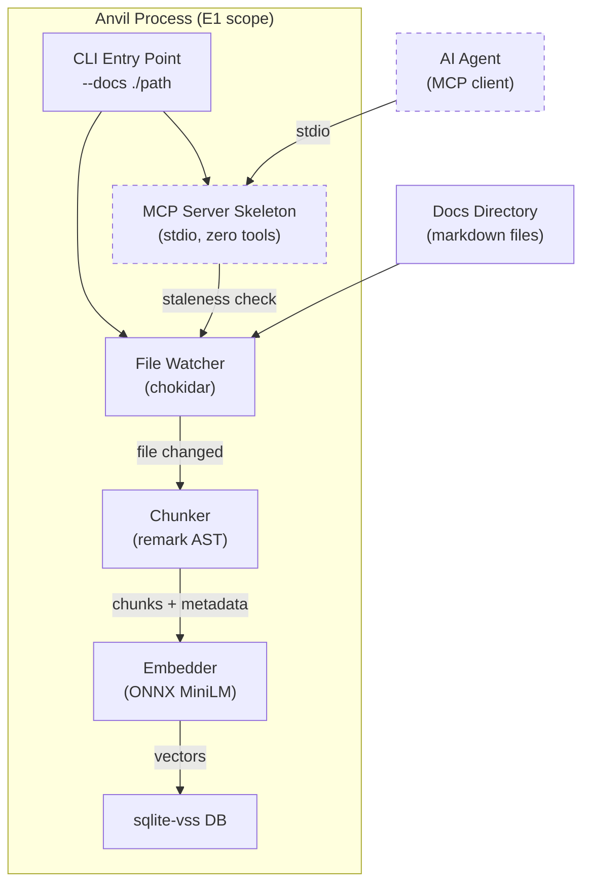
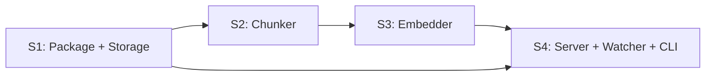

# E1: Core Server, Chunker & Embedder — Epic Design Doc

*Status: 🔄 In Refinement (Step 0)*
*Authors: Dan Hannah & Clay*
*Created: March 29, 2026*
*Parent: [Anvil Project Design Doc](../design.md)*

---

## Overview

### What Is This Epic?

E1 is the foundation of Anvil — the indexing pipeline that turns a directory of markdown files into a queryable vector database. It delivers a running MCP server process that watches a docs directory, chunks files by heading hierarchy, generates local embeddings via ONNX, stores them in sqlite-vss, and auto-reindexes on changes. By the end of E1, the server starts, indexes, and stays fresh — but has no query tools yet (that's E2).

This is the "engine without the steering wheel." E2 adds the MCP tools that let agents actually query. E1 proves the pipeline works end-to-end.

### Problem Statement

Today, AI agents get documentation context through manual copy-paste or by reading entire files. There's no automated way to chunk, embed, and serve documentation for semantic retrieval. Before agents can query docs (E2), the indexing infrastructure must exist — file watching, markdown parsing, heading-based chunking, embedding generation, and vector storage.

Without E1, there's nothing to query.

### Goals

- **Working MCP server process** that starts via `npx anvil --docs ./path` and stays running
- **Markdown chunker** that splits files by heading hierarchy with breadcrumb metadata
- **Local ONNX embedder** using all-MiniLM-L6-v2 (zero API keys)
- **sqlite-vss storage** with the full schema from the design doc
- **File watcher** that detects changes and triggers incremental re-indexing
- **Staleness check** on every inbound MCP request (belt-and-suspenders with file watcher)
- **First-run full index** with progress reporting
- **Incremental re-index** — only re-chunk and re-embed changed files
- **Content-hash diffing** — only re-embed chunks whose content actually changed within a changed file

### Non-Goals

- **No MCP tools** — E1 registers zero tools. The server starts and accepts connections but has no query surface. E2 adds `search_docs`, `get_page`, `get_section`, `list_pages`.
- **No CLI polish** — no config file support, no pretty status output, no `--help` with rich formatting. E3 handles DX.
- **No OpenAI embeddings** — local ONNX only for E1. The embedder interface should support swapping providers, but only local is implemented.
- **No non-markdown formats** — markdown only. Format adapters are v2.
- **No llms.txt generation** — deferred to v2 (E4).
- **No remote/SSE transport** — stdio only.

---

## Context

### Current State

Nothing exists yet. This is a greenfield TypeScript project. The project design doc is refined and locked. Directory structure (`csdlc-docs/docs/projects/anvil/`) is in place.

### Affected Systems

| System / Layer | How It's Affected |
|---------------|-------------------|
| New: `packages/anvil/` (or standalone repo) | The entire package is created by this epic |
| MCP protocol layer | Server skeleton registered with `@modelcontextprotocol/sdk`, stdio transport, zero tools |
| File system | Watches docs directory, reads markdown files, writes sqlite DB file |

### Dependencies

- **None** — E1 is the first epic. No prior Anvil code exists.
- **External:** Node.js v18+, npm ecosystem (`@modelcontextprotocol/sdk`, `@huggingface/transformers`, `better-sqlite3`, `sqlite-vss`, `unified`/`remark`, `chokidar`)

### Dependents

- **E2: MCP Tools & Query Layer** — blocked until E1 ships. E2 adds the 4 query tools on top of E1's indexing pipeline.
- **E3: Developer Experience** — blocked until E2 ships.

---

## Design

### Approach

E1 builds the Anvil server as a single Node.js process with four internal layers, each implemented as a story:

```
CLI Entry Point → File Watcher → Chunker → Embedder → sqlite-vss DB
                                                          ↑
                                        MCP Server (stdio, zero tools)
                                        Staleness check on each request
```

The layers are built bottom-up: storage first (so we have somewhere to write), then chunker (parsing logic), then embedder (vector generation), then the server process that wires everything together with file watching and the MCP skeleton.

### Architecture Diagram



*Dashed: MCP server accepts connections but has zero tools in E1. Agents can connect but can't query yet.*

### Data Model

Implements the schema from the project design doc:

```sql
CREATE TABLE chunks (
    chunk_id TEXT PRIMARY KEY,       -- deterministic hash of file_path + heading_path
    file_path TEXT NOT NULL,         -- relative path within docs/
    heading_path TEXT NOT NULL,      -- breadcrumb: "Architecture > Data Flow > Events"
    heading_level INTEGER NOT NULL,  -- 1-6
    content TEXT NOT NULL,           -- raw markdown text
    content_hash TEXT NOT NULL,      -- SHA-256 of content (diff-based re-embedding)
    last_modified TEXT,              -- ISO timestamp of source file
    char_count INTEGER               -- content length
);

CREATE TABLE anvil_meta (
    key TEXT PRIMARY KEY,
    value TEXT
);
-- Keys: embedding_model, embedding_dimensions, last_index_timestamp,
--        anvil_version, docs_root_path

CREATE VIRTUAL TABLE chunks_vss USING vss0(
    embedding(384)                   -- MiniLM dimension
);
```

### Chunking Algorithm

The chunker is the most important piece of E1 — chunk quality determines retrieval quality in E2.

**Algorithm:**
1. Parse markdown file into AST via `remark`
2. Walk the AST, splitting at heading nodes (h1-h6)
3. Each heading starts a new chunk. Content between this heading and the next heading at the same or higher level belongs to this chunk.
4. Build breadcrumb from heading hierarchy (e.g., `## Architecture` → `### Data Flow` → breadcrumb: `Architecture > Data Flow`)
5. Generate deterministic `chunk_id` from `SHA-256(file_path + heading_path)`
6. Generate `content_hash` from `SHA-256(content)` — used for diff-based re-embedding

**Long section handling:**
- If a chunk exceeds `maxChunkSize` (default: 6000 chars, ~1500 tokens), split at paragraph boundaries
- Sub-chunks inherit the heading breadcrumb with a part indicator: `Architecture > Data Flow [part 2/3]`
- Each sub-chunk gets its own `chunk_id` (hash includes part number)

**Short section handling (configurable):**
- Sections under `minChunkSize` (default: 200 chars, ~50 tokens) can optionally merge upward into parent heading's chunk
- Default: merge enabled. Prevents tiny chunks that waste embedding compute.

**Front matter:**
- YAML front matter is stripped from content but could be stored as chunk-level metadata in future

### Embedding Pipeline

1. On first run, download `all-MiniLM-L6-v2` ONNX model via `@huggingface/transformers` (~80MB, cached after first download)
2. For each chunk, generate a 384-dimension embedding vector
3. Batch embedding for efficiency (process N chunks at a time, configurable)
4. Store embedding in `chunks_vss` virtual table, linked by `chunk_id`

**Embedding model mismatch detection:**
- On startup, read `embedding_model` and `embedding_dimensions` from `anvil_meta`
- If the configured model doesn't match the stored model → trigger full re-embed with warning
- Prevents silent quality degradation from model switches

### Incremental Re-indexing

The re-indexing pipeline is designed for minimal work on each change:

```
File changed (watcher or staleness check)
    → Re-parse only that file
    → Generate new chunks
    → Compare chunk content_hash against DB
    → Only re-embed chunks with changed content
    → Upsert changed chunks, delete removed chunks
    → Prune chunks for deleted files
```

**Performance targets (from design doc):**
| Scenario | Target Latency |
|----------|---------------|
| Normal query (DB fresh) | ~5ms staleness check |
| Small edit (1 page, ~5 chunks) | ~200-400ms |
| New doc added (~10 chunks) | ~400-800ms |
| Major restructure (50+ chunks) | ~2-4s |
| First-ever full index (1,000 chunks) | ~30-60s |

### File Watcher

- Uses `chokidar` to watch the docs directory recursively
- Watches for: file create, modify, delete, rename
- Debounce: 300ms (prevents rapid-fire re-index on editor save-swap patterns)
- Filters: only `.md` files (configurable glob pattern for future format support)
- On change: triggers incremental re-index for affected file(s)

### Staleness Check

Belt-and-suspenders with the file watcher. On every inbound MCP request:
1. Quick mtime scan of docs directory (or hash of directory listing)
2. If anything changed since last index → trigger incremental re-index before processing the request
3. Target: ~5ms for the check when nothing changed

This ensures correctness even if the file watcher misses an event (OS-level edge cases, network filesystems, etc.).

---

## Edge Cases & Gotchas

| Scenario | Expected Behavior | Why It's Tricky |
|----------|-------------------|-----------------|
| Markdown file with no headings | Treat the entire file as one chunk with `heading_path = "(root)"` | Most chunkers assume headings exist — we can't skip headingless files |
| Heading with duplicate text in same file | `chunk_id` must be unique — append occurrence index to hash input | `## Usage` appearing twice in one file would collide |
| File deleted while server running | Watcher triggers prune of all chunks for that `file_path` | Must handle gracefully, not crash |
| Circular symlinks in docs directory | Chokidar's `followSymlinks: false` or depth limit | Could cause infinite traversal |
| Very large file (10,000+ lines) | Chunker still works, just produces many chunks. No file-size limit. | Embedding batch size matters for memory |
| Binary files in docs directory | Skip non-text files silently | Glob filter on `.md` handles this, but a stray `.png` shouldn't crash anything |
| Empty markdown file | Skip — don't create zero-content chunks | Edge case in the chunker |
| sqlite-vss native extension fails to load | Clear error message with platform-specific install instructions | This is the #1 predicted adoption blocker |
| ONNX model download fails (offline/firewall) | Error with instructions. Future: support pre-downloaded model path. | First-run requires internet for model download |
| Docs directory doesn't exist | Fail fast with clear error, don't create it | User typo in `--docs` path |
| Concurrent file changes during full index | Queue changes, process after initial index completes | First-run index + immediate edit race condition |

---

## Risks

| Risk | Likelihood | Impact | Mitigation |
|------|-----------|--------|------------|
| sqlite-vss installation fails on some platforms | Medium | High — blocks entire project | Test on macOS (arm64), Linux (x86_64), Windows (WSL2). Document fallback build instructions. Consider fallback to pure-JS vector search if native ext is a dealbreaker. |
| `@huggingface/transformers` ONNX inference is slow | Low | Medium — poor DX on first run | Benchmark on target platforms. MiniLM is lightweight. Batch processing helps. |
| Heading-based chunking produces poor quality for some doc styles | Medium | High — core value prop | Test with multiple real-world doc sets (our CSDLC docs, QuoteAI, random OSS projects). Make chunk params configurable. |
| chokidar file watcher is unreliable on some OS/filesystem combos | Low | Low — staleness check is the safety net | The staleness-check-on-every-request pattern means the watcher is an optimization, not a requirement |
| Remark AST doesn't handle all markdown flavors | Low | Medium | Test with GFM (GitHub Flavored Markdown), which is our primary target. Remark has GFM plugins. |

---

## Testing Strategy

### Test Layers

| Layer | Applies? | Notes |
|-------|:--------:|-------|
| **Unit tests** | ✅ Yes | Chunker (heading extraction, breadcrumbs, long/short handling), content hash, chunk ID generation, staleness check logic |
| **Integration tests** | ✅ Yes | Full pipeline: markdown file → chunks → embeddings → DB. Verify round-trip: write file, index, read chunks from DB, verify content and metadata. |
| **E2E tests** | ✅ Yes | Start server process, write files to watched directory, verify DB updates. File watcher integration. |

### Required Test Fixtures

| Fixture | What It Tests | Priority |
|---------|--------------|----------|
| `simple-headings.md` | Basic h1/h2/h3 hierarchy, clean splits | 🔴 High |
| `no-headings.md` | File with no headings → single root chunk | 🔴 High |
| `long-section.md` | Section exceeding maxTokens → paragraph splitting | 🔴 High |
| `short-sections.md` | Multiple tiny sections → merge behavior | 🟡 Medium |
| `duplicate-headings.md` | Same heading text repeated → unique chunk IDs | 🔴 High |
| `frontmatter.md` | YAML front matter → stripped from content | 🟡 Medium |
| `empty-file.md` | Empty file → skipped, no chunks | 🟡 Medium |
| `nested-deep.md` | h1 through h6 nesting → correct breadcrumbs | 🟡 Medium |
| `gfm-features.md` | Tables, task lists, footnotes → preserved in chunk content | 🟡 Medium |
| `real-world-csdlc.md` | Copy of an actual CSDLC design doc → validates against real content | 🔴 High |

### Verification Rules

1. Every chunker behavior (split, merge, long-section split) has a unit test with a fixture
2. Integration test proves: write markdown → full index → read back chunks with correct metadata
3. Re-indexing test: modify a file → verify only changed chunks are re-embedded
4. Deletion test: remove a file → verify chunks pruned from DB
5. Content hash test: edit content → hash changes. Edit whitespace only → hash changes (or doesn't — this is a design decision to make during implementation)

---

## Stories

Stories are ordered by dependency. S1-S3 are serial (each builds on the last). S4 depends on S1 (DB layer) but is parallelizable with S2-S3.

| Story | Summary | Size | Dependencies | Status |
|-------|---------|------|-------------|--------|
| **S1** | Package scaffold + sqlite-vss storage layer | Small-Med | None | Not started |
| **S2** | Markdown chunker (remark AST, heading hierarchy) | Medium | S1 (writes to DB) | Not started |
| **S3** | ONNX embedder + embedding pipeline | Medium | S1 (writes to DB), S2 (produces chunks) | Not started |
| **S4** | MCP server skeleton + file watcher + staleness check + CLI entry point | Medium | S1, S2, S3 (wires everything together) | Not started |

### Dependency Graph



S1 → S2 → S3 → S4 is the critical path. S4 is the integration story that wires the pipeline together.

### S1: Package Scaffold + sqlite-vss Storage Layer

**What:** Create the `anvil` package, configure TypeScript, install dependencies, implement the sqlite-vss storage layer (create tables, CRUD operations for chunks, metadata table management).

**Acceptance Criteria:**
- [ ] Package exists with `package.json`, `tsconfig.json`, `vitest.config.ts`
- [ ] Dependencies installed: `better-sqlite3`, `sqlite-vss`, `@modelcontextprotocol/sdk`, `unified`, `remark`, `@huggingface/transformers`, `chokidar`
- [ ] `Database` class (or module) that:
  - Creates DB file at specified path (or default alongside docs dir)
  - Creates `chunks`, `anvil_meta`, and `chunks_vss` tables on init
  - Provides `upsertChunk(chunk)`, `deleteChunk(chunkId)`, `deleteFileChunks(filePath)`, `getChunksByFile(filePath)`, `getAllChunks()`, `getChunkByHeading(filePath, headingPath)`
  - Provides `getMeta(key)`, `setMeta(key, value)` for the metadata table
  - Handles sqlite-vss extension loading with clear error on failure
- [ ] Unit tests for all DB operations (using in-memory or temp-file DB)
- [ ] sqlite-vss confirmed working on macOS arm64 (Dan's machine)

**Target files:** `src/db.ts`, `src/types.ts`

### S2: Markdown Chunker

**What:** Implement the heading-hierarchy chunker using `remark`. Parses a markdown file and produces an array of `Chunk` objects with breadcrumb metadata.

**Acceptance Criteria:**
- [ ] `chunkMarkdown(content: string, filePath: string): Chunk[]` function
- [ ] Splits at heading boundaries (h1-h6)
- [ ] Builds heading breadcrumb path (e.g., `Architecture > Data Flow > Events`)
- [ ] Generates deterministic `chunk_id` from `SHA-256(filePath + headingPath)`
- [ ] Generates `content_hash` from `SHA-256(content)`
- [ ] Handles long sections: splits at paragraph boundaries when exceeding `maxTokens` (default 1500), preserves breadcrumb with `[part N/M]`
- [ ] Handles short sections: merges upward into parent when under `minTokens` (default 50)
- [ ] Handles files with no headings: single chunk with `heading_path = "(root)"`
- [ ] Handles duplicate heading text: appends occurrence index to ensure unique `chunk_id`
- [ ] Strips YAML front matter from content
- [ ] Skips empty files (returns empty array)
- [ ] Preserves GFM features (tables, task lists) in chunk content
- [ ] Sets `char_count` on each chunk
- [ ] Unit tests for every behavior using test fixtures
- [ ] Tests pass against a real CSDLC design doc (copy of our Routr or Anvil design doc)

**Target files:** `src/chunker.ts`

**Boundaries:** Does NOT generate embeddings. Does NOT write to DB. Pure function: markdown string in, chunks out.

### S3: ONNX Embedder + Embedding Pipeline

**What:** Implement the embedding layer using `@huggingface/transformers` with `all-MiniLM-L6-v2`. Takes chunks from S2 and produces vector embeddings. Includes the diff-based re-embedding logic.

**Acceptance Criteria:**
- [ ] `Embedder` class/module that:
  - Downloads and caches `all-MiniLM-L6-v2` ONNX model on first use
  - `embedChunks(chunks: Chunk[]): Promise<Float32Array[]>` — batch embedding
  - `embedQuery(text: string): Promise<Float32Array>` — single query embedding (for E2)
  - Reports download progress on first run
- [ ] Batch processing: configurable batch size (default: 32 chunks at a time)
- [ ] Embedding model mismatch detection: reads `embedding_model` from DB metadata, warns and triggers full re-embed if model changed
- [ ] Integration with DB layer (S1): `indexFile(filePath, chunks, embeddings)` function that:
  - Compares `content_hash` of new chunks vs. existing DB chunks
  - Only calls embedder for chunks with changed content
  - Upserts changed chunks + embeddings
  - Deletes chunks that no longer exist in the file
- [ ] Integration test: chunk a markdown file → embed → store → read back → verify embeddings are 384-dim float arrays
- [ ] Performance test: index 100 chunks, verify < 30s on Apple Silicon

**Target files:** `src/embedder.ts`, `src/indexer.ts` (orchestrates chunk → embed → store)

**Boundaries:** Does NOT parse markdown (uses S2's output). Does NOT watch files (S4's job).

### S4: MCP Server Skeleton + File Watcher + Staleness Check + CLI Entry Point

**What:** The integration story. Wire S1-S3 into a running server process: CLI entry point (`npx anvil --docs ./path`), MCP server via stdio (zero tools registered), file watcher for auto-reindexing, staleness check on MCP requests, and first-run full index.

**Acceptance Criteria:**
- [ ] CLI entry point: `anvil --docs <path>` starts the server
  - Validates `--docs` path exists, fails fast with clear error if not
  - Accepts `--db <path>` for custom DB location (default: `<docs>/.anvil/index.db`)
  - Minimal arg parsing (no config file support — that's E3)
- [ ] On startup:
  - If no DB exists: full index with progress reporting to stderr (not stdout — that's MCP stdio)
  - If DB exists: quick staleness check, incremental re-index if needed
- [ ] MCP server running on stdio transport via `@modelcontextprotocol/sdk`
  - Zero tools registered (tools come in E2)
  - Server accepts connections and responds to protocol handshake
- [ ] File watcher (chokidar):
  - Watches `--docs` directory recursively for `.md` files
  - Debounces changes (300ms)
  - Triggers incremental re-index on file create/modify/delete
  - Handles watcher errors gracefully (log warning, don't crash)
- [ ] Staleness check on every inbound MCP request:
  - Quick mtime scan (~5ms when fresh)
  - If stale: re-index before processing (transparent to caller)
- [ ] Graceful shutdown on SIGINT/SIGTERM (close DB, stop watcher)
- [ ] Integration test: start server, create/edit/delete markdown files in watched directory, verify DB reflects changes
- [ ] E2E test: full round-trip — `anvil --docs ./test-fixtures/` → verify DB contains expected chunks with embeddings

**Target files:** `src/server.ts`, `src/watcher.ts`, `src/cli.ts` (or `src/index.ts`)

**Boundaries:** Does NOT register any MCP tools. Does NOT support config files. Does NOT have pretty output/formatting.

---

## Decisions Log

| Date | Decision | Rationale | Alternatives Considered |
|------|----------|-----------|------------------------|
| 2026-03-29 | Name locked: Anvil (was LLMkDocs) | Decoupled from mkdocs — name should reflect standalone nature. Claymore forge theme. Clean CLI name. | Temper, Whetstone, Recall, Hone |
| 2026-03-29 | 4 stories, serial dependency chain | Each layer builds on the previous. Storage → Chunker → Embedder → Server is the natural build order. | Parallel stories (rejected: too many cross-dependencies in this epic) |
| 2026-03-29 | Chunker is a pure function | No side effects — takes string, returns chunks. Makes it testable in isolation and reusable. | Chunker writes directly to DB (rejected: harder to test, couples concerns) |
| 2026-03-29 | Progress reporting to stderr | stdout is reserved for MCP stdio protocol. Any human-readable output goes to stderr. | Separate log file (rejected: adds complexity), no progress (rejected: bad DX on first run) |
| 2026-03-29 | Whitespace changes trigger re-embed (defer optimization to v2) | Local ONNX model = no API cost, just CPU cycles. ~200ms for unnecessary re-embed isn't worth optimizing. Hash raw content as-is. | Normalize whitespace before hashing (rejected for v1: premature optimization) |
| 2026-03-29 | DB location defaults to `<docs>/.anvil/index.db` | Hidden dir inside docs dir — self-contained, easy to `.gitignore`, out of the way. DB is a derived artifact, never committed. | Sibling to docs dir (rejected: visible clutter), user home dir (rejected: disconnected from project) |
| 2026-03-29 | Drop `nav_path` from E1 schema | mkdocs-specific concept. `heading_path` is the universal equivalent. Re-add if mkdocs awareness comes in v2. | Keep nullable column (rejected: dead weight, confusing for non-mkdocs users) |
| 2026-03-29 | Char-based heuristic for chunk size limits (`maxChunkSize` in chars) | `chars / 4 ≈ tokens` is ~80% accurate, zero dependencies. Adding a real tokenizer (22-53MB) contradicts the lightweight philosophy. Honest naming (`maxChunkSize` not `maxTokens`) avoids confusion. | `gpt-tokenizer` (rejected: 53MB for a heuristic), `js-tiktoken` (rejected: 22MB, still heavy) |
| 2026-03-29 | Package as `@claymore/anvil` on npm | `anvil` is taken (dormant since 2018). Scoped package ties into Claymore brand, `npx @claymore/anvil` is clean enough. | `anvil-docs` (generic), `anvil-mcp` (couples to protocol), contact original author (unreliable) |
| 2026-03-29 | Standalone public repo from day one | No secrets in codebase, free GH Actions, building in public generates early interest. `v0.x` semver covers early roughness. | Private repo (rejected: no reason to stealth a dev tool) |

---

## Known Issues / Tech Debt

| Issue | Severity | Notes |
|-------|----------|-------|
| Only local ONNX embeddings implemented | Low | Embedder interface should support swapping providers, but only MiniLM is wired up. OpenAI adapter is future work. |
| No config file support | Low | CLI args only. Config file (`anvil.config.json`) is E3 scope. |
| Char-based chunk sizing | Low | `chars / 4 ≈ tokens` heuristic. Proper tokenizer deferred to v2 when OpenAI embeddings are added. |
| Staleness check implementation TBD | Low | Exact mechanism (mtime scan vs. directory hash vs. checksum file) to be determined during implementation. |

---

*This epic doc is refined collaboratively (Step 0) before stories are broken down (Step 1). Once refined, the AI Lead extracts context from this doc to craft sub-agent prompts (Step 2).*
*Update this doc as implementation reveals new information — design docs are living documents.*
