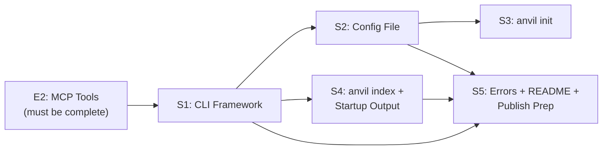

# E3: Developer Experience — Epic Design Doc

*Status: 🔄 In Refinement (Step 0)*
*Authors: Dan Hannah & Clay*
*Created: March 29, 2026*
*Parent: [Anvil Project Design Doc](../design.md)*

---

## Overview

### What Is This Epic?

E3 is the polish layer. E1 built the indexing engine. E2 added the query tools. E3 makes Anvil feel like a real product — a CLI that's intuitive, config that's flexible, output that's informative, errors that are helpful, and documentation that gets someone from zero to querying in under 2 minutes.

This is the difference between "it works" and "I want to use this." Developer experience is the adoption lever — a tool with great DX gets recommended. A tool with bad DX gets abandoned after the first frustrating error message.

### Problem Statement

After E2, Anvil is fully functional but rough around the edges:
- CLI only accepts `--docs` and `--db` flags (no config file, no `--help` with rich formatting)
- Output is minimal (stderr progress on first run, that's it)
- Error messages are functional but not polished
- No README, no quickstart guide, no documentation
- No `anvil init` or guided setup
- Package isn't published to npm yet

E3 smooths all of this out and ships the first public release.

### Goals

- **Rich CLI interface** with proper arg parsing, `--help`, `--version`, and subcommands
- **Config file support** (`anvil.config.json`) for persistent project-level settings
- **Informative startup output** — what's being indexed, how many files, how long it took
- **Helpful error messages** — every error suggests what to do next
- **README.md** — project overview, quickstart, configuration reference, MCP client setup examples
- **`npx @claymore/anvil` works end-to-end** — published to npm, zero-friction first run
- **`anvil init`** — optional guided setup that creates config file with sensible defaults

### Non-Goals

- **No web UI** — CLI and MCP only for v1.
- **No SSE transport** — stdio only. Remote access is v2.
- **No telemetry or analytics** — no phone-home, no tracking. Open-source trust.
- **No plugin system** — no custom chunkers or embedding providers via config. Interface exists internally, but user-facing extension points are v2.
- **No man pages** — `--help` output and README are sufficient for v1.

---

## Context

### Current State (Post-E2)

E2 delivers a fully functional MCP server with 5 tools (`search_docs`, `get_page`, `get_section`, `list_pages`, `get_status`). The server starts via `npx @claymore/anvil --docs ./path`, indexes docs, watches for changes, and serves queries. But:

- CLI arg parsing is minimal (hand-rolled in E1's S4)
- No config file — all settings via CLI flags
- Output is bare (progress to stderr, nothing else)
- No documentation beyond the design docs (which are for us, not users)
- Package exists but isn't published to npm

### Affected Systems

| System / Layer | How It's Affected |
|---------------|-------------------|
| `src/cli.ts` | Major overhaul — proper arg parser, subcommands, help text |
| `src/config.ts` | New — config file loading, merging with CLI args, validation |
| `src/logger.ts` | New — structured output for startup, indexing, errors |
| `README.md` | New — project documentation |
| `package.json` | Update — `bin` field, publish config, keywords, description |

### Dependencies

- **E1: Core Server** — must be complete (CLI entry point, server process)
- **E2: MCP Tools** — must be complete (tools must work before we document them)
- **Pre-build:** `@claymore` npm org created, standalone repo exists

### Dependents

- **First public release** — E3 is the gate. After E3, Anvil is usable by anyone.
- **QuoteAI** — first external consumer. Needs clear setup docs.
- **CSDLC integration** — our own sub-agents need MCP client config examples.

---

## Design

### Approach

E3 is primarily additive — it wraps and polishes existing functionality rather than changing core behavior. The stories are mostly independent, making them good candidates for parallel execution.

### CLI Interface

#### Command Structure

```bash
# Primary usage — start the MCP server
anvil serve --docs ./docs/
anvil serve                     # Uses config file or current directory

# Guided setup
anvil init                      # Creates anvil.config.json interactively

# One-shot index (don't start server)
anvil index --docs ./docs/      # Index and exit — useful for CI, validation, benchmarking

# Info
anvil --help
anvil --version
anvil serve --help
```

**Design Decision: `anvil serve` vs bare `anvil`**

Two options:
1. `anvil --docs ./path` (current E1/E2 behavior — bare command starts the server)
2. `anvil serve --docs ./path` (explicit subcommand)

**Recommendation:** Support both. `anvil serve` is explicit and discoverable. Bare `anvil --docs ./path` is the zero-friction path from the quickstart. If no subcommand is given, default to `serve`. This matches how tools like `vite` work — `vite` and `vite dev` do the same thing.

#### Arg Parsing

Use a lightweight arg parser (`commander`, `yargs`, or `citty`). Requirements:
- Named flags with sensible defaults
- `--help` auto-generated from command definitions
- `--version` reads from `package.json`
- Unknown flags produce helpful errors (not stack traces)

**Recommended:** `commander` — mature, zero-config, TypeScript support, used by half the npm ecosystem.

#### CLI Flags (Full Set)

| Flag | Short | Default | Description |
|------|-------|---------|-------------|
| `--docs <path>` | `-d` | `./` or from config | Path to docs directory |
| `--db <path>` | | `<docs>/.anvil/index.db` | Path to sqlite DB file |
| `--config <path>` | `-c` | `./anvil.config.json` | Path to config file |
| `--no-config` | | `false` | Ignore config file even if present |
| `--no-watch` | | `false` | Disable file watcher (index once, serve from static DB) |
| `--max-chunk-size <n>` | | `6000` | Max chunk size in characters |
| `--min-chunk-size <n>` | | `200` | Min chunk size before merge-up |
| `--embedding-provider` | | `local` | Embedding provider (`local` or `openai`) |
| `--log-level` | | `info` | Log verbosity: `silent`, `error`, `warn`, `info`, `debug` |
| `--help` | `-h` | | Show help |
| `--version` | `-v` | | Show version |

CLI flags override config file values. Config file overrides defaults. Standard precedence: **defaults < config file < CLI flags < environment variables**.

### Config File

#### Format: `anvil.config.json`

```json
{
  "docs": "./docs",
  "db": "./.anvil/index.db",
  "embedding": {
    "provider": "local",
    "model": "all-MiniLM-L6-v2"
  },
  "chunking": {
    "maxChunkSize": 6000,
    "minChunkSize": 200,
    "mergeShort": true
  },
  "watch": true,
  "logLevel": "info"
}
```

#### Config Discovery

1. Check `--config` flag (explicit path)
2. Look for `anvil.config.json` in current directory
3. Look for `anvil.config.json` in `--docs` directory
4. No config found → use defaults (this is fine — config is optional)

#### Config Validation

Validate on load with clear error messages:
- Unknown keys → warning (not error — forward compatibility)
- Wrong types → error with expected type
- Invalid values (e.g., `logLevel: "verbose"`) → error with valid options
- Missing required fields → fall back to defaults (nothing is truly "required" — the whole file is optional)

### `anvil init` — Guided Setup

Interactive prompt that creates `anvil.config.json`:

```
$ anvil init

🔨 Anvil Setup

Where are your docs? (./docs) › ./docs
Embedding provider? (local) › local
Max chunk size in chars? (6000) › 6000

✅ Created anvil.config.json

Next steps:
  anvil serve        Start the MCP server
  anvil index        Index docs without starting the server
```

Keep it short — 3-4 questions max. Sensible defaults for everything. The goal is to create the config file, not teach the user about embeddings.

**Library:** `enquirer` or `prompts` — lightweight, good TypeScript support.

### `anvil index` — One-Shot Indexing

Indexes docs and exits without starting the MCP server. Use cases:
- **CI validation** — verify docs index cleanly as part of a build pipeline
- **Benchmarking** — time the indexing of a corpus
- **Pre-warming** — index before starting the server (useful for very large corpora)

```
$ anvil index --docs ./docs/

🔨 Indexing ./docs/
  Found 47 markdown files
  Chunked into 312 sections
  Generating embeddings... done (14.2s)
  Wrote .anvil/index.db (2.4 MB)

✅ Index complete: 47 pages, 312 chunks
```

### Startup Output

When the server starts, show useful info on stderr:

```
🔨 Anvil v0.1.0
  Docs:      ./docs/ (47 files)
  DB:        .anvil/index.db (2.4 MB, 312 chunks)
  Embedding: all-MiniLM-L6-v2 (local, 384 dims)
  Watching:  enabled
  Transport: stdio

  Index is fresh (last indexed 3s ago)
  MCP server ready — 5 tools registered
```

If indexing is needed on startup:

```
🔨 Anvil v0.1.0
  Docs:      ./docs/ (47 files)
  Indexing:  3 files changed since last run
  Chunking:  ████████████████████████ 100% (12 chunks)
  Embedding: ████████████████████████ 100% (14.2s)
  DB:        .anvil/index.db (2.4 MB, 312 chunks)

  MCP server ready — 5 tools registered
```

**Key principle:** All human-readable output goes to stderr. stdout is reserved for MCP stdio protocol. This was decided in E1 and remains critical.

### Error Messages

Every error should:
1. **Say what happened** — clear, jargon-free
2. **Say why** — the likely cause
3. **Say what to do** — the fix or next step

**Examples:**

```
✗ Docs directory not found: ./docss/
  Did you mean ./docs/? Check the --docs flag or anvil.config.json.

✗ Failed to load sqlite-vss extension
  This is a native module that needs to be compiled for your platform.
  Try: npm rebuild better-sqlite3
  Platform: darwin arm64 (Apple Silicon)
  More info: https://github.com/nicolo-ribaudo/sqlite-vss-node#troubleshooting

✗ Config file has invalid values:
  • chunking.maxChunkSize must be a number, got "big"
  • embedding.provider must be "local" or "openai", got "anthropic"

⚠ Config file has unknown keys (ignored): chunking.overlap
  This may be a typo or a setting from a newer version of Anvil.
```

### README.md

Structure:

```markdown
# 🔨 Anvil

Make your docs queryable by AI agents. Zero config, local-first, open source.

## Quickstart (< 2 minutes)

## What It Does (with diagram)

## Installation

## Configuration

## MCP Client Setup
  - Cursor
  - Claude Desktop
  - OpenClaw
  - Generic MCP client

## CLI Reference

## How It Works (brief architecture)

## Contributing

## License (BSD)
```

**Key constraint:** The quickstart must get someone from zero to a working MCP query in under 2 minutes. Three commands max:

```bash
npm install -g @claymore/anvil
cd your-project
anvil serve --docs ./docs/
```

Then one MCP client config snippet and they're querying.

---

## Edge Cases & Gotchas

| Scenario | Expected Behavior | Why It's Tricky |
|----------|-------------------|-----------------|
| Config file exists but is malformed JSON | Clear parse error with line number if possible | `JSON.parse` errors are cryptic by default |
| Config file and CLI flags conflict | CLI wins (standard precedence) | Must be documented clearly |
| `anvil init` in directory that already has config | Ask to overwrite, show diff of what would change | Don't silently clobber existing config |
| `anvil serve` with no docs directory (no flag, no config, no ./docs/) | Error with suggestion: "No docs directory found. Use --docs or run anvil init." | Common first-run mistake |
| `--version` when package isn't installed globally | Still works — reads from local package.json | `npx` users won't have it global |
| Extremely large corpus (10,000+ files) | Progress bar on indexing, maybe warn about initial index time | stdout/stderr separation is critical here |
| User runs `anvil serve` and sees nothing (stdout is MCP) | Startup banner on stderr explains what's happening | Confusing for first-time users who expect terminal output |
| `anvil index` when DB already exists | Incremental re-index (same as serve startup behavior) | User might expect "full rebuild" — add `--force` flag for that |

---

## Risks

| Risk | Likelihood | Impact | Mitigation |
|------|-----------|--------|------------|
| npm publish fails (org setup, auth, naming) | Low | Medium — blocks release | Test publish with `--dry-run` first. Document the publish process. |
| README gets stale quickly as features evolve | Medium | Medium — bad first impression | README points to versioned docs. Keep it focused on quickstart, not exhaustive reference. |
| Config file format locks us in | Low | Medium | Keep it simple — flat structure, obvious names. Breaking changes via major version bump. |
| `anvil init` prompts are annoying for experienced users | Low | Low | All questions have defaults — enter through to accept all. `--yes` flag skips prompts. |

---

## Testing Strategy

### Test Layers

| Layer | Applies? | Notes |
|-------|:--------:|-------|
| **Unit tests** | ✅ Yes | Config loading/merging/validation, CLI arg parsing, error message formatting |
| **Integration tests** | ✅ Yes | Config file + CLI flags precedence, `anvil index` end-to-end, startup output content |
| **E2E tests** | ✅ Yes | `npx @claymore/anvil --docs ./fixtures/ ` full lifecycle: init → index → serve → query |

### Verification Rules

1. `anvil --help` outputs formatted help text with all flags
2. `anvil --version` outputs version matching `package.json`
3. `anvil serve --docs ./path` starts server with correct config
4. `anvil serve` with config file uses config file values
5. CLI flags override config file values
6. `anvil init` creates valid `anvil.config.json`
7. `anvil init` in directory with existing config prompts before overwrite
8. `anvil index --docs ./path` indexes and exits (process exits 0)
9. Invalid config file produces clear validation error
10. Missing docs directory produces actionable error message
11. All output goes to stderr (stdout clean for MCP)
12. `--no-watch` disables file watcher
13. `--log-level silent` suppresses all non-error output

---

## Stories

Stories are mostly independent. S1 (CLI framework) should go first since it establishes the arg parsing that other stories depend on. S2-S5 are parallelizable.

| Story | Summary | Size | Dependencies | Status |
|-------|---------|------|-------------|--------|
| **S1** | CLI framework + arg parsing + help/version | Small-Med | E2 complete | Not started |
| **S2** | Config file support (load, merge, validate) | Small | S1 (CLI integration) | Not started |
| **S3** | `anvil init` guided setup | Small | S2 (config format defined) | Not started |
| **S4** | `anvil index` subcommand + startup output polish | Small | S1 (subcommand routing) | Not started |
| **S5** | Error message polish + README + npm publish prep | Medium | S1-S4 (needs final tool surface to document) | Not started |

### Dependency Graph



S5 is the capstone — it needs the final surface area to document and the polished errors to test. S2-S4 can run in parallel after S1.

### S1: CLI Framework + Arg Parsing + Help/Version

**What:** Replace E1's minimal arg parsing with a proper CLI framework. Establish subcommand routing (`serve`, `init`, `index`), global flags, and auto-generated help.

**Acceptance Criteria:**
- [ ] CLI framework installed and configured (`commander` recommended)
- [ ] `anvil serve --docs <path>` works (backwards compatible with E1/E2 behavior)
- [ ] `anvil --docs <path>` defaults to `serve` (no subcommand = serve)
- [ ] `anvil --help` shows formatted help with all global flags and subcommands
- [ ] `anvil serve --help` shows serve-specific flags
- [ ] `anvil --version` outputs version from `package.json`
- [ ] All flags from the CLI Flags table are accepted (but config and init behavior are stubs — S2/S3 implement them)
- [ ] Unknown flags produce helpful error (not stack trace)
- [ ] Subcommand routing: `serve` → existing server, `init` → stub, `index` → stub
- [ ] Unit tests for arg parsing edge cases

**Target files:** `src/cli.ts` (overhaul)

**Boundaries:** Config file loading is S2. `init` and `index` implementation are S3/S4. This story establishes the framework and stubs.

### S2: Config File Support

**What:** Implement `anvil.config.json` loading, validation, and merging with CLI flags.

**Acceptance Criteria:**
- [ ] Config discovery: `--config` flag → cwd → docs dir → no config (all valid)
- [ ] `--no-config` flag skips config loading entirely
- [ ] Config schema validation with clear error messages per field
- [ ] Unknown keys produce warnings (not errors)
- [ ] Merge precedence: defaults < config < CLI flags
- [ ] Config values flow through to server startup (docs path, db path, chunk sizes, log level, watch toggle)
- [ ] Unit tests: valid config, invalid config, partial config, merge precedence
- [ ] Integration test: config file + CLI flag override → verify correct behavior

**Target files:** `src/config.ts` (new)

### S3: `anvil init` Guided Setup

**What:** Interactive CLI command that creates `anvil.config.json` with sensible defaults.

**Acceptance Criteria:**
- [ ] `anvil init` launches interactive prompts (docs path, embedding provider, chunk size)
- [ ] All questions have sensible defaults (press enter to accept)
- [ ] `anvil init --yes` skips prompts, uses all defaults
- [ ] Writes valid `anvil.config.json` to current directory
- [ ] If config file already exists: prompt to overwrite (show what would change)
- [ ] Output includes "Next steps" with copy-pasteable commands
- [ ] Integration test: `anvil init --yes` creates valid config that `anvil serve` accepts

**Target files:** `src/commands/init.ts` (new)

### S4: `anvil index` Subcommand + Startup Output Polish

**What:** Implement the one-shot index command and polish the server startup output with progress bars, summary stats, and clear status messaging.

**Acceptance Criteria:**
- [ ] `anvil index --docs <path>` indexes docs and exits (no MCP server, no file watcher)
- [ ] Exit code 0 on success, 1 on failure
- [ ] `anvil index --force` forces full re-index (ignores content hashes)
- [ ] Progress output during indexing: file count, chunk count, embedding progress bar, timing
- [ ] `anvil serve` startup banner shows: version, docs path, DB stats, embedding config, watch status, transport, tool count
- [ ] All output to stderr (stdout reserved for MCP stdio)
- [ ] `--log-level` controls verbosity (silent suppresses everything except errors)
- [ ] Integration test: `anvil index` on fixtures → verify DB exists and exit code 0
- [ ] Integration test: `anvil index --force` re-embeds all chunks (verify via DB timestamps)

**Target files:** `src/commands/index.ts` (new), `src/logger.ts` (new or enhanced)

### S5: Error Messages + README + npm Publish Prep

**What:** The capstone. Polish all error messages across the codebase, write the README, and prepare the package for npm publish.

**Acceptance Criteria:**
- [ ] Audit all error paths in codebase — every error follows the pattern: what happened, why, what to do next
- [ ] sqlite-vss load failure has platform-specific troubleshooting
- [ ] ONNX model download failure has clear offline/firewall guidance
- [ ] Config validation errors list all issues (not just the first one)
- [ ] Missing docs directory suggests common fixes
- [ ] README.md written with sections: quickstart, what it does, installation, configuration, MCP client setup (Cursor, Claude Desktop, OpenClaw), CLI reference, architecture overview, contributing, license
- [ ] Quickstart is ≤ 3 commands to a working MCP query
- [ ] MCP client config examples are copy-pasteable and tested
- [ ] `package.json` has: correct `bin` field, `files` whitelist, `keywords`, `description`, `repository`, `license: BSD-3-Clause`
- [ ] `npm pack --dry-run` produces clean package with expected files
- [ ] `.npmignore` or `files` field excludes test fixtures, source maps, etc.
- [ ] CHANGELOG.md with v0.1.0 entry
- [ ] LICENSE file (BSD-3-Clause)

**Target files:** Various (error audit), `README.md`, `CHANGELOG.md`, `LICENSE`, `package.json`

**Boundaries:** Does NOT actually publish to npm — that's a manual step after human review of the package. Prepares everything so `npm publish` is the only step left.

---

## Decisions Log

| Date | Decision | Rationale | Alternatives Considered |
|------|----------|-----------|------------------------|
| 2026-03-29 | `commander` for CLI framework | Mature, zero-config, TypeScript-native, auto-generated help. Industry standard. | `yargs` (heavier, more opinionated), `citty` (newer, less ecosystem support), hand-rolled (rejected: reinventing the wheel) |
| 2026-03-29 | Bare `anvil` defaults to `serve` | Zero-friction quickstart. `anvil --docs ./path` just works. Explicit `anvil serve` also works for discoverability. | Require subcommand always (rejected: extra friction), bare command shows help (rejected: confusing for "just start it" use case) |
| 2026-03-29 | Config file is JSON, not YAML or TOML | JSON is native to Node.js — `JSON.parse`, no dependencies. TOML and YAML require parsers. Anvil's config is simple enough that JSON is fine. | YAML (rejected: needs parser, error-prone whitespace), TOML (rejected: needs parser, less familiar to JS devs) |
| 2026-03-29 | Config is optional — zero-config is the default | Anvil's biggest DX promise is `npx @claymore/anvil --docs ./path` with no setup. Config is for customization, not a requirement. | Config required (rejected: contradicts zero-config philosophy) |
| 2026-03-29 | `anvil index` as separate subcommand | CI/CD use case (validate docs index cleanly), benchmarking, pre-warming. Clean separation: `index` = one-shot, `serve` = long-running. | Combined into serve with `--index-only` (rejected: overloaded flag), no index command (rejected: loses CI use case) |
| 2026-03-29 | S5 is the capstone (depends on S1-S4) | README needs final surface area. Error audit needs all code paths. Publish prep needs everything in place. | Write README first (rejected: will be outdated by S2-S4 changes), parallel with other stories (rejected: too many moving targets) |
| 2026-03-29 | Don't actually publish in S5 — prepare only | Human must review the package before it goes public. `npm publish` is a one-line manual step after review. | Auto-publish in CI (rejected: not for v0.1.0 — needs human eyes) |
| 2026-03-29 | BSD-3-Clause license | Per project design doc. Maximizes adoption, doesn't scare enterprise. | MIT (viable alternative), AGPL (rejected: enterprise-hostile for a dev tool) |

---

## Known Issues / Tech Debt

| Issue | Severity | Notes |
|-------|----------|-------|
| No shell completions | Low | Tab completions for subcommands and flags. Nice-to-have for v0.2. |
| No `anvil doctor` command | Low | Auto-diagnose common issues (sqlite-vss, model download, config). Future DX enhancement. |
| Config schema not formally typed | Low | Validation is imperative, not schema-driven. Consider JSON Schema or Zod for v0.2. |
| README MCP examples may drift | Low | Examples are tested in S5 but could drift as MCP client configs evolve. |

---

*This epic doc is refined collaboratively (Step 0) before stories are broken down (Step 1). Once refined, the AI Lead extracts context from this doc to craft sub-agent prompts (Step 2).*
*Update this doc as implementation reveals new information — design docs are living documents.*
