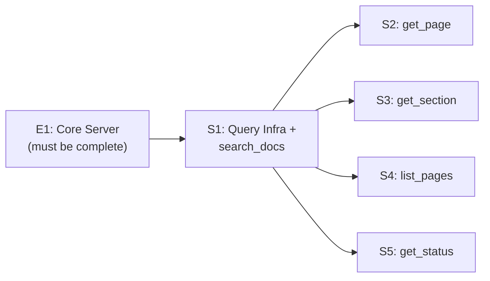

# E2: MCP Tools & Query Layer — Epic Design Doc

*Status: 🔄 In Refinement (Step 0)*
*Authors: Dan Hannah & Clay*
*Created: March 29, 2026*
*Parent: [Anvil Project Design Doc](../design.md)*

---

## Overview

### What Is This Epic?

E2 adds the query interface to Anvil — the 5 MCP tools that let AI agents actually retrieve documentation from the indexed vector database. E1 built the engine (watch → chunk → embed → store). E2 adds the steering wheel (search, browse, retrieve, diagnose).

By the end of E2, an agent can connect to Anvil via MCP and:
- Semantically search across all indexed docs
- Retrieve a full page by path
- Retrieve a specific section by heading
- Browse the doc structure to discover what's available
- Check server health and index state (is it working? is it fresh?)

This is where Anvil becomes *useful*. E1 proves the pipeline works. E2 proves the product works.

### Problem Statement

After E1, Anvil has a running MCP server with a fully indexed vector database — but zero tools registered. Agents can connect but can't query. The indexing pipeline is invisible without a retrieval layer on top. E2 bridges that gap: it takes the raw infrastructure and exposes it as a clean, agent-friendly tool surface.

### Goals

- **5 MCP tools** registered and functional: `search_docs`, `get_page`, `get_section`, `list_pages`, `get_status`
- **Semantic search** via sqlite-vss vector similarity with relevance scoring
- **Metadata enrichment** on all responses (file path, heading breadcrumb, last modified, char count)
- **Query embedding** — embed the agent's search query using the same ONNX model used for indexing
- **File filtering** — scope searches to specific paths or glob patterns
- **Graceful error handling** — clear MCP error responses for bad paths, empty results, missing sections
- **Staleness-aware** — every tool invocation triggers E1's staleness check before querying (agents always get fresh results)

### Non-Goals

- **No write tools** — read-only per design doc decision. Agents write via filesystem, not MCP.
- **No re-ranking** — deferred to v2. Heading-based chunking provides good enough retrieval for bounded corpora.
- **No caching** — accepted tech debt for v1. Local sqlite queries are fast enough.
- **No `get_related`** — v2 tool. Requires page-level embeddings not yet computed.
- **No `get_changelog`** — v2 tool. Requires git integration.
- **No `search_by_tag`** — v2 tool. Requires frontmatter extraction beyond what E1 stores.
- **No SSE transport** — stdio only per project design doc.

---

## Context

### Current State (Post-E1)

E1 delivers:
- A running MCP server process (`npx @claymore/anvil --docs ./path`)
- sqlite-vss database with chunks table, embeddings, and metadata
- File watcher + staleness check for auto-reindexing
- MCP server skeleton on stdio — accepts connections, zero tools registered
- `Embedder` with `embedQuery()` method ready for query-time embedding

E2 builds directly on top of this. The storage layer, embedding pipeline, and server infrastructure are all in place.

### Affected Systems

| System / Layer | How It's Affected |
|---------------|-------------------|
| `src/server.ts` | Tool registration — goes from zero tools to four |
| `src/db.ts` | New query methods: vector search, file listing, section lookup |
| `src/embedder.ts` | `embedQuery()` called at query time for `search_docs` |
| `src/types.ts` | Response types for each tool's return shape |

### Dependencies

- **E1: Core Server, Chunker & Embedder** — must be complete. E2 uses E1's DB layer, embedder, and server skeleton.

### Dependents

- **E3: Developer Experience** — blocked until E2 ships. E3 polishes CLI, config, and documentation.
- **QuoteAI** — first real consumer. Once E2 ships, QuoteAI agents can query their own docs via Anvil.
- **CSDLC workflow (us)** — Anvil becomes part of our own sub-agent prompting pipeline.

---

## Design

### Approach

E2 implements four MCP tools, each mapping to a different retrieval pattern. The tools are thin — they validate input, call the DB/embedder layer, shape the response, and return. The heavy lifting (indexing, embedding, storage) was done in E1.

```
Agent sends MCP tool call
    → Server receives request
    → Staleness check (E1 infrastructure — transparent)
    → Tool handler validates parameters
    → Calls DB query layer (vector search or direct lookup)
    → Shapes response with metadata
    → Returns to agent
```

### Tool Specifications

#### `search_docs` — Semantic Search

The workhorse. 80%+ of agent queries will use this tool.

**Parameters:**

| Param | Type | Required | Default | Description |
|-------|------|----------|---------|-------------|
| `query` | `string` | Yes | — | Natural language search query |
| `top_k` | `number` | No | 5 | Number of results to return (1-20) |
| `file_filter` | `string` | No | — | Glob pattern to scope search (e.g., `"epics/*"`, `"architecture.md"`) |

**Returns:**
```typescript
{
  results: Array<{
    content: string;          // Raw markdown chunk content
    score: number;            // Cosine similarity (0-1)
    metadata: {
      file_path: string;      // Relative path within docs/
      heading_path: string;   // Breadcrumb: "Architecture > Data Flow > Events"
      heading_level: number;  // 1-6
      last_modified: string;  // ISO timestamp
      char_count: number;     // Content length
    }
  }>;
  total_chunks: number;       // Total chunks in DB (or filtered subset)
  query_ms: number;           // Query execution time in ms
}
```

**Flow:**
1. Validate `query` is non-empty string
2. Embed query via `embedder.embedQuery(query)` → 384-dim vector
3. If `file_filter` provided, resolve glob to matching `file_path` values in DB
4. Run sqlite-vss similarity search: `SELECT * FROM chunks_vss WHERE vss_search(embedding, ?) LIMIT ?`
5. Join with `chunks` table for full metadata
6. If `file_filter` active, filter results to matching paths (post-filter or pre-filter depending on sqlite-vss capabilities)
7. Return results sorted by descending score

**Edge Cases:**
- Empty query → MCP error: "query parameter is required"
- `top_k` out of range → clamp to 1-20
- `file_filter` matches no files → return empty results with `total_chunks: 0`
- No results above minimum similarity threshold → return empty results (threshold configurable, default: 0.0 — return everything, let the agent decide relevance)

---

#### `get_page` — Full Page Retrieval

For when an agent knows exactly which file it needs. Returns all chunks for a file, ordered by position.

**Parameters:**

| Param | Type | Required | Default | Description |
|-------|------|----------|---------|-------------|
| `file_path` | `string` | Yes | — | Relative path within docs/ (e.g., `"architecture/data-flow.md"`) |

**Returns:**
```typescript
{
  file_path: string;
  title: string;              // First h1 heading, or filename if no h1
  last_modified: string;
  total_chars: number;        // Sum of all chunk char_counts
  chunks: Array<{
    content: string;
    heading_path: string;
    heading_level: number;
    char_count: number;
  }>;
}
```

**Flow:**
1. Query DB for all chunks where `file_path` matches
2. Order by chunk position (heading order in document — implied by the chunking order in E1)
3. Extract title from first h1 chunk (or use filename as fallback)
4. Sum `char_count` for total page size
5. Return ordered chunks with metadata

**Edge Cases:**
- File path not found in DB → MCP error: `"No page found at path: {file_path}. Use list_pages to discover available pages."`
- Path with leading slash or `./` prefix → normalize (strip prefix) before querying

**Design Decision — Chunk Ordering:**
E1's `chunks` table doesn't have an explicit `position` column. Chunks are inserted in document order during indexing, but relying on insertion order in SQLite is fragile. **Options:**
1. Add a `position INTEGER` column to the chunks table (requires E1 schema update)
2. Derive order from `heading_path` (works for headings but not for multi-part chunks)
3. Add an `ordinal INTEGER` column — simple sequential number per file

**Decision:** `ordinal INTEGER` column added to E1's chunks schema. Each chunk gets a sequential number within its file (0, 1, 2, ...). `ORDER BY ordinal` is trivial and handles multi-part chunks correctly.

---

#### `get_section` — Section-Level Retrieval

Surgical precision. Agent knows exactly which heading it wants.

**Parameters:**

| Param | Type | Required | Default | Description |
|-------|------|----------|---------|-------------|
| `file_path` | `string` | Yes | — | Relative path within docs/ |
| `heading_path` | `string` | Yes | — | Heading breadcrumb (e.g., `"Architecture > Data Flow > Events"`) |

**Returns:**
```typescript
{
  content: string;
  metadata: {
    file_path: string;
    heading_path: string;
    heading_level: number;
    last_modified: string;
    char_count: number;
  }
}
```

**Flow:**
1. Query DB for chunk matching `file_path` AND `heading_path`
2. If multi-part chunk (long section split), concatenate all parts in order
3. Return content with metadata

**Edge Cases:**
- Section not found → MCP error: `"No section found at heading: {heading_path} in {file_path}. Use get_page to see available sections."`
- Partial heading match (agent sends `"Data Flow"` but full path is `"Architecture > Data Flow"`) → exact match only in v1. Fuzzy matching is v2.
- Multi-part chunks (`"Architecture > Data Flow [part 1/3]"`) → concatenate all parts, return as single content block with the base heading path (strip part indicators)

**Design Decision — Heading Path Matching:**
Heading paths are stored as full breadcrumbs. Should `get_section` require exact full-path match, or support partial/leaf matching?

**Recommendation:** Exact match for v1. If the agent passes `"Data Flow"`, it won't match `"Architecture > Data Flow"`. This keeps the implementation simple and predictable. Agents can use `get_page` to discover the full heading paths, then use `get_section` with the exact path. Partial matching (or heading search) is a v2 enhancement.

---

#### `list_pages` — Documentation Discovery

Lets agents browse the doc structure before querying. The entry point for agents that don't know what docs exist.

**Parameters:**

| Param | Type | Required | Default | Description |
|-------|------|----------|---------|-------------|
| `prefix` | `string` | No | — | Filter by path prefix (e.g., `"epics/"` returns only epic docs) |

**Returns:**
```typescript
{
  pages: Array<{
    file_path: string;        // Relative path
    title: string;            // First h1 heading or filename
    headings: string[];       // Top-level heading list (h1/h2 only — keeps it scannable)
    chunk_count: number;      // Number of chunks for this page
    total_chars: number;      // Total content size
    last_modified: string;
  }>;
  total_pages: number;
}
```

**Flow:**
1. Query DB for distinct `file_path` values (with optional prefix filter)
2. For each page, aggregate: chunk count, total chars, last modified (max of chunks)
3. Extract title from first h1 chunk per file
4. Extract top-level headings (h1/h2) for a scannable outline
5. Sort by file path (alphabetical)

**Edge Cases:**
- No pages indexed → return empty array with `total_pages: 0`
- Prefix matches nothing → return empty array
- Prefix with trailing slash vs. without → normalize (treat `"epics"` and `"epics/"` the same)

---

#### `get_status` — Server Health & Index Info

The diagnostic tool. Agents (and humans debugging) use this to verify Anvil is healthy, indexing correctly, and up-to-date. Also serves as the active development feedback loop — if Anvil has a bug or stale index, this is how you know.

**Parameters:** None.

**Returns:**
```typescript
{
  server: {
    version: string;            // Anvil version from package.json
    uptime_seconds: number;     // Time since server started
    docs_root: string;          // Watched directory path
  };
  index: {
    total_pages: number;        // Files indexed
    total_chunks: number;       // Chunks in DB
    last_indexed: string;       // ISO timestamp of last index operation
    db_path: string;            // Where the DB lives
    db_size_bytes: number;      // DB file size
  };
  embedding: {
    model: string;              // "all-MiniLM-L6-v2"
    dimensions: number;         // 384
    provider: string;           // "local" (or "openai" in future)
  };
  git: {
    head_commit: string | null; // Local HEAD commit hash (short)
    origin_main: string | null; // origin/main commit hash (short), null if fetch fails
    dirty: boolean | null;      // Uncommitted changes in docs dir
  } | null;                     // null if docs dir is not a git repo
}
```

**Flow:**
1. Read `anvil_meta` table for embedding info and last index timestamp
2. Count distinct `file_path` and total rows in `chunks` table
3. `fs.stat` the DB file for size
4. Attempt `git rev-parse HEAD --short` and `git rev-parse origin/main --short` in docs directory
5. Attempt `git status --porcelain` scoped to docs directory for dirty check
6. Return assembled status (git fields are null if not a git repo or commands fail)

**Edge Cases:**
- Docs directory is not a git repo → `git` field is `null` (not an error)
- `git fetch` not run recently → `origin_main` may be stale (that's fine — it shows what the server *knows*, not what remote *has*)
- Server just started, no index yet → `last_indexed` is `null`, counts are 0

**Why git info matters:** When an agent is working on a feature branch and docs look stale, `get_status` tells it: "your local HEAD is `abc123` but origin/main is `def456` — you might need to pull." And `dirty: true` means someone edited docs but hasn't committed — the index is fresh (file watcher caught it) but the changes aren't in git yet. This is the kind of situational awareness that makes agents genuinely useful during development.

---

### Response Design Principles

1. **Always include metadata.** Agents need to cite sources, follow up on specific sections, and assess relevance. Every response includes `file_path`, `heading_path`, and `last_modified`.

2. **Return raw markdown.** Don't strip formatting, don't render HTML, don't summarize. The agent's LLM can handle markdown — and the formatting carries semantic information (code blocks, tables, emphasis).

3. **Include timing.** `query_ms` in search results helps agents (and us) understand performance characteristics. Cheap to add, useful for debugging.

4. **Errors are informative.** Every error message suggests the next action: "Use `list_pages` to discover available pages" or "Use `get_page` to see available sections."

5. **No pagination in v1.** `top_k` caps search results. `list_pages` returns all pages (bounded by corpus size — Anvil targets project docs, not Wikipedia). Pagination adds complexity for a problem we don't have yet.

### Integration with E1 Staleness Check

Every MCP tool invocation passes through E1's staleness check before executing. This is transparent to E2 — the server infrastructure handles it. From E2's perspective, the DB is always fresh when a tool handler runs.

The only E2-side concern: if a staleness-triggered re-index is slow (major restructure, ~2-4s), the tool response is delayed. **No timeout handling needed in v1** — local ONNX re-indexing is fast enough that agent-side MCP timeouts won't fire.

---

## Cross-Cutting Concerns

| Concern | How E2 Handles It |
|---------|-------------------|
| **Staleness** | Inherited from E1 — transparent to tool handlers |
| **Chunk quality** | E2 exposes whatever E1 indexed. If chunks are bad, search results are bad. E2 has no mitigation — quality is an E1 concern. |
| **Score interpretation** | Cosine similarity scores (0-1) returned raw. No normalization or thresholding — agents interpret scores themselves. |
| **Large page retrieval** | `get_page` on a huge file could return 50+ chunks. No truncation in v1 — the agent asked for the full page, it gets the full page. |
| **Concurrent queries** | sqlite is single-writer but supports concurrent reads. Multiple agents querying simultaneously is fine. Write lock only during re-index (brief). |

---

## Edge Cases & Gotchas

| Scenario | Expected Behavior | Why It's Tricky |
|----------|-------------------|-----------------|
| Agent searches before any docs are indexed | `search_docs` returns empty results, `list_pages` returns empty array | Not an error — just an empty corpus. Tool still works. |
| Agent queries during active re-index | Reads see the pre-reindex state (sqlite read doesn't block on write) | Results may be briefly stale during re-index window (~200-400ms) |
| Very long query string | Embed it anyway — MiniLM handles up to 256 tokens, truncates silently | Agent might pass a paragraph as a "query" — still works, just noisy |
| `file_filter` glob with special chars | Use a simple glob library (micromatch or minimatch) for matching | Regex injection isn't a concern (read-only DB) but malformed globs shouldn't crash |
| Agent passes absolute path to `get_page` | Strip to relative path if it starts with the docs root, else error | Agents might construct paths from other context |
| Score ties in search results | Stable sort by score desc, then by file_path asc | Deterministic ordering matters for reproducible results |
| Unicode in heading paths | Store and match as-is (UTF-8) | Normalization (NFC/NFD) could cause match failures — use raw string comparison |

---

## Risks

| Risk | Likelihood | Impact | Mitigation |
|------|-----------|--------|------------|
| sqlite-vss query syntax is awkward or limited | Medium | Medium — workarounds needed | Prototype the vector search query early. If vss_search is too limited, wrap with additional SQL. |
| Search relevance is poor for short queries | Medium | Medium — bad UX | Test with real agent query patterns from our CSDLC workflow. Tune `top_k` default. |
| `get_page` returns too much data for large docs | Low | Low — agent handles it | Not a v1 problem. If it becomes one, add optional `max_chunks` param. |
| Heading path matching is too strict | Medium | Medium — agents struggle to find sections | Exact match for v1, but document the paths clearly in `list_pages` headings list. |
| Query embedding adds noticeable latency | Low | Low — local model is fast | MiniLM query embedding is ~5-10ms. Not a concern. |

---

## Testing Strategy

### Test Layers

| Layer | Applies? | Notes |
|-------|:--------:|-------|
| **Unit tests** | ✅ Yes | Each tool handler: parameter validation, response shaping, edge cases |
| **Integration tests** | ✅ Yes | Full pipeline: index test fixtures → query via tool handlers → verify results |
| **E2E tests** | ✅ Yes | MCP client connects to running server → calls tools → validates responses |

### Required Test Fixtures

Reuses E1's test fixtures (already indexed) plus:

| Fixture | What It Tests | Priority |
|---------|--------------|----------|
| `search-relevance/` (directory) | Multiple docs with overlapping topics — verify `search_docs` ranks correctly | 🔴 High |
| `known-result.md` | Doc with a unique, searchable phrase — verify exact retrieval | 🔴 High |
| `large-page.md` | 50+ sections — `get_page` returns all chunks in order | 🟡 Medium |
| `nested-headings.md` | Deep heading hierarchy — `get_section` with full breadcrumb path | 🔴 High |
| `multi-part-section.md` | Long section split into parts — `get_section` concatenates correctly | 🔴 High |

### Dogfood Test: Real CSDLC Docs

In addition to synthetic fixtures, E2 includes integration tests against a snapshot of our own documentation. This is the ultimate validation — if Anvil can't find the right sections in the docs we wrote, something is fundamentally wrong.

**Fixture:** A copy (not symlink) of the Anvil project design doc, frozen at test-write time. Stored as `test/fixtures/real-docs/anvil-design.md`.

**Assertions:**
- `search_docs("heading-based chunking")` → top result contains the Chunking Strategy section
- `search_docs("sqlite vector database")` → top result contains the Tech Stack section
- `get_page("anvil-design.md")` → returns all sections in document order, total chunks matches expected count
- `get_section("anvil-design.md", "Competitive Landscape > Why We're Still Building This")` → returns the correct section content
- `list_pages()` → includes `anvil-design.md` with correct title and chunk count
- `get_status()` → `total_pages >= 1`, `total_chunks > 0`, `embedding.model` is `all-MiniLM-L6-v2`

This is meta, but it's the best possible integration test — we know the content, we know what queries should return, and it validates the full pipeline from chunking through retrieval.

### Verification Rules

1. `search_docs` with a query that matches a single unique chunk → that chunk is result #1
2. `search_docs` with `file_filter` → results only from matching paths
3. `get_page` returns chunks in document order (by ordinal)
4. `get_section` with multi-part heading → returns concatenated content
5. `get_section` with exact heading path → returns correct content
6. `get_section` with wrong heading path → returns informative MCP error
7. `list_pages` returns all indexed files with correct metadata
8. `list_pages` with prefix filter → only matching paths
9. All tools return metadata (file_path, heading_path, last_modified)
10. All query tools trigger staleness check (verify by modifying a file between index and query)
11. `get_status` returns correct page/chunk counts matching actual DB state
12. `get_status` returns git info when docs dir is a git repo, null when it's not
13. Dogfood tests against real CSDLC docs pass (search returns expected sections)

---

## Stories

Stories are ordered by dependency. S1 builds the query infrastructure, S2-S4 implement individual tools. S2 depends on S1 (needs vector search). S3 and S4 are independent of each other and parallelizable after S1.

| Story | Summary | Size | Dependencies | Status |
|-------|---------|------|-------------|--------|
| **S1** | Query infrastructure + `search_docs` tool | Medium | E1 complete | Not started |
| **S2** | `get_page` tool | Small | S1 (query layer, response types) | Not started |
| **S3** | `get_section` tool | Small | S1 (query layer, response types) | Not started |
| **S4** | `list_pages` tool | Small | S1 (query layer, response types) | Not started |
| **S5** | `get_status` tool | Small | S1 (query layer, response types) | Not started |

### Dependency Graph



S1 is the critical path. S2-S5 are parallelizable after S1 — good candidates for sub-agent worktrees.

### S1: Query Infrastructure + `search_docs`

**What:** Build the query layer on top of E1's DB, implement query-time embedding, register `search_docs` as the first MCP tool. This establishes the patterns (response types, error handling, metadata enrichment) that S2-S4 reuse.

**Acceptance Criteria:**
- [ ] Query module (`src/query.ts` or similar) that wraps DB access for tool handlers:
  - `vectorSearch(embedding: Float32Array, topK: number, fileFilter?: string): SearchResult[]`
  - `getPageChunks(filePath: string): Chunk[]` (ordered by ordinal)
  - `getSectionChunks(filePath: string, headingPath: string): Chunk[]`
  - `listIndexedPages(prefix?: string): PageSummary[]`
- [ ] Response types defined (`SearchResult`, `PageResult`, `SectionResult`, `PageSummary`)
- [ ] `search_docs` MCP tool registered and functional:
  - Accepts `query`, `top_k`, `file_filter` parameters
  - Embeds query via `embedder.embedQuery()`
  - Runs vector similarity search via sqlite-vss
  - Returns results with content, score, and full metadata
  - Handles all edge cases (empty query, no results, invalid top_k)
- [ ] `file_filter` glob matching works (using `minimatch` or `micromatch`)
- [ ] MCP error responses follow consistent format with actionable messages
- [ ] Integration test: index fixture docs → `search_docs` with known query → verify correct chunk is top result
- [ ] Integration test: `search_docs` with `file_filter` → only matching files in results

**Target files:** `src/query.ts`, `src/tools/search-docs.ts`, `src/types.ts` (extended)

**Boundaries:** Does NOT implement `get_page`, `get_section`, or `list_pages` (but builds the query infrastructure they'll use).

### S2: `get_page` Tool

**What:** Register `get_page` MCP tool. Returns all chunks for a file, ordered by position.

**Acceptance Criteria:**
- [ ] `get_page` MCP tool registered and functional
- [ ] Accepts `file_path` parameter
- [ ] Returns all chunks for the file ordered by `ordinal`
- [ ] Extracts page title from first h1 chunk (fallback: filename)
- [ ] Sums `char_count` for `total_chars`
- [ ] Normalizes path input (strips leading `./` or `/`)
- [ ] Returns informative MCP error for unknown paths (suggests `list_pages`)
- [ ] Unit test: mock DB → verify response shape and ordering
- [ ] Integration test: index fixture → `get_page` → verify all chunks present and ordered

**Target files:** `src/tools/get-page.ts`

### S3: `get_section` Tool

**What:** Register `get_section` MCP tool. Returns a specific section by heading path, handling multi-part chunks.

**Acceptance Criteria:**
- [ ] `get_section` MCP tool registered and functional
- [ ] Accepts `file_path` and `heading_path` parameters
- [ ] Exact match on heading path (no fuzzy/partial matching)
- [ ] Multi-part chunks: detects `[part N/M]` variants, concatenates all parts in order, returns with base heading path
- [ ] Returns informative MCP error for unknown section (suggests `get_page`)
- [ ] Unit test: mock DB with multi-part chunks → verify concatenation
- [ ] Integration test: index fixture with long section → `get_section` → verify concatenated content

**Target files:** `src/tools/get-section.ts`

### S4: `list_pages` Tool

**What:** Register `list_pages` MCP tool. Returns indexed page listing with metadata and outline.

**Acceptance Criteria:**
- [ ] `list_pages` MCP tool registered and functional
- [ ] Accepts optional `prefix` parameter
- [ ] Returns per-page: `file_path`, `title`, `headings` (h1/h2 only), `chunk_count`, `total_chars`, `last_modified`
- [ ] Normalizes prefix (trailing slash handling)
- [ ] Sorted by `file_path` alphabetically
- [ ] Empty corpus → returns empty array with `total_pages: 0`
- [ ] Integration test: index multiple fixture files → `list_pages` → verify all present with correct metadata
- [ ] Integration test: `list_pages` with prefix → only matching paths returned

**Target files:** `src/tools/list-pages.ts`

### S5: `get_status` Tool

**What:** Register `get_status` MCP tool. Returns server health, index state, embedding config, and git info for the docs directory.

**Acceptance Criteria:**
- [ ] `get_status` MCP tool registered and functional
- [ ] No parameters
- [ ] Returns server info: version (from `package.json`), uptime, docs root path
- [ ] Returns index info: total pages, total chunks, last indexed timestamp, DB path, DB file size
- [ ] Returns embedding info: model name, dimensions, provider (from `anvil_meta`)
- [ ] Returns git info (if docs dir is a git repo):
  - Local HEAD commit hash (short)
  - `origin/main` commit hash (short), null if fetch fails
  - `dirty` boolean (uncommitted changes in docs dir)
- [ ] Git info is `null` (not an error) if docs dir is not a git repo
- [ ] Git commands fail gracefully — never crashes the tool
- [ ] Unit test: mock DB + mock git → verify response shape
- [ ] Integration test: index fixtures in a git repo → `get_status` → verify counts and git info

**Target files:** `src/tools/get-status.ts`

---

## Resolved Questions

1. **Chunk ordering (`ordinal` column):** ✅ Add `ordinal INTEGER` to E1's chunks schema. Minor patch — chunker already processes in order, just assign sequential numbers per file. E1 epic doc updated.

2. **Minimum similarity threshold for `search_docs`:** ✅ No threshold. Return all `top_k` results. Corpus is bounded (user's own docs) — agents judge relevance better than an arbitrary cutoff. Add later if search results prove noisy.

3. **`list_pages` heading depth:** ✅ h1/h2 only. Discovery tool, not a full TOC. Agents that need deeper headings use `get_page`. Keeps responses scannable.

4. **Response size limits:** ✅ No caps in v1. Project-scale docs, not encyclopedias. If `get_page` on a massive doc blows a context window, that's user error. Add `max_chunks` param later if needed.

---

## Decisions Log

| Date | Decision | Rationale | Alternatives Considered |
|------|----------|-----------|------------------------|
| 2026-03-29 | 4 stories: infra+search, then 3 parallel tools | `search_docs` is the most complex and establishes patterns for the others. Remaining 3 are thin and parallelizable. | All 4 tools in one story (rejected: too large), one story per tool with no shared infra (rejected: duplicated code) |
| 2026-03-29 | No similarity threshold in v1 | Local corpus is bounded — low-relevance results are still from the user's docs. Let agents judge. | Hard threshold of 0.3 (rejected: might hide relevant results for edge queries), configurable threshold (rejected: premature complexity) |
| 2026-03-29 | Exact heading path matching only | Simple, predictable, no ambiguity. Agents discover full paths via `list_pages` or `get_page`. | Partial/leaf matching (rejected: ambiguity when multiple sections share leaf name), fuzzy matching (rejected: v2 complexity) |
| 2026-03-29 | Raw markdown in responses, no processing | Agents' LLMs handle markdown natively. Formatting carries semantic info (code blocks, tables). Stripping it loses information. | Plain text (rejected: loses structure), HTML (rejected: heavier, agents don't need it) |
| 2026-03-29 | No pagination | Anvil targets project-scale docs (hundreds of pages, not millions). `top_k` caps search. `list_pages` is bounded by corpus. | Cursor-based pagination (rejected: premature for local tool) |
| 2026-03-29 | Add `ordinal` column to E1 schema | `get_page` needs document-order retrieval. Deriving order from heading paths is fragile, especially for multi-part chunks. One-line schema change, trivial to populate during chunking. | Derive from heading_path (rejected: fragile), insertion order (rejected: SQLite doesn't guarantee it) |
| 2026-03-29 | No similarity threshold | Bounded corpus — low-relevance results are still from the user's docs. Agents judge relevance better than arbitrary cutoffs. | Hard threshold at 0.3 (rejected: might hide valid results), configurable threshold (rejected: premature) |
| 2026-03-29 | `list_pages` shows h1/h2 headings only | Discovery, not full TOC. Keeps responses scannable. Deeper headings available via `get_page`. | Include h3 (rejected: verbose), no headings (rejected: not enough info for discovery) |
| 2026-03-29 | No response size caps in v1 | Project-scale docs, not encyclopedias. Largest docs are ~50 chunks. | `max_chunks` param (rejected for v1: premature, easy to add later) |
| 2026-03-29 | Add `get_status` as 5th MCP tool | Active development feedback loop — agents and humans need to know if Anvil is healthy, indexing correctly, and up-to-date. Zero-parameter, reads existing `anvil_meta` table. Includes git commit hashes for docs-vs-remote drift detection. | No health tool (rejected: no way to diagnose issues), separate CLI command (rejected: agents can't call CLI commands) |
| 2026-03-29 | Include git info (HEAD, origin/main, dirty) in `get_status` | Agents need drift detection: "am I on the right branch? is my index stale vs remote? are there uncommitted doc changes?" Critical for multi-developer workflows. | No git info (rejected: loses valuable development context), full git log (rejected: too much data) |
| 2026-03-29 | Dogfood test against real CSDLC docs | Best possible integration test — we wrote the content, we know what queries should return. Validates full pipeline. Frozen snapshot avoids test fragility. | Synthetic fixtures only (rejected: misses real-world chunking/retrieval quality issues) |
| 2026-03-29 | Frontmatter/metadata filtering deferred to v2 | QuoteAI use case (structured quote data as markdown with frontmatter) would benefit from metadata queries, but it's a scope expansion from "document search" to "structured document query engine." Semantic search gets 80% there for v1. | Add `query_metadata` tool (rejected for v1: scope creep, different retrieval pattern) |

---

## Known Issues / Tech Debt

| Issue | Severity | Notes |
|-------|----------|-------|
| No query result caching | Low | Same query re-embeds and re-searches every time. Fine for local, problem at scale. |
| No re-ranking | Low | Raw cosine similarity. Good enough for bounded corpus. Cross-encoder re-ranking is v2. |
| Heading path matching is brittle | Medium | Exact string match. Agent must know the full breadcrumb. Partial matching deferred to v2. |
| No response size limits | Low | `get_page` on a 100-section doc returns everything. Not a problem for project-scale docs. |

---

*This epic doc is refined collaboratively (Step 0) before stories are broken down (Step 1). Once refined, the AI Lead extracts context from this doc to craft sub-agent prompts (Step 2).*
*Update this doc as implementation reveals new information — design docs are living documents.*
