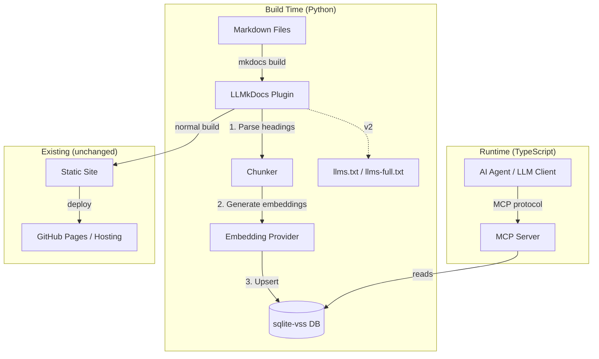
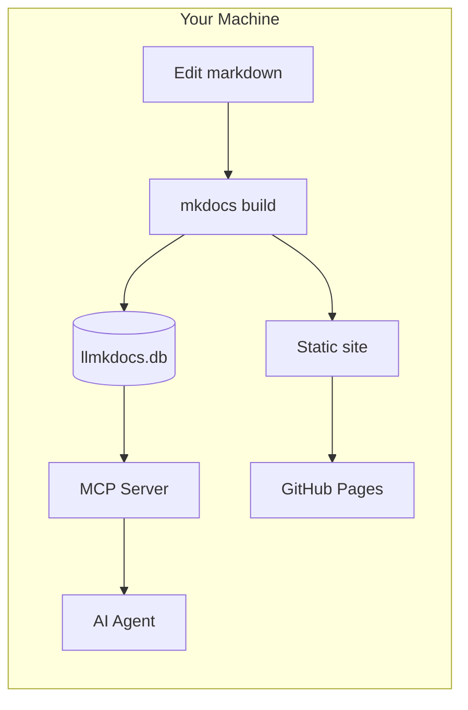
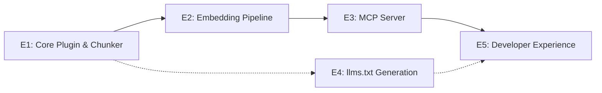

# LLMkDocs — Project Design Doc

*Status: Draft — Step 0 Refinement*
*Created: March 28, 2026*
*Authors: Dan Hannah & Clay*

---

## Overview

### What Is This?

LLMkDocs is an open-source mkdocs plugin that makes documentation queryable by AI agents. When you build your docs, LLMkDocs automatically chunks your markdown by heading hierarchy, generates embeddings, and stores them in a local vector database. It then exposes that database through an MCP server so any LLM client can semantically search your docs on demand — no copy-pasting context, no llms.txt concatenation, no manual curation.

Write markdown → build → agents can query it. That's the entire promise.

### Why This Exists — The Dual-Audience Problem

Documentation has always served one audience: humans. MkDocs, Sphinx, Docusaurus — they're all optimized for human consumption. Beautiful formatting, searchable web pages, nice navigation. And they're great at it.

But now there's a second audience: **AI agents.** And their needs are fundamentally different from humans.

| Need | Human | AI Agent |
|------|-------|----------|
| **Format** | Beautiful HTML, nice typography, nav sidebar | Raw text with metadata — headings, paths, structure |
| **Access pattern** | Browse, scan, read linearly | Query semantically — "find me the section about X" |
| **Volume** | Read one page at a time, skim the rest | Needs targeted chunks — 500 tokens, not 50,000 |
| **Freshness** | Checks docs when they remember to | Needs docs current as of the last build, every session |
| **Context** | Carries knowledge between reading sessions | **Starts from zero every session** — the cold start problem |

LLMkDocs bridges this gap. **The human gets mkdocs** — the same beautiful, browsable site they've always had. **The agent gets an MCP server** — semantic search over the same content, returning exactly the chunks it needs. Both audiences consume the same source of truth, in their optimal format.

### The Collaboration Unlock

This isn't just about agents reading docs. It's about **human-AI collaboration at the documentation layer.**

When a human writes or updates documentation, the agent's knowledge updates automatically on the next build. When an agent needs context for a task, it queries the docs instead of the human copy-pasting 15,000 tokens into a prompt. The documentation becomes the **shared memory** between human and AI — bridging the gap between sessions and solving the cold start problem that plagues every AI workflow.

In the context of [CSDLC](../../methodology/process.md), this transforms **Step 2 (Agent Prompt Crafting)** from manual context curation to agent self-service. Instead of the AI Lead extracting and pasting relevant doc sections into each sub-agent's prompt, sub-agents query the docs themselves and pull exactly what they need. Estimated reduction: 15-20k tokens of pasted context → 500-1,000 tokens of targeted retrieval per query.

### Who Is It For?

**Primary:** Development teams using mkdocs who work with AI agents (coding assistants, CI/CD agents, internal chatbots). Their pain point: agents need documentation context but current options are either "paste the whole doc" (token-expensive, noisy) or "hope the agent figures it out" (unreliable).

**Secondary:** Anyone publishing technical documentation who wants LLM-ready access — open-source projects, internal knowledge bases, API documentation.

**Tertiary (future):** Non-mkdocs documentation platforms. The architecture is designed so the chunking/embedding/MCP layers are independent of mkdocs, but v1 is mkdocs-only.

### Bootstrapping with Existing Projects

LLMkDocs is designed to drop into any existing mkdocs project with zero migration:

1. `pip install llmkdocs`
2. Add the plugin to `mkdocs.yml` (3-5 lines of config)
3. `mkdocs build`
4. Vector DB is generated. Point the MCP server at it. Done.

No restructuring, no special frontmatter, no markdown format changes. If mkdocs can build it, LLMkDocs can index it. This applies to existing projects like our Routr CSDLC docs, internal documentation at work, or any mkdocs site.

### Business Model

**Open-source core (BSD or MIT license).** The plugin, local vector DB, and MCP server are free forever.

**Future monetization options (not v1):**
- **Hosted vector DB** — managed cloud storage so teams don't run local infra
- **Analytics dashboard** — "which docs do agents query most?", "which sections have low retrieval quality?" — helps teams improve their docs
- **Enterprise embedding providers** — plug into Bedrock, Azure OpenAI, private models
- **Team features** — shared vector DBs, access control, audit logs

Monetization is deferred. The goal for v1 is adoption and validation.

---

## Tech Stack

| Layer | Technology | Rationale |
|-------|-----------|-----------|
| Plugin Host | mkdocs (Python) | Existing ecosystem, hook-based plugin API, widely adopted |
| Chunking | Custom (Python) | Heading-hierarchy-aware splitting — no off-the-shelf chunker does this well for markdown |
| Embeddings (default) | `all-MiniLM-L6-v2` via sentence-transformers | **Zero API keys required.** 80MB local model, runs in CI, good quality for bounded-corpus retrieval. |
| Embeddings (optional) | OpenAI `text-embedding-3-small` | Higher quality, requires API key. Configurable upgrade path. |
| Vector DB | sqlite-vss | Zero infrastructure — it's a SQLite extension. Ships as a file. No server process needed. |
| MCP Server | MCP SDK (TypeScript) | Standard MCP protocol, stdio transport for v1. TypeScript because the MCP ecosystem is TS-first. |

### Key Libraries & Dependencies

| Library | Purpose | Notes |
|---------|---------|-------|
| `mkdocs` plugin API | Hook into build lifecycle | `on_page_markdown`, `on_post_build` events |
| `sqlite-vss` | Vector similarity search | SQLite extension — `pip install sqlite-vss` |
| `sentence-transformers` | Local embedding generation | Default provider — no API key needed |
| `openai` (Python) | Optional cloud embeddings | Configurable upgrade for higher quality |
| `@modelcontextprotocol/sdk` | MCP server implementation | TypeScript, stdio transport |
| `better-sqlite3` | MCP server reads sqlite-vss DB | Node.js SQLite driver with extension loading |

### Architecture Decision: Local-First Embeddings

The default embedding model runs locally — no API key, no network calls, no cost per build. This is a deliberate choice:

- **Zero friction adoption:** `pip install llmkdocs` and you're done. No OpenAI account, no API key management, no billing surprises.
- **CI-native:** The 80MB model downloads once and caches. GitHub Actions, GitLab CI, any CI system can run it without secrets.
- **Good enough for docs:** You're searching within a bounded corpus (your own docs), not the entire internet. The quality difference between MiniLM and OpenAI embeddings matters less when the search space is small and well-structured.
- **Upgrade path exists:** Users who want higher quality can switch to OpenAI (or Bedrock, or any provider) with one config line.

### Architecture Decision: Two Languages

The plugin is Python (because mkdocs is Python). The MCP server is TypeScript (because the MCP SDK ecosystem is TypeScript-first and most MCP clients expect Node.js processes). They communicate through the sqlite-vss database file — it's the shared contract.

**Alternative considered:** All-Python (use a Python MCP SDK). Rejected because the Python MCP ecosystem is immature, and agents/clients (Cursor, Claude Desktop, OpenClaw) predominantly speak to TypeScript MCP servers.

**Alternative considered:** All-TypeScript (rewrite the mkdocs integration). Rejected because fighting the mkdocs plugin system from outside Python would be painful and fragile.

---

## System Architecture

### Architecture Diagram



### Layer Descriptions

**Chunker (build-time, Python)**
Parses markdown into semantically meaningful chunks based on heading hierarchy. Each chunk carries metadata: source file path, heading breadcrumb (e.g., `Architecture > Data Flow > Event System`), heading level, position in document, and last-modified timestamp. Chunks are the atomic unit — one chunk = one retrievable piece of context.

**Embedding Provider (build-time, Python)**
Takes chunks and generates vector embeddings. Abstracted behind an interface so providers are swappable. Default: `all-MiniLM-L6-v2` (local, no API key). Optional: OpenAI, Bedrock, or any provider that implements the interface.

**Vector DB (shared, file-based)**
sqlite-vss database file. Contains the chunks table (text, metadata, embedding vector) and the VSS index. This file is the contract between the Python build step and the TypeScript MCP server. It can be committed to a repo, stored as a CI artifact, or synced via any file mechanism.

**MCP Server (runtime, TypeScript)**
Lightweight process that loads the sqlite-vss DB and exposes MCP tools. Agents connect via stdio. The server is **read-only** — it cannot modify the DB, the docs, or anything else.

**llms.txt Generator (build-time, Python)**
Produces `llms.txt` (structured site map with page titles, paths, and one-line descriptions) and `llms-full.txt` (full concatenated content of all pages). These are **fallback formats** for LLM clients that don't support MCP — they provide basic docs access without semantic search. See [llms.txt section](#llmstxt--llms-fulltxt) for details.

### Data Flow

#### Build-Time: Indexing Documentation

```
Author edits docs/architecture.md
    → mkdocs build triggers
    → Plugin re-chunks ALL files (cheap — just string splitting)
    → Compares chunk content_hash against existing DB entries
    → Only re-embeds chunks whose content actually changed (expensive — API/model call)
    → sqlite-vss DB updated via upsert (new/changed chunks inserted, unchanged chunks kept)
    → Stale chunks pruned (chunks from deleted pages/sections removed)
    → llms.txt regenerated
    → Site builds normally to static HTML
```

**Cost implication:** A 200-page docs site might have 1,000 chunks. Editing one page affects ~5 chunks. With diff-based re-embedding, only those 5 chunks get re-embedded — not all 1,000. With the local model (default), this is free. With OpenAI, it's the difference between $0.0001 and $0.02 per build.

#### Runtime: Agent Queries Docs

```
Agent needs context about "data flow"
    → Agent calls MCP tool: search_docs("data flow architecture")
    → MCP server runs vector similarity search against sqlite-vss
    → Returns top-k chunks with metadata and relevance scores
    → Agent gets exactly the context it needs (~500-1000 tokens)
    → vs. old way: human pastes entire doc (~15,000-20,000 tokens)
```

---

## Data Model

### Core Entities

```python
@dataclass
class Chunk:
    """The atomic unit of retrievable documentation."""
    chunk_id: str          # Deterministic hash of file_path + heading_path
    file_path: str         # Relative path within docs/ (e.g., "architecture/data-flow.md")
    heading_path: str      # Breadcrumb (e.g., "Architecture > Data Flow > Event System")
    heading_level: int     # 1-6 (h1-h6)
    content: str           # Raw markdown text of this section
    content_hash: str      # Hash of content — used for diff-based re-embedding
    embedding: list[float] # Vector embedding (384 dims for MiniLM, 1536 for OpenAI)
    nav_path: str          # mkdocs nav position (e.g., "Getting Started > Installation")
    last_modified: str     # ISO timestamp of source file last modification
    char_count: int        # Length of content — useful for token estimation
    
@dataclass
class ChunkMetadata:
    """Returned to agents alongside search results."""
    file_path: str
    heading_path: str
    nav_path: str
    last_modified: str
    relevance_score: float  # Cosine similarity from vector search
```

### SQLite Schema

```sql
CREATE TABLE chunks (
    chunk_id TEXT PRIMARY KEY,
    file_path TEXT NOT NULL,
    heading_path TEXT NOT NULL,
    heading_level INTEGER NOT NULL,
    content TEXT NOT NULL,
    content_hash TEXT NOT NULL,
    nav_path TEXT,
    last_modified TEXT,
    char_count INTEGER
);

-- Metadata table for DB self-description
CREATE TABLE llmkdocs_meta (
    key TEXT PRIMARY KEY,
    value TEXT
);
-- Stores: embedding_model, embedding_dimensions, build_timestamp, mkdocs_version, llmkdocs_version

-- sqlite-vss virtual table for vector search
CREATE VIRTUAL TABLE chunks_vss USING vss0(
    embedding(384)  -- dimension matches embedding model (384 for MiniLM, 1536 for OpenAI)
);
```

### Chunking Strategy

**Split on headings, not token count.** Most RAG systems chunk by fixed token windows (500 tokens, 1000 tokens). This is wrong for documentation because it splits mid-section, losing semantic coherence. LLMkDocs chunks at heading boundaries — each section under a heading becomes one chunk.

**Problem:** Some sections are very long (2000+ tokens). **Solution:** If a chunk exceeds a configurable max (default: 1500 tokens), split at paragraph boundaries within that section. The heading breadcrumb is preserved on all sub-chunks, with a part indicator (e.g., `Architecture > Data Flow [part 2/3]`).

**Problem:** Some sections are very short (a single sentence under an h4). **Solution:** Optionally merge short chunks upward into their parent heading's chunk. Configurable — some users want granular, some want consolidated.

---

## MCP Tool Surface

### v1 Tools (MVP)

| Tool | Description | Parameters | Returns |
|------|-------------|-----------|---------|
| `search_docs` | Semantic search across all documentation | `query: string`, `top_k?: number` (default 5), `file_filter?: string` (glob pattern) | Array of `{ content, metadata, score }` |
| `get_page` | Retrieve full page content by file path | `file_path: string` | `{ content, metadata, chunks[] }` |
| `get_section` | Retrieve a specific section by heading path | `file_path: string`, `heading_path: string` | `{ content, metadata }` |
| `list_pages` | List all pages with nav structure | `prefix?: string` (filter by path prefix) | Array of `{ file_path, nav_path, title, chunk_count }` |

### Explicitly Out of Scope: Write Tools

v1 is **read-only**. There is no `create_page` or `update_section` MCP tool. Rationale:

- Write tools would require the MCP server to have filesystem access to the markdown source — breaking the clean read-only security model
- Agents can already write markdown files through their normal filesystem access (they don't need MCP for that)
- The MCP server's job is **retrieval**, not authoring
- A write layer would effectively be a docs CMS — a much larger product scope

If write tools are added in the future, they would write to markdown source and trigger a rebuild, not directly modify the vector DB.

### v2 Tools (Future)

| Tool | Description | Notes |
|------|-------------|-------|
| `get_related` | Find pages related to a given page | Based on embedding similarity between page-level vectors |
| `get_changelog` | What changed since a given date | Git-backed, shows which sections were modified |
| `search_by_tag` | Filter by frontmatter tags/categories | Requires metadata extraction from frontmatter |

### Tool Design Principles

- **`search_docs` is the workhorse.** 80% of agent queries will use this. It must be fast and relevant.
- **`get_page` is the fallback.** When an agent knows exactly what file it needs, don't make it search.
- **`get_section` is surgical precision.** When an agent knows exactly what heading it wants.
- **`list_pages` is discovery.** An agent can browse the doc structure before querying.

---

## llms.txt & llms-full.txt

### What Are These?

`llms.txt` is an [emerging convention](https://llmstxt.org/) for making website content accessible to LLMs. LLMkDocs generates two files:

- **`llms.txt`** — A structured site map listing every page with its title, path, and a one-line description. Think `robots.txt` but for LLMs. An agent reads this to understand what documentation exists and where it lives.
- **`llms-full.txt`** — The full content of every page concatenated into one text file, with page boundaries marked by headers.

### Why Include This?

Not all LLM clients support MCP. Some can only read files or URLs. `llms.txt` gives them *something* — basic access to your docs without semantic search.

### The Limitation (Why MCP Is Better)

`llms-full.txt` for a medium docs site might be 50,000+ tokens. An agent consuming it gets everything whether it needs it or not. That's expensive, noisy, and often exceeds context windows.

MCP search returns 500-1,000 targeted tokens per query. That's the difference — and why MCP is the primary interface, with llms.txt as the fallback.

### MVP Scope Decision

**Deferred to v2.** llms.txt generation is not included in the v1 MVP. The core value prop is MCP semantic search — llms.txt serves a different audience (non-MCP clients) that we're not targeting yet. When we're ready to share LLMkDocs with the broader community, llms.txt becomes a valuable adoption tool. For now, it's overhead.

---

## Configuration

### mkdocs.yml Integration

```yaml
plugins:
  - llmkdocs:
      # Embedding provider (default: local model, no API key needed)
      embedding_provider: local           # local | openai | bedrock
      # embedding_model: text-embedding-3-small  # only needed for non-local providers
      # embedding_api_key_env: OPENAI_API_KEY     # only needed for non-local providers
      
      # Chunking
      max_chunk_tokens: 1500              # Split oversized sections
      merge_short_chunks: true            # Merge tiny sections into parent
      min_chunk_tokens: 50                # Threshold for "too short"
      
      # Output
      db_path: site/llmkdocs.db           # Where to write the sqlite-vss DB
      generate_llms_txt: true             # Also produce llms.txt / llms-full.txt
      
      # MCP server config (written to site/llmkdocs-mcp.json)
      mcp_server:
        transport: stdio                  # stdio | sse (future)
        default_top_k: 5
```

### Minimal Config (Zero-Config Start)

```yaml
plugins:
  - llmkdocs
```

That's it. All defaults apply: local embeddings, 1500 max tokens, DB written to `site/llmkdocs.db`. **No API key required.**

### MCP Server Config (for LLM clients)

```json
{
  "mcpServers": {
    "llmkdocs": {
      "command": "npx",
      "args": ["llmkdocs-mcp", "--db", "./site/llmkdocs.db"],
      "transport": "stdio"
    }
  }
}
```

---

## Deployment & Access Model

### How It Works: Local-First (v1)

The v1 deployment model is **local-first.** The plugin runs wherever you build your docs, and the MCP server runs wherever your agents run — typically the same machine.



**There is no hosted component in v1.** The vector DB is a local file. The MCP server is a local process. The static site still deploys to GitHub Pages (or wherever) as normal — that part is completely unchanged.

### Keeping the DB Fresh

When you edit docs and rebuild, the DB updates in place. The MCP server reads the DB on each query (no caching in v1), so agents automatically get fresh results after a rebuild.

**"Do I need to pull main every time docs change?"** Depends on your workflow:

| Scenario | How DB Stays Fresh |
|----------|--------------------|
| **Solo dev, local docs** | You edit and build locally. DB updates automatically. Zero friction. |
| **Team, shared repo** | Pull latest, run `mkdocs build`. DB regenerates from source. |
| **CI-built DB** | GitHub Actions builds the DB and commits it (or uploads as artifact). Pull to get latest. |
| **Hosted DB (v2)** | DB pushed to cloud storage on build. MCP server reads from remote. No local sync needed. |

**For our use case (CSDLC docs, solo dev, local agents): Option 1.** You build locally, DB is right there. No syncing needed.

**For team use (GMPPU): Option 2 or 3.** Team members pull and build, or CI builds the DB for them. v2 would add hosted DB for zero-sync team access.

### Staleness Detection

A real risk: the DB gets out of sync with the docs because someone forgot to rebuild after editing. LLMkDocs handles this with **two safeguards:**

**1. Git hook (automatic rebuild on pull)**
A `post-merge` git hook in the docs repo auto-runs `mkdocs build` whenever you `git pull`. You can't forget because it happens automatically.

```bash
# .git/hooks/post-merge
#!/bin/sh
mkdocs build --quiet
```

**2. DB freshness check (runtime warning)**
The MCP server stores a `build_timestamp` and `source_git_commit` in the DB metadata table. On each query, it can compare against the current git state of the docs directory. If the DB is stale (docs have changed since the last build), the MCP server returns a warning alongside results:

```json
{
  "warning": "Docs DB is 3 commits behind source. Run `mkdocs build` to update.",
  "results": [ ... ]
}
```

The agent can then auto-rebuild before continuing, or surface the warning to the human.

**3. Session start ritual**
In CSDLC workflows, the AI Lead's standup checklist (AGENTS.md) includes "check docs DB freshness" as a boot step. If stale, rebuild before proceeding. This is the human-process layer backing up the automated layer.

### Branch Handling

**v1: The DB reflects whatever branch you build.** Run `mkdocs build` on `main`, you get main's DB. Run it on a feature branch, you get that branch's DB. The DB is just a build artifact — it has no branch awareness.

**v2 (future):** Versioned DBs — maintain separate vector stores per branch/tag. MCP server accepts a `version` parameter. Enables agents to query docs from a specific release or compare branches.

### Environments

| Environment | What Happens | Deploy Trigger |
|-------------|-------------|---------------|
| Local (`mkdocs serve`) | Plugin watches for changes, re-chunks and re-embeds on save. MCP server runs alongside. | `mkdocs serve` |
| CI/CD (`mkdocs build`) | Plugin builds full vector DB as a build artifact. DB can be committed, uploaded, or downloaded. | Push to main / PR merge |
| GitHub Pages | Static site deploys as normal. **Vector DB is NOT served via Pages** — it's a separate artifact. | GitHub Actions |

### Infrastructure Dependencies

| Dependency | Required? | What Breaks Without It |
|-----------|-----------|----------------------|
| Python + mkdocs | Yes | It's a plugin for mkdocs |
| sqlite-vss Python extension | Yes (build-time) | Can't write vector DB |
| sentence-transformers (default) | Yes (build-time, if using local embeddings) | Can't generate embeddings. ~80MB model download on first build, cached after. |
| OpenAI API (if configured) | Only if `embedding_provider: openai` | Can't generate embeddings. Build fails with clear error. |
| Node.js + sqlite-vss | Yes (MCP server runtime) | Can't run similarity search |

---

## Security Model

### API Key Management

- **Default config requires zero API keys.** Local embeddings model runs entirely offline.
- If a cloud provider is configured, API keys are referenced by environment variable name — **never** stored in config files.
- The MCP server does **not** need API keys — it only reads the pre-built DB.

### Data Sensitivity

- The vector DB contains your documentation content in plain text (it has to — that's what gets returned to agents).
- If your docs are private/internal, the DB file should be treated with the same access controls as the docs themselves.
- **Don't commit the DB to a public repo if your docs are private.**

### Public vs. Private Documentation

LLMkDocs doesn't manage access control — it inherits whatever access model your docs repo uses. Some considerations:

- **Public repo, public docs:** No concerns. The DB contains the same content that's already public.
- **Private repo, private docs:** DB should also be private. Don't publish it as a public artifact.
- **Mixed (some public, some private):** Not supported in v1. Either all docs are indexed or none. v2 could support per-page or per-directory inclusion/exclusion via config.

!!! note "Splitting Public and Private"
    If you want some docs public (e.g., methodology, process) and others private (e.g., project implementations), the recommended approach is **separate repos** — a public repo for shareable content and a private repo for project-specific docs. Each gets its own LLMkDocs instance and vector DB.

### Trust Boundaries

- The MCP server is **read-only**. It cannot modify the DB, the docs, or anything else.
- stdio transport means the MCP server only communicates with its parent process (the agent/client). No network exposure.
- Future SSE transport would require authentication — deferred to v2.

---

## Cross-Cutting Concerns

| Concern | Summary | Affected Areas |
|---------|---------|---------------|
| **Embedding model portability** | DB stores model name + dimensions in metadata. Switching models requires full re-embed (detected automatically). | Chunker, Embedding Provider, DB schema |
| **Chunk quality** | Bad chunks = bad retrieval. This is the single biggest quality lever. | Chunker, all MCP tools |
| **Two-language split** | Python plugin + TypeScript MCP server adds complexity. Shared contract is the DB schema. | Build system, MCP server, testing |
| **sqlite-vss portability** | C extension — needs to compile on target platform. May be friction on some systems. | Installation, CI |
| **First build model download** | Default local model is ~80MB. First build takes longer (download + cache). Subsequent builds are fast. | DX, CI caching |
| **DB staleness** | If docs change but the DB isn't rebuilt, agents query stale content. Mitigated by git hooks, runtime freshness checks, and session start rituals. | MCP Server, Deployment, AGENTS.md |

---

## Risks & Constraints

### Technical Risks

| Risk | Likelihood | Impact | Mitigation |
|------|-----------|--------|------------|
| sqlite-vss installation friction (C extension compilation) | Medium | High (blocks adoption) | Ship pre-built wheels, document fallbacks. Consider ChromaDB as alternative backend. |
| sentence-transformers dependency size (~500MB with PyTorch) | Medium | Medium (slow first install) | Document the weight. Consider ONNX runtime for lighter inference. |
| Embedding model changes break existing DBs | Low | Medium | Store model name + dimensions in DB metadata. Detect mismatch and prompt full re-embed. |
| Chunk quality is poor for unusual doc structures | Medium | High (core value prop) | Extensive testing with real-world docs. Configurable chunking params. |
| Two-language maintenance burden | Medium | Medium | Clear contract (DB schema). Separate test suites. Consider all-TS rewrite if Python side stays thin. |

### Known Limitations (v1)

- **mkdocs only** — no Sphinx, Docusaurus, VitePress support
- **Local MCP only** — stdio transport, no remote/hosted access
- **Read-only** — no write tools, agents can't create/update docs via MCP
- **No branch awareness** — DB reflects whatever branch was built, no version switching
- **No per-page access control** — all docs in the mkdocs project are indexed, or none
- **English-optimized** — embedding models work best with English. Multilingual is possible but untested.
- **No incremental watch mode for MCP server** — if DB is rebuilt, MCP server reads stale data until next query (acceptable for v1 since reads are per-query, not cached)

### Tech Debt (Accepted for MVP)

- No caching layer between DB and MCP server (fine for local, problem for hosted)
- Only two embedding providers implemented (local + OpenAI). Interface exists for more.
- llms.txt generation may be deferred (separate code path from chunker)

---

## Epic Index

| Epic | Doc | Status | Summary |
|------|-----|--------|---------|
| E1: Core Plugin & Chunker | [link](epics/core-plugin.md) | Not started | mkdocs plugin skeleton, heading-based chunker, sqlite-vss writer |
| E2: Embedding Pipeline | [link](epics/embedding-pipeline.md) | Not started | Provider abstraction, local model (default), OpenAI (optional), diff-based re-embedding |
| E3: MCP Server | [link](epics/mcp-server.md) | Not started | TypeScript MCP server, 4 tools, stdio transport |
| E4: llms.txt Generation | [link](epics/llms-txt.md) | **Deferred to v2** | Auto-generate llms.txt and llms-full.txt — not needed for v1 (MCP is the primary interface) |
| E5: Developer Experience | [link](epics/developer-experience.md) | Not started | CLI commands, status output, error messages, README, quickstart |

### Dependency Graph



- **E1 → E2** is serial (need chunks before you can embed them)
- **E2 → E3** is serial (need a populated DB before MCP server can query it)
- **E4** is deferred to v2 (llms.txt not needed for v1)
- **E5** is last (polishes the entire pipeline)

**MVP critical path:** E1 → E2 → E3 → E5 (4 epics, serial)

---

## Decisions Log

| Date | Decision | Rationale | Alternatives Considered |
|------|----------|-----------|------------------------|
| 2026-03-28 | mkdocs plugin, not fork | Maintain less code, leverage existing ecosystem, easier adoption | Full fork (rejected: maintenance burden), standalone tool (rejected: misses mkdocs integration) |
| 2026-03-28 | sqlite-vss for vector DB | Zero infrastructure, file-based, portable | ChromaDB (heavier, requires server), Pinecone (cloud-only, paid), pgvector (requires Postgres) |
| 2026-03-28 | Two languages (Python + TypeScript) | Play to each ecosystem's strength | All-Python (immature MCP SDK), All-TypeScript (fighting mkdocs from outside) |
| 2026-03-28 | Open-source core, BSD license | Maximize adoption, monetize hosted/enterprise later | Closed source (rejected: dev tools need adoption), AGPL (rejected: scares enterprise) |
| 2026-03-28 | Heading-based chunking, not token-window | Preserves semantic coherence of doc sections | Fixed token windows (rejected: splits mid-section), page-level (rejected: too coarse) |
| 2026-03-28 | Diff-based re-embedding | Only re-embed changed content — saves cost and time | Full re-embed on every build (rejected: wasteful for large sites) |
| 2026-03-28 | Docs-first, code support deferred to v2 | Docs are structured for humans, easier to chunk well. Code needs AST-aware chunking — different problem. | Code + docs in v1 (rejected: scope creep, different chunking strategies) |
| 2026-03-28 | Develop alongside QuoteAI | Dogfooding from day one — QuoteAI docs are the first content, QuoteAI agents are the first consumers | Build in isolation (rejected: no feedback loop) |
| 2026-03-28 | Local embedding model as default | Zero API keys, zero cost, runs in CI, good enough for bounded-corpus retrieval | OpenAI as default (rejected: friction — requires account, API key, costs money) |
| 2026-03-28 | Read-only MCP server, no write tools | Clean security model, agents already have filesystem access for writing | Read-write MCP (rejected: scope creep, different product — a docs CMS) |
| 2026-03-28 | Local-first deployment for v1 | Simplest model — build locally, DB is a file, MCP server reads it | Cloud-hosted DB (rejected for v1: premature infrastructure) |
| 2026-03-28 | v1 has no branch awareness | DB reflects whatever branch is built. Versioned DBs deferred to v2. | Multi-branch support (rejected: complexity not justified for solo/small team use) |
| 2026-03-28 | Defer llms.txt to v2 | v1 targets MCP-capable clients (OpenClaw, Cursor, Claude Desktop). llms.txt serves non-MCP clients we're not targeting yet. | Include in v1 (rejected: extra code path, no immediate consumer) |
| 2026-03-28 | No MCP write tools | Agents already have filesystem access for writing docs. MCP write adds indirection without capability. Read-only is cleaner. | Read-write MCP (rejected: moot for local agents, scope creep toward docs CMS) |
| 2026-03-28 | Staleness detection (git hook + runtime check) | Forgetting to rebuild is a real risk. Git hooks automate it, runtime checks catch edge cases. | Manual rebuild only (rejected: humans forget), auto-rebuild on query (rejected: too magical, unexpected build times) |

---

## Glossary

| Term | Definition |
|------|-----------|
| **Chunk** | A semantically meaningful section of documentation, typically defined by heading boundaries. The atomic unit of retrieval. |
| **Embedding** | A vector representation of text that captures semantic meaning. Enables similarity search — "find docs about X" without keyword matching. |
| **Vector DB** | A database optimized for storing and searching vector embeddings. sqlite-vss is the local/file-based option. |
| **MCP** | Model Context Protocol — a standard for LLM clients to connect to external tools and data sources. |
| **llms.txt** | An emerging convention for making website content LLM-accessible. A site map with descriptions (llms.txt) and full content dump (llms-full.txt). |
| **RAG** | Retrieval-Augmented Generation — the pattern of searching for relevant context before generating a response. LLMkDocs enables RAG over documentation. |
| **Diff-based re-embedding** | Only regenerating embeddings for chunks whose content has changed since the last build. Saves API cost and build time. |
| **stdio transport** | MCP communication over standard input/output pipes. The simplest transport — agent spawns the MCP server as a child process. |
| **Cold start problem** | AI agents start every session with zero context. Without documentation access, they either get context copy-pasted (expensive) or guess (unreliable). |

---

*This design doc is the source of truth for LLMkDocs project architecture. Epic-level details will live in `epics/`. Update this doc when architecture changes.*
