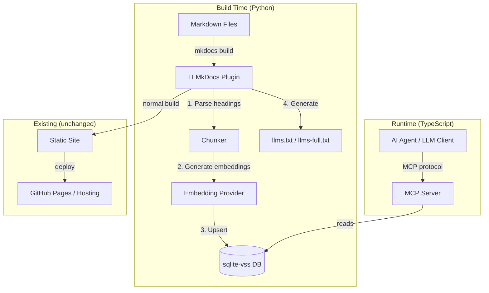
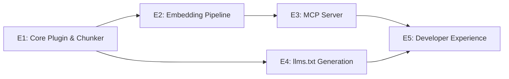

# LLMkDocs — Project Design Doc

*Status: Draft — Step 0 Refinement*
*Created: March 28, 2026*
*Authors: Dan Hannah & Clay*

---

## Overview

### What Is This?

LLMkDocs is an open-source mkdocs plugin that makes documentation queryable by AI agents. When you build your docs, LLMkDocs automatically chunks your markdown by heading hierarchy, generates embeddings, and stores them in a local vector database. It then exposes that database through an MCP server so any LLM client can semantically search your docs on demand — no copy-pasting context, no llms.txt concatenation, no manual curation.

Write markdown → build → agents can query it. That's the entire promise.

### Who Is It For?

**Primary:** Development teams using mkdocs who work with AI agents (coding assistants, CI/CD agents, internal chatbots). Their pain point: agents need documentation context but current options are either "paste the whole doc" (token-expensive, noisy) or "hope the agent figures it out" (unreliable).

**Secondary:** Anyone publishing technical documentation who wants LLM-ready access — open-source projects, internal knowledge bases, API documentation.

**Tertiary (future):** Non-mkdocs documentation platforms. The architecture is designed so the chunking/embedding/MCP layers are independent of mkdocs, but v1 is mkdocs-only.

### Business Model

**Open-source core (BSD or MIT license).** The plugin, local vector DB, and MCP server are free forever.

**Future monetization options (not v1):**
- **Hosted vector DB** — managed cloud storage so teams don't run local infra
- **Analytics dashboard** — "which docs do agents query most?", "which sections have low retrieval quality?" — helps teams improve their docs
- **Enterprise embedding providers** — plug into Bedrock, Azure OpenAI, private models
- **Team features** — shared vector DBs, access control, audit logs

Monetization is deferred. The goal for v1 is adoption and validation.

---

## Tech Stack

| Layer | Technology | Rationale |
|-------|-----------|-----------|
| Plugin Host | mkdocs (Python) | Existing ecosystem, hook-based plugin API, Dan's team already uses it |
| Chunking | Custom (Python) | Heading-hierarchy-aware splitting — no off-the-shelf chunker does this well for markdown |
| Embeddings | OpenAI `text-embedding-3-small` (default) | Best price/performance ratio, widely available. Pluggable — provider is configurable. |
| Vector DB | sqlite-vss | Zero infrastructure — it's a SQLite extension. Ships as a file. No server process needed. |
| MCP Server | MCP SDK (TypeScript) | Standard MCP protocol, stdio transport for v1. TypeScript because the MCP ecosystem is TS-first. |
| llms.txt | Auto-generated | Plugin generates llms.txt / llms-full.txt as a build artifact alongside the vector DB |

### Key Libraries & Dependencies

| Library | Purpose | Notes |
|---------|---------|-------|
| `mkdocs` plugin API | Hook into build lifecycle | `on_page_markdown`, `on_post_build` events |
| `sqlite-vss` | Vector similarity search | SQLite extension — `pip install sqlite-vss` |
| `openai` (Python) | Embedding generation | Default provider; abstracted behind an interface |
| `@modelcontextprotocol/sdk` | MCP server implementation | TypeScript, stdio transport |
| `better-sqlite3` | MCP server reads sqlite-vss DB | Node.js SQLite driver with extension loading |

### Architecture Decision: Two Languages

The plugin is Python (because mkdocs is Python). The MCP server is TypeScript (because the MCP SDK ecosystem is TypeScript-first and most MCP clients expect Node.js processes). They communicate through the sqlite-vss database file — it's the shared contract.

**Alternative considered:** All-Python (use a Python MCP SDK). Rejected because the Python MCP ecosystem is immature, and agents/clients (Cursor, Claude Desktop, OpenClaw) predominantly speak to TypeScript MCP servers.

**Alternative considered:** All-TypeScript (rewrite the mkdocs integration). Rejected because fighting the mkdocs plugin system from outside Python would be painful and fragile.

---

## System Architecture

### Architecture Diagram



### Layer Descriptions

**Chunker (build-time, Python)**
Parses markdown into semantically meaningful chunks based on heading hierarchy. Each chunk carries metadata: source file path, heading breadcrumb (e.g., `Architecture > Data Flow > Event System`), heading level, position in document, and last-modified timestamp. Chunks are the atomic unit — one chunk = one retrievable piece of context.

**Embedding Provider (build-time, Python)**
Takes chunks and generates vector embeddings. Abstracted behind an interface so providers are swappable (OpenAI, Bedrock, local models). Default: OpenAI `text-embedding-3-small` (1536 dimensions, $0.02/1M tokens — a typical docs site costs fractions of a cent to embed).

**Vector DB (shared, file-based)**
sqlite-vss database file. Contains the chunks table (text, metadata, embedding vector) and the VSS index. This file is the contract between the Python build step and the TypeScript MCP server. It can be committed to a repo, stored as a CI artifact, or synced via any file mechanism.

**MCP Server (runtime, TypeScript)**
Lightweight process that loads the sqlite-vss DB and exposes MCP tools. Agents connect via stdio. The server is stateless — it just reads the DB.

**llms.txt Generator (build-time, Python)**
Produces `llms.txt` (site map with page summaries) and `llms-full.txt` (full concatenated content) as build artifacts. This is the "dumb" fallback for clients that don't support MCP — they can still consume the docs, just not semantically.

### Data Flow

```
Author edits docs/architecture.md
    → mkdocs build triggers
    → Plugin detects changed file
    → Chunker splits into sections by heading
    → Only changed chunks get re-embedded (diff-based)
    → sqlite-vss DB updated (upsert by chunk ID)
    → llms.txt regenerated
    → Site builds normally to static HTML

Agent needs context about "data flow"
    → Agent calls MCP tool: search_docs("data flow architecture")
    → MCP server runs vector similarity search
    → Returns top-k chunks with metadata and relevance scores
    → Agent gets exactly the context it needs (~500-1000 tokens)
    → vs. old way: human pastes entire doc (~15,000-20,000 tokens)
```

---

## Data Model

### Core Entities

```python
@dataclass
class Chunk:
    """The atomic unit of retrievable documentation."""
    chunk_id: str          # Deterministic hash of file_path + heading_path
    file_path: str         # Relative path within docs/ (e.g., "architecture/data-flow.md")
    heading_path: str      # Breadcrumb (e.g., "Architecture > Data Flow > Event System")
    heading_level: int     # 1-6 (h1-h6)
    content: str           # Raw markdown text of this section
    content_hash: str      # Hash of content — used for diff-based re-embedding
    embedding: list[float] # Vector embedding (1536 dims for text-embedding-3-small)
    nav_path: str          # mkdocs nav position (e.g., "Getting Started > Installation")
    last_modified: str     # ISO timestamp of source file last modification
    char_count: int        # Length of content — useful for token estimation
    
@dataclass
class ChunkMetadata:
    """Returned to agents alongside search results."""
    file_path: str
    heading_path: str
    nav_path: str
    last_modified: str
    relevance_score: float  # Cosine similarity from vector search
```

### SQLite Schema

```sql
CREATE TABLE chunks (
    chunk_id TEXT PRIMARY KEY,
    file_path TEXT NOT NULL,
    heading_path TEXT NOT NULL,
    heading_level INTEGER NOT NULL,
    content TEXT NOT NULL,
    content_hash TEXT NOT NULL,
    nav_path TEXT,
    last_modified TEXT,
    char_count INTEGER
);

-- sqlite-vss virtual table for vector search
CREATE VIRTUAL TABLE chunks_vss USING vss0(
    embedding(1536)  -- dimension matches embedding model
);
```

### Chunking Strategy

**Split on headings, not token count.** Most RAG systems chunk by fixed token windows (500 tokens, 1000 tokens). This is wrong for documentation because it splits mid-section, losing semantic coherence. LLMkDocs chunks at heading boundaries — each section under a heading becomes one chunk.

**Problem:** Some sections are very long (2000+ tokens). **Solution:** If a chunk exceeds a configurable max (default: 1500 tokens), split at paragraph boundaries within that section. The heading breadcrumb is preserved on all sub-chunks.

**Problem:** Some sections are very short (a single sentence under an h4). **Solution:** Optionally merge short chunks upward into their parent heading's chunk. Configurable — some users want granular, some want consolidated.

---

## MCP Tool Surface

### v1 Tools (MVP)

| Tool | Description | Parameters | Returns |
|------|-------------|-----------|---------|
| `search_docs` | Semantic search across all documentation | `query: string`, `top_k?: number` (default 5), `file_filter?: string` (glob pattern) | Array of `{ content, metadata, score }` |
| `get_page` | Retrieve full page content by file path | `file_path: string` | `{ content, metadata, chunks[] }` |
| `get_section` | Retrieve a specific section by heading path | `file_path: string`, `heading_path: string` | `{ content, metadata }` |
| `list_pages` | List all pages with nav structure | `prefix?: string` (filter by path prefix) | Array of `{ file_path, nav_path, title, chunk_count }` |

### v2 Tools (Future)

| Tool | Description | Notes |
|------|-------------|-------|
| `get_related` | Find pages related to a given page | Based on embedding similarity between page-level vectors |
| `get_changelog` | What changed since a given date | Git-backed, shows which sections were modified |
| `search_by_tag` | Filter by frontmatter tags/categories | Requires metadata extraction from frontmatter |

### Tool Design Principles

- **`search_docs` is the workhorse.** 80% of agent queries will use this. It must be fast and relevant.
- **`get_page` is the fallback.** When an agent knows exactly what file it needs, don't make it search.
- **`get_section` is surgical precision.** When an agent knows exactly what heading it wants.
- **`list_pages` is discovery.** An agent can browse the doc structure before querying.

---

## Configuration

### mkdocs.yml Integration

```yaml
plugins:
  - llmkdocs:
      # Embedding provider
      embedding_provider: openai          # openai | bedrock | local
      embedding_model: text-embedding-3-small
      embedding_api_key_env: OPENAI_API_KEY  # env var name (never hardcoded)
      
      # Chunking
      max_chunk_tokens: 1500              # Split oversized sections
      merge_short_chunks: true            # Merge tiny sections into parent
      min_chunk_tokens: 50                # Threshold for "too short"
      
      # Output
      db_path: site/llmkdocs.db           # Where to write the sqlite-vss DB
      generate_llms_txt: true             # Also produce llms.txt / llms-full.txt
      
      # MCP server config (written to site/llmkdocs-mcp.json)
      mcp_server:
        transport: stdio                  # stdio | sse (future)
        default_top_k: 5
```

### MCP Server Config

```json
{
  "mcpServers": {
    "llmkdocs": {
      "command": "npx",
      "args": ["llmkdocs-mcp", "--db", "./site/llmkdocs.db"],
      "transport": "stdio"
    }
  }
}
```

---

## Deployment & Infrastructure

### Environments

| Environment | What Happens | Deploy Trigger |
|-------------|-------------|---------------|
| Local (`mkdocs serve`) | Plugin watches for changes, re-chunks and re-embeds on save. MCP server runs alongside. | `mkdocs serve` |
| CI/CD (`mkdocs build`) | Plugin builds full vector DB as a build artifact. DB can be committed or uploaded. | Push to main / PR merge |
| GitHub Pages | Static site deploys as normal. Vector DB is a separate artifact (not served via Pages). | GitHub Actions |

### How Agents Access the DB

**Local development:** MCP server reads DB from local filesystem. Agent and MCP server on same machine.

**CI/CD:** DB file is a build artifact. Download it and point a local MCP server at it. Or commit it to the repo.

**Hosted (v2):** DB is pushed to a cloud vector store. MCP server runs as a service with an SSE endpoint. Agents connect remotely.

### Infrastructure Dependencies

| Dependency | Required? | What Breaks Without It |
|-----------|-----------|----------------------|
| OpenAI API (or configured provider) | Yes (build-time only) | Can't generate embeddings. Build fails with clear error. |
| sqlite-vss Python extension | Yes (build-time) | Can't write vector DB. |
| sqlite-vss Node extension | Yes (MCP server runtime) | Can't run similarity search. |
| mkdocs | Yes | It's a plugin for mkdocs. |

---

## Security Model

### API Key Management

- Embedding API keys are **never** stored in config files. They're referenced by environment variable name.
- The plugin reads `OPENAI_API_KEY` (or configured env var) at build time only.
- The MCP server does **not** need API keys — it only reads the pre-built DB.

### Data Sensitivity

- The vector DB contains your documentation content in plain text (it has to — that's what gets returned to agents).
- If your docs are private/internal, the DB file should be treated with the same access controls as the docs themselves.
- Don't commit the DB to a public repo if your docs are private.

### Trust Boundaries

- The MCP server is read-only. It cannot modify the DB, the docs, or anything else.
- stdio transport means the MCP server only communicates with its parent process (the agent/client). No network exposure.
- Future SSE transport would require authentication — deferred to v2.

---

## Cross-Cutting Concerns

| Concern | Summary | Affected Areas |
|---------|---------|---------------|
| **Embedding cost** | Every build that changes content costs API calls. Diff-based re-embedding minimizes this. | Chunker, Embedding Provider |
| **Chunk quality** | Bad chunks = bad retrieval. This is the single biggest quality lever. | Chunker, all MCP tools |
| **Two-language split** | Python plugin + TypeScript MCP server adds complexity. Shared contract is the DB schema. | Build system, MCP server, testing |
| **sqlite-vss portability** | C extension — needs to compile on target platform. May be friction on some systems. | Installation, CI |

---

## Risks & Constraints

### Technical Risks

| Risk | Likelihood | Impact | Mitigation |
|------|-----------|--------|------------|
| sqlite-vss installation friction (C extension compilation) | Medium | High (blocks adoption) | Ship pre-built wheels, document fallbacks. Consider ChromaDB as alternative backend. |
| Embedding model changes break existing DBs | Low | Medium | Store model name + dimensions in DB metadata. Detect mismatch and prompt full re-embed. |
| Chunk quality is poor for unusual doc structures | Medium | High (core value prop) | Extensive testing with real-world docs. Configurable chunking params. |
| Two-language maintenance burden | Medium | Medium | Clear contract (DB schema). Separate test suites. Consider all-TS rewrite if Python side stays thin. |
| OpenAI rate limits on large doc sites | Low | Low | Batch embedding calls. Diff-based to minimize API calls. |

### Known Limitations (v1)

- **mkdocs only** — no Sphinx, Docusaurus, VitePress support
- **Local MCP only** — stdio transport, no remote/hosted access
- **English-optimized** — embedding models work best with English. Multilingual is possible but untested.
- **No incremental watch mode for MCP server** — if DB is rebuilt, MCP server must be restarted (or it reads stale data). Fix in v2 with file watching.

### Tech Debt (Accepted for MVP)

- No caching layer between DB and MCP server (fine for local, problem for hosted)
- No embedding provider abstraction beyond OpenAI (interface exists, only one implementation)
- llms.txt generation is a separate code path from the chunker (should share the content extraction)

---

## Epic Index

| Epic | Doc | Status | Summary |
|------|-----|--------|---------|
| E1: Core Plugin & Chunker | [link](epics/core-plugin.md) | Not started | mkdocs plugin skeleton, heading-based chunker, sqlite-vss writer |
| E2: Embedding Pipeline | [link](epics/embedding-pipeline.md) | Not started | Provider abstraction, OpenAI implementation, diff-based re-embedding |
| E3: MCP Server | [link](epics/mcp-server.md) | Not started | TypeScript MCP server, 4 tools, stdio transport |
| E4: llms.txt Generation | [link](epics/llms-txt.md) | Not started | Auto-generate llms.txt and llms-full.txt from doc content |
| E5: Developer Experience | [link](epics/developer-experience.md) | Not started | CLI commands, status output, error messages, README, quickstart |

### Dependency Graph



- **E1 → E2** is serial (need chunks before you can embed them)
- **E2 → E3** is serial (need a populated DB before MCP server can query it)
- **E4** can run in parallel with E2/E3 (shares the chunker, different output)
- **E5** is last (polishes the entire pipeline)

---

## Decisions Log

| Date | Decision | Rationale | Alternatives Considered |
|------|----------|-----------|------------------------|
| 2026-03-28 | mkdocs plugin, not fork | Maintain less code, leverage existing ecosystem, easier adoption | Full fork (rejected: maintenance burden), standalone tool (rejected: misses mkdocs integration) |
| 2026-03-28 | sqlite-vss for vector DB | Zero infrastructure, file-based, portable | ChromaDB (heavier, requires server), Pinecone (cloud-only, paid), pgvector (requires Postgres) |
| 2026-03-28 | Two languages (Python + TypeScript) | Play to each ecosystem's strength | All-Python (immature MCP SDK), All-TypeScript (fighting mkdocs from outside) |
| 2026-03-28 | Open-source core, BSD license | Maximize adoption, monetize hosted/enterprise later | Closed source (rejected: dev tools need adoption), AGPL (rejected: scares enterprise) |
| 2026-03-28 | Heading-based chunking, not token-window | Preserves semantic coherence of doc sections | Fixed token windows (rejected: splits mid-section), page-level (rejected: too coarse) |
| 2026-03-28 | Diff-based re-embedding | Only re-embed changed content — saves cost and time | Full re-embed on every build (rejected: wasteful for large sites) |
| 2026-03-28 | Docs-first, code support deferred to v2 | Docs are structured for humans, easier to chunk well. Code needs AST-aware chunking — different problem. | Code + docs in v1 (rejected: scope creep, different chunking strategies) |
| 2026-03-28 | Develop alongside QuoteAI | Dogfooding from day one — QuoteAI docs are the first content, QuoteAI agents are the first consumers | Build in isolation (rejected: no feedback loop) |

---

## Glossary

| Term | Definition |
|------|-----------|
| **Chunk** | A semantically meaningful section of documentation, typically defined by heading boundaries. The atomic unit of retrieval. |
| **Embedding** | A vector representation of text that captures semantic meaning. Enables similarity search — "find docs about X" without keyword matching. |
| **Vector DB** | A database optimized for storing and searching vector embeddings. sqlite-vss is the local/file-based option. |
| **MCP** | Model Context Protocol — a standard for LLM clients to connect to external tools and data sources. |
| **llms.txt** | An emerging convention for making website content LLM-accessible. A site map with descriptions (llms.txt) and full content dump (llms-full.txt). |
| **RAG** | Retrieval-Augmented Generation — the pattern of searching for relevant context before generating a response. LLMkDocs enables RAG over documentation. |
| **Diff-based re-embedding** | Only regenerating embeddings for chunks whose content has changed since the last build. Saves API cost and build time. |
| **stdio transport** | MCP communication over standard input/output pipes. The simplest transport — agent spawns the MCP server as a child process. |

---

*This design doc is the source of truth for LLMkDocs project architecture. Epic-level details will live in `epics/`. Update this doc when architecture changes.*
