# Validation Pipeline — Epic Design Doc

*Status: 🔄 In Refinement (Step 0)*
*Authors: Dan Hannah & Clay*
*Created: March 23, 2026*

---

## Overview

### What Is This Epic?

The Validation Pipeline is Routr's quality assurance backbone — a multi-layered testing system that ensures the app produces dimensionally accurate, safe G-code for real CNC machines. It bridges the gap between "the app works in the browser" and "this G-code is safe to run on wood."

This is Routr's first forward-looking design doc. Every previous doc was retroactive — reading existing code and documenting what was already built. This one designs before building. That's the CSDLC leveling up.

### Problem Statement

Routr has solid unit test coverage across toolpath generators, coordinate transforms, and SVG parsing. But there is **no automated way to verify that the full pipeline — from board configuration to final G-code output — produces correct results.** And beyond digital verification, there's no formal process for validating that G-code performs correctly on a physical CNC machine.

**What's broken today:**

- A change to the toolpath generator could silently alter G-code output for every operation type, and no test would catch it
- Coordinate system bugs (like the edge treatment flip and kerf line flip) made it to real cuts before being discovered
- The design tab, simulator, and G-code can each show *different* things — a chamfer placed on the top edge in the design tab showed up on the bottom in the sim tab but cut correctly in real life. No automated test catches cross-layer visual inconsistencies.
- There's no "known good" G-code baseline to compare against
- Physical validation cuts have been done ad hoc — no formal protocol, no documented results, no traceability from design dimensions to measured dimensions
- There's no way for AI sub-agents to programmatically interact with the app for testing — all interaction requires UI automation through a human-designed interface

**The deeper problem:**

In an AI-driven development workflow, the AI writes the code — but how does the AI *prove to the human* that the code works? Unit tests are invisible to most humans. The validation pipeline is the mechanism by which the AI demonstrates correctness: "Here's the G-code output, here's what the design tab looks like, here's what the sim looks like, here are the dimensional measurements, and here's how all of these match." The human reviews *evidence*, not code. This shifts the human role from *writing* the proof to *reviewing* the proof — the AI-driven equivalent of test-driven development.

**What triggered this work:**

The coordinate flip bug class — the same category of bug appeared in edge treatments and table saw kerf lines. Both were caught during physical cuts, not by tests. The chamfer top/bottom flip between design and sim tabs proved that **G-code correctness alone isn't sufficient** — visual consistency across the app's layers matters too. With launch approaching, the question is: what else might be wrong that we haven't cut yet?

### Goals

- Define the complete validation pipeline from automated tests to physical verification
- Establish integration tests driven by JSON test fixtures that validate G-code output, 2D canvas rendering, AND 3D simulator rendering
- Create a formal physical validation protocol with documented results
- Build an in-app measurement tool for fast dimensional comparison between design and physical cuts — available in both 2D design tab and 3D sim tab for cross-layer verification
- Define AI-accessible hooks that let sub-agents programmatically drive and test the app
- Build an MCP server that wraps the app's capabilities for AI-driven exploratory testing and future product features
- Make "is this operation validated?" answerable for any feature at any time
- Enable fast, confident iteration on the codebase without fear of silent regressions
- Establish a testing strategy pattern that applies to all future epics/features

### Non-Goals

- **Not fixing the kerf line flip bug** — that's a standalone ticket
- **Not adding roundover validation** — roundover is feature-flagged off for launch
- **Not automating physical cuts** — the human runs the CNC machine; this epic defines the protocol

---

## Context

### Current State

**What exists today:**

| Layer | Status | Coverage |
|-------|--------|----------|
| Unit tests | ✅ Solid | Individual toolpath generators, edge mapping, bit offset, arc G-code, coordinate transforms, SVG parsing |
| Functional/Integration tests | ❌ None | No end-to-end pipeline tests, no JSON fixtures, no visual regression |
| E2E tests | ❌ None | No formal physical validation protocol, no dimensional measurement tooling |

**The unit tests are solid but test functions in isolation.** None of them test the full pipeline: "given this board with these shapes and these tool settings, the G-code output should be exactly X and the 2D canvas should look exactly like Y and the sim should look exactly like Z."

### Affected Systems

| System / Layer | How It's Affected |
|---------------|-------------------|
| G-code Pipeline | Primary target — integration tests validate end-to-end G-code output |
| Workshop Mode (2D Canvas) | Visual regression screenshots validate design tab rendering; measurement tool overlay |
| Simulator (3D Canvas) | Visual regression screenshots validate 3D sim rendering; measurement tool overlay |
| Coordinate Systems | Cross-layer visual tests AND cross-layer measurement catch coordinate transform inconsistencies |
| Edge Treatments | Specific validation needed for each treatment type × edge combination |
| SVG Import | Engrave and pocket toolpaths need integration test coverage |
| Zustand Store | AI-accessible hooks need programmatic store access |

### Dependencies

- **Coordinate flip fix (SHIPPED)** — centralized `edgeMapping.ts` must be in place before establishing baselines
- **Kerf line flip bug (OPEN)** — should be fixed before table saw baselines are established
- **Playwright** — already available; needed for screenshot capture and AI-driven app interaction

### Dependents

- **Production launch** — launch requires minimum validation confidence per operation type
- **Future epics/features** — every new feature enters the pipeline through this testing framework
- **PDF-to-G-code pipeline** — AI hooks built for testing become the foundation for AI-driven app features
- **Epic design template** — testing strategy pattern from this epic gets extracted into the template for all future epics

---

## Design

### Three-Layer Testing Architecture

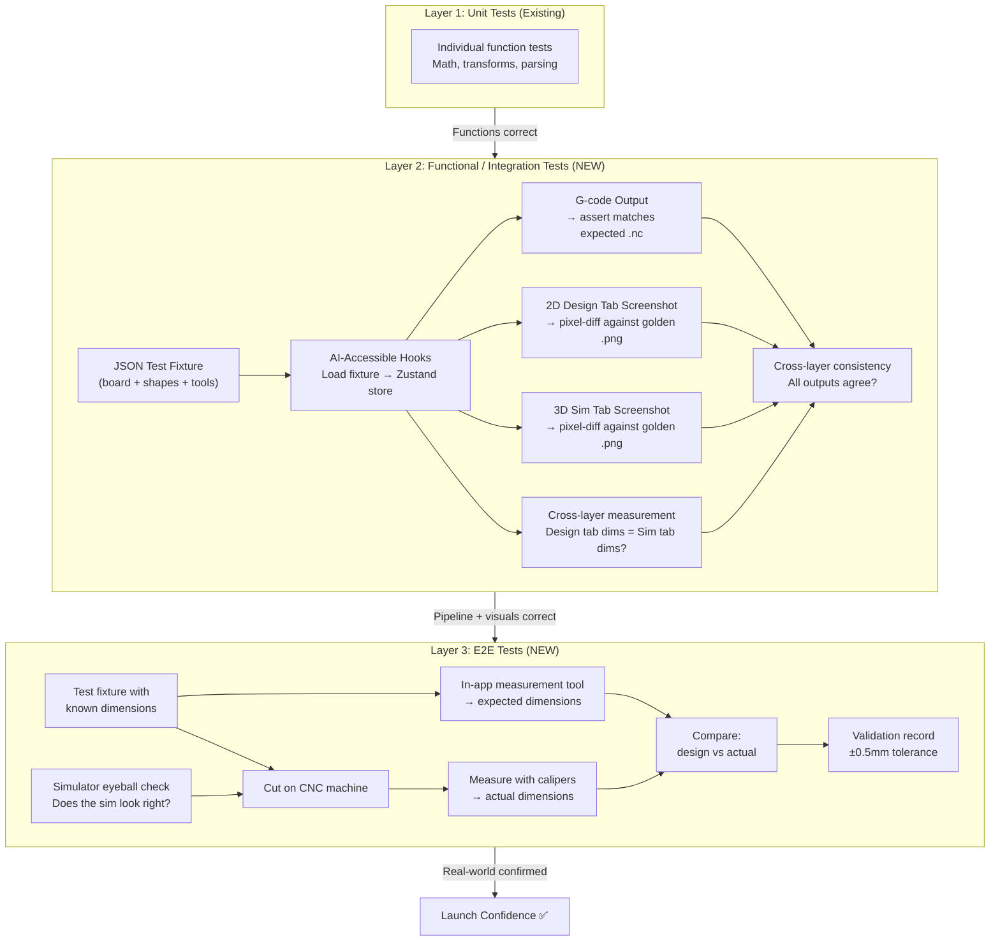

Each layer catches different categories of bugs:

| Layer | What It Catches | Cost | Frequency |
|-------|----------------|------|-----------|
| **Unit tests** | Math errors, logic bugs, type mismatches | Free (seconds) | Every code change |
| **Functional/Integration** | G-code pipeline regressions, coordinate bugs, visual rendering inconsistencies between 2D design/3D sim/G-code, cross-layer dimensional mismatches | Free (seconds–minutes) | Every code change |
| **E2E** | Real-world factors: tool deflection, material variance, machine quirks, dimensional accuracy, simulator visual trust | High (material + time) | New operation types, coordinate changes, pre-launch |

---

### Quality Gates

Quality gates define WHERE in the CSDLC pipeline each check lives. This maps the testing layers to the development process:

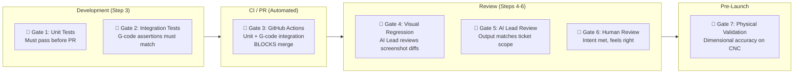

| Gate | Type | Where in Pipeline | Who | Blocks? |
|------|------|------------------|-----|---------|
| **Gate 1: Unit Tests** | Automated | Step 3 (sub-agent execution) | Sub-agent runs before submitting | Yes — PR not created if tests fail |
| **Gate 2: Integration Tests** | Automated | Step 3 (sub-agent execution) | Sub-agent verifies G-code assertions | Yes — PR not created if assertions fail |
| **Gate 3: CI Check** | Automated | PR creation | GitHub Actions | **Yes — required status check, blocks merge** |
| **Gate 4: Visual Regression** | Semi-automated | Step 4 (AI Lead review) | AI Lead reviews Playwright screenshot diffs | Yes — AI Lead must approve visual changes |
| **Gate 5: AI Lead Review** | Manual (AI) | Step 4 | AI Lead verifies scope, quality, no regressions | Yes — work doesn't reach human until AI Lead approves |
| **Gate 6: Human Review** | Manual (Human) | Step 6 | Dan reviews intent, UX, "feels right" | Yes — final approval before merge/ship |
| **Gate 7: Physical Validation** | Manual (Human) | Pre-launch / new op types | Dan cuts on CNC, measures with calipers | Yes — new operation types must pass before launch |

**The key insight:** Gates 1-3 are cheap and automated — they run on every change. Gates 4-5 are AI-assisted — the AI Lead surfaces evidence for review. Gate 6 is human judgment — the irreplaceable "does this feel right?" check. Gate 7 is physical — rare but critical for real-world trust.

---

### CI/CD Strategy

**Split approach: text-based tests run locally as part of sub-agent verification. Visual regression tests run in GitHub Actions CI.**

| Test Type | Where It Runs | Why |
|-----------|--------------|-----|
| Unit tests | **Local (Vitest)** | Fast, sub-agent runs before every PR. Agent template enforces this. |
| G-code integration tests | **Local (Vitest)** | Deterministic string comparison. Sub-agent includes markdown report in PR description. |
| Visual regression tests | **GitHub Actions CI** | Screenshot capture + pixel-diff needs consistent environment. CI auto-posts PR comment with before/after diff images. Eliminates manual screenshot uploading. |
| Cross-layer coordinate assertions | **Local (Vitest)** | Pure math — `measureFromEdge()` vs parsed G-code positions. No browser needed. |
| E2E (physical validation) | **Local only** | Human runs the CNC machine. |

**Why the split:** Text-based tests (unit, G-code integration, cross-layer) are deterministic and fast — sub-agents run them locally before creating PRs. No PR has shipped with broken tests to date. Visual tests have a different workflow problem: they produce screenshot artifacts that need to be attached to PRs, and rendering consistency matters (same browser/OS). GitHub Actions solves both — Playwright runs in a consistent environment, diff images upload as artifacts, and the action auto-posts a PR comment with the visual report.

**Future: Expand CI.** Unit and G-code integration tests can be added to CI when team size or failure rate justifies it. The infrastructure is CI-ready (Vitest, no browser needed).

---

### Cross-Cutting Concern: AI-Accessible Interface

Since this app is designed and written by AI, it makes sense to build first-class interfaces for AI to drive and test it. This isn't just about testing — it's about making the app AI-native. The hooks built here for validation become the foundation for future AI features like PDF-to-G-code.

**This may be a core architectural pattern for AI-designed apps.** Every modern app has a UI layer (for humans), an API layer (for services), and a data layer (for persistence). AI-designed apps need an **AI layer** — a structured interface purpose-built for LLMs to understand, drive, and extend the app. Not a REST API (too low-level, no semantic context). Not the UI (too fragile, designed for humans). An MCP-style interface that gives AI agents the same fluency with the app that a senior developer has. This pattern should be considered for every CSDLC project going forward.

**Dev-mode API (`window.__routr`):**

Exposed in development/test builds, and on staging behind a feature flag for AI feature experimentation. NOT in production until a product feature requires it.

```typescript
// Proposed dev-mode API surface
window.__routr = {
  // Fixture loading
  loadFixture(fixture: TestFixture): void,      // Load JSON fixture into Zustand store
  getState(): ProjectState,                       // Read current store state

  // G-code
  generateGcode(): string,                        // Trigger pipeline, return G-code string
  generateToolpaths(): ToolpathOperation[],        // Get intermediate toolpath data

  // Measurement (same engine used by in-app measurement tool)
  measureDistance(pointA: Point, pointB: Point): number,  // Distance between two points (mm)
  measureFromEdge(shapeId: string, edge: 'top' | 'bottom' | 'left' | 'right'): number,

  // Canvas capture
  captureDesignCanvas(): Promise<ImageData>,       // 2D canvas screenshot
  captureSimCanvas(): Promise<ImageData>,          // 3D sim screenshot

  // Store actions
  addBoard(config: BoardConfig): string,           // Returns board ID
  addShape(boardId: string, shape: ShapeConfig): string,
  setToolSettings(settings: ToolSettings): void,
  addEdgeTreatment(boardId: string, treatment: EdgeTreatmentConfig): void,
};
```

**Why this matters:**

- **Testing**: Sub-agents call `loadFixture()` + `generateGcode()` instead of clicking through UI
- **Reliability**: No flaky CSS selectors, no waiting for animations, no "button didn't render yet"
- **Speed**: Direct function calls are orders of magnitude faster than Playwright UI automation
- **Future features**: PDF-to-G-code AI reads a plan, calls `addBoard()` + `addShape()` to build the design programmatically
- **Validation**: `measureDistance()` and `measureFromEdge()` make dimensional verification instant — in both 2D and 3D contexts

#### MCP Server: AI-Native Tool Interface (Separate Package)

The `window.__routr` API gives programmatic access from within the browser. But to let AI agents **reason about and drive the app from outside** — connecting from Claude, OpenClaw sub-agents, or any MCP-compatible client — we wrap the same capabilities in an [MCP (Model Context Protocol)](https://modelcontextprotocol.io/) server.

The MCP server lives as a **separate package** in the repo (`packages/routr-mcp` or similar) with its own versioning. This keeps concerns clean — the app doesn't depend on MCP, and MCP can evolve independently. It also positions the MCP server for distribution beyond just testing (future product features, marketplace integrations).

**What MCP adds over a raw API:**

MCP doesn't just expose endpoints — it gives each tool rich descriptions, parameter schemas, and contextual guidance so the LLM knows *when, why, and how* to use each tool. The AI doesn't just know "there's a `loadFixture` function." It knows "use `loadFixture` when you want to set up a test scenario — it takes a fixture JSON describing a board with shapes and tool settings, and after loading you can generate G-code or capture screenshots to verify the result."

**Proposed MCP tool surface:**

```
MCP Server: routr-tools
├── create_board          — Create a board with dimensions and material
├── add_shape             — Add a cut, pocket, hole, path, or slot to a board
├── add_edge_treatment    — Apply chamfer, dado, or rabbet to a board edge
├── set_tool_settings     — Configure bit, feeds, speeds
├── import_svg            — Import an SVG file for engrave/pocket
├── generate_toolpaths    — Generate toolpath operations from current state
├── generate_gcode        — Generate G-code and return as string
├── capture_design_view   — Screenshot the 2D design canvas
├── capture_sim_view      — Screenshot the 3D simulator at a standard angle
├── measure_distance      — Measure between two points or shape-to-edge
├── load_fixture          — Load a test fixture JSON into the app
├── get_project_state     — Read the current Zustand store state
└── validate_gcode        — Compare generated G-code against an expected file
```

#### AI-Driven Exploratory Testing & the Protagonist/Antagonist Pattern

Scripted integration tests (fixtures + assertions) catch regressions. But an AI agent connected via MCP can do something far more powerful — **creative, exploratory testing:**

- *"Design a board with a 2-inch pocket centered on a 6×12 board, generate the G-code, and verify the pocket coordinates are correct"*
- *"Try every edge treatment on every edge and check for visual inconsistencies between the design and sim tabs"*
- *"Create a stress test — maximum shapes, weird dimensions, overlapping cuts — and report what breaks"*
- *"Verify that changing the bit diameter correctly adjusts all toolpath offsets"*

The AI understands woodworking concepts, understands the app's capabilities, and can creatively find edge cases that no human would think to write a fixture for. This is a fundamentally different testing paradigm — not "did it change?" (regression) but "is it correct?" (verification).

**Protagonist/Antagonist Agent Pattern:**

This maps naturally to the CSDLC pipeline:

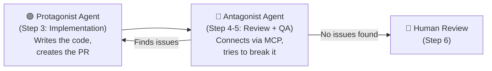

- The **protagonist** is the sub-agent executing the ticket (Step 3). It writes code, runs scripted tests, creates the PR.
- The **antagonist** is a separate AI agent that reviews the protagonist's work (Steps 4-5). It connects via MCP, loads the affected fixtures, runs exploratory tests, tries creative edge cases, and reports findings.
- The **human** reviews the evidence from both agents (Step 6) and makes the final call.

This adversarial pattern drives quality because the antagonist has different incentives than the protagonist — its job is to find problems, not ship features. It's the AI equivalent of a dedicated QA engineer who didn't write the code.

**The product vision connection:**

The MCP server built for testing IS the integration layer for Routr's AI product features:

| Use Case | How MCP Enables It |
|----------|-------------------|
| **AI-driven testing** | Sub-agents connect via MCP, design test scenarios, execute, report findings |
| **Protagonist/Antagonist QA** | Antagonist agent connects via MCP to challenge protagonist's work |
| **PDF-to-G-code** | AI reads a woodworking plan PDF, connects to Routr via MCP, calls `create_board` + `add_shape` to build the design, exports G-code |
| **AI Design Assistant** | "I want a cutting board with a juice groove" → AI agent uses MCP tools to design it in Routr |
| **Plan Marketplace ingestion** | Automated pipeline that takes uploaded plans and converts them to Routr projects |

**Architecture:**

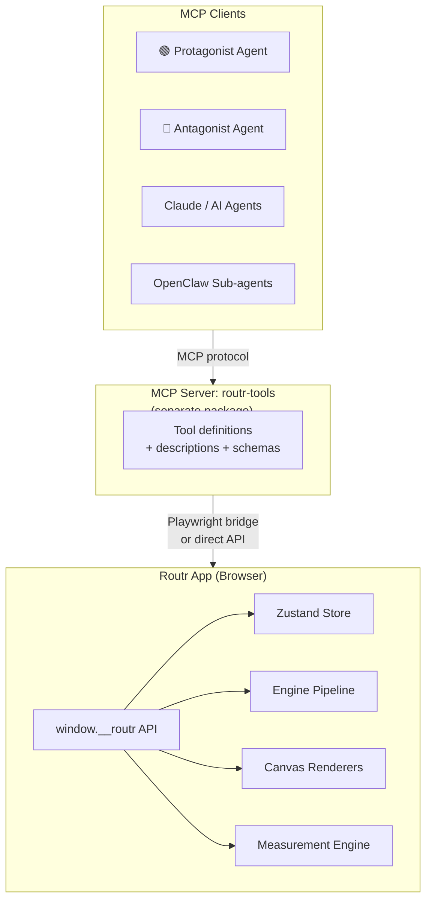

The MCP server connects to the running Routr app (via Playwright for browser-based interaction, or directly to the engine for headless G-code generation). This means we can run both:

- **Headed mode**: MCP drives the actual app UI (for visual testing)
- **Headless mode**: MCP calls engine functions directly (for fast G-code testing)

---

### Layer 2: Functional / Integration Tests (Detail)

This is the core of the epic. Integration tests tie together multiple outputs from a single input.

#### Integration Test Architecture

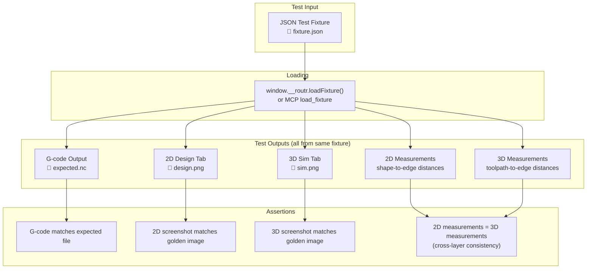

**How the test runner works:**

1. **Load** — Read fixture JSON, call `loadFixture()` to hydrate Zustand store
2. **Generate** — Call `generateGcode()`, capture the output string
3. **Capture** — Trigger Playwright screenshots of design tab and sim tab at locked viewport/camera/theme
4. **Measure** — Call `measureFromEdge()` for key shapes in both 2D design context and 3D sim context
5. **Assert** — Compare all outputs against stored baselines:
    - G-code: character-by-character diff against `.expected.nc`
    - Screenshots: pixel-diff with tolerance threshold against golden `.png` files
    - Measurements: 2D design dimensions must equal 3D sim dimensions (cross-layer consistency)
6. **Report** — On failure, output the diffs for human review

#### Test Report: How AI Proves Changes Are Valid

The integration test runner generates an **HTML report** (or markdown summary) on every run. This is the primary mechanism by which the AI demonstrates correctness to the human:

```
📊 Integration Test Report — 2026-03-24 14:32

Fixture: pocket-rectangle
├── G-code:      ✅ Match (no diff)
├── Design 2D:   ✅ Match (0.1% pixel diff — within tolerance)
├── Sim 3D:      ✅ Match (0.0% pixel diff)
└── Measurements: ✅ 2D pocket-to-left-edge: 47.0mm | 3D: 47.0mm

Fixture: edge-chamfer-top
├── G-code:      ⚠️ Changed (diff below)
│   - Line 42: G1 Z-3.175 → G1 Z-3.200
│   - [Review: depth calculation adjusted]
├── Design 2D:   ✅ Match
├── Sim 3D:      ✅ Match
└── Measurements: ✅ Consistent

Overall: 14/16 fixtures pass | 2 changed (review required)
```

For visual diffs, the report includes **side-by-side before/after images** with pixel differences highlighted. The human scans the gallery, verifies the changes look correct, and approves. No manual screenshot capturing needed — the test infrastructure generates the evidence.

The protagonist sub-agent includes this report summary in the PR description. The human reviews evidence, not code.

**Baseline management:**

- First run with a new fixture: `npm run test:integration -- --update` saves current outputs as baselines
- Subsequent runs compare against baselines
- When a baseline changes intentionally: review the diff, run `--update` to accept
- **Fixture updates require human review** — the diff must be inspected, not rubber-stamped

**Test commands:**

```bash
# Run G-code integration tests only (fast, CI-friendly)
npm run test:integration:gcode

# Run visual regression tests (requires browser, slower)
npm run test:integration:visual

# Run all integration tests
npm run test:integration

# Update baselines after intentional changes
npm run test:integration -- --update
```

#### The JSON Test Fixture

A fixture file fully describes a project state — everything needed to reproduce a specific board configuration deterministically:

```json
{
  "name": "straight-cut-basic",
  "description": "Single vertical table saw cut through a board",
  "board": {
    "width": 200,
    "height": 100,
    "thickness": 19
  },
  "shapes": [
    {
      "type": "rectangle",
      "cutType": "table-saw",
      "position": { "x": 100, "y": 0 },
      "params": { "width": 0, "height": 100 },
      "depth": 19
    }
  ],
  "toolSettings": {
    "bitDiameter": 6.35,
    "feedRate": 1000,
    "plungeRate": 500,
    "stepDown": 3,
    "safeHeight": 5,
    "spindleSpeed": 18000
  },
  "edgeTreatments": [],
  "units": "metric"
}
```

**Fixture design principles:**

- Each fixture tests **one concern** — a straight cut fixture, a pocket fixture, etc.
- Use **known, simple dimensions** — easy to mentally verify
- Specify **ALL settings explicitly** — never rely on defaults (defaults change, fixtures shouldn't)
- A **comprehensive fixture** combines multiple operations to test ordering and tool changes

#### Three Assertion Types + Cross-Layer Measurement

**1. G-code assertion** — Load fixture via `loadFixture()`, call `generateGcode()`, compare against stored `.expected.nc` file. Character-by-character match. If it differs → developer reviews diff → update expected file (intentional) or fix regression.

**2. 2D canvas screenshot** — Load fixture, capture design tab canvas via Playwright at locked viewport + theme. Compare against golden `.design.png` using pixel-diff with tolerance threshold (absorbs anti-aliasing). Catches: shapes in wrong positions, cuts on wrong side, visual artifacts.

**3. 3D sim screenshot** — Load fixture, generate toolpaths, capture sim tab at a **fixed camera angle**. Compare against golden `.sim.png`. Catches the chamfer-on-wrong-edge class of bugs — where design tab shows one thing and sim shows another.

**4. Cross-layer measurement** — Use the measurement API to check the same dimensions in both the 2D design tab and 3D sim tab. "This pocket is 47mm from the left edge" should be true in BOTH contexts. If the numbers disagree, we've found a coordinate bug. This is the most precise way to catch the kerf line flip class of bugs — not just "does it look right?" but "do the numbers match?"

#### Standard Camera Angles for 3D Sim Screenshots

Consistent camera angles ensure deterministic screenshots. We use **orthographic views only** — perspective projection introduces angle distortion that makes pixel-diff unreliable for position verification (a 5-pixel shift in perspective could be correct or a bug — impossible to tell without angle correction math).

| Angle | Name | Plane | What It Verifies |
|-------|------|-------|-----------------|
| **Top-down orthographic** | `top-down` | X/Y | Cut positions, pocket placement, drill hole locations, shape spacing. Pixel positions map directly to board positions — no distortion. |
| **Front orthographic** | `front` | X/Z | Edge treatments (top vs bottom), cut depth visualization, which edge a chamfer/dado/rabbet is on. |

Every fixture captures both angles. Between top-down and front, all three dimensions are covered without any angle correction:

- **X position** — verified by both views
- **Y position** — verified by top-down
- **Z depth** — verified by front view + G-code assertions (exact Z values) + measurement API

Pixel-diff on orthographic views is clean and reliable — if something shifts, it's a real change, not a projection artifact. Additional angles can be added later if needed, but these two plus the measurement API provide complete dimensional coverage.

#### File Structure

```
cncmill-app/src/__fixtures__/
├── straight-cut-basic/
│   ├── fixture.json          # Input: board + shapes + tools
│   ├── expected.nc           # Expected G-code output
│   ├── design.png            # Golden 2D canvas screenshot
│   ├── sim-top.png           # Golden 3D sim screenshot (top-down orthographic)
│   └── sim-front.png         # Golden 3D sim screenshot (front orthographic)
├── pocket-rectangle/
│   └── ...
├── drill-basic/
│   └── ...
├── edge-chamfer-top/
│   ├── fixture.json
│   ├── expected.nc
│   ├── design.png
│   ├── sim-top.png           # top-down (verify X/Y position)
│   └── sim-front.png         # front (verify which edge the chamfer is on)
├── svg-engrave/
│   └── ...
└── multi-operation/          # Comprehensive: multiple ops on one board
    └── ...
```

#### Fixture Inventory

| Fixture | What It Tests | Priority |
|---------|--------------|----------|
| `straight-cut-basic` | Table saw vertical cut | 🔴 High (blocked on kerf flip fix) |
| `pocket-rectangle` | Router rectangular pocket | 🔴 High |
| `pocket-circle` | Router circular pocket | 🟡 Medium |
| `drill-basic` | Single drill hole | 🔴 High |
| `drill-grid` | Multiple drill holes | 🟡 Medium |
| `profile-cut` | Board outline profile with tabs | 🔴 High |
| `edge-chamfer-top` | Chamfer on top edge | 🔴 High |
| `edge-chamfer-bottom` | Chamfer on bottom edge | 🔴 High |
| `edge-chamfer-left` | Chamfer on left edge | 🟡 Medium |
| `edge-chamfer-right` | Chamfer on right edge | 🟡 Medium |
| `edge-dado` | Dado on edge | 🟡 Medium |
| `edge-rabbet` | Rabbet on edge | 🟡 Medium |
| `svg-engrave` | SVG import with engrave toolpath | 🟡 Medium |
| `svg-pocket` | SVG with pocket detection | 🟡 Medium |
| `surfacing` | Planer/surfacing operation | 🟢 Low |
| `multi-operation` | Comprehensive: straight cut + pocket + drill + edge treatment | 🔴 High |

---

### Layer 3: E2E Tests (Detail)

E2E testing is the full loop: design in app → verify in simulator → cut on CNC → measure physical piece → compare against design dimensions.

#### Simulator Eyeball Check

Before cutting anything, the human reviews the simulator render: "Does this look like what I'd expect this cut to produce?" This is NOT automated — it's a human judgment call. The simulator already exists and works; this just formalizes reviewing sim output before committing material.

**When to do it:**

- After establishing new fixture baselines
- After any coordinate system changes
- Before physical validation cuts (preview what you're about to cut)

#### Physical Validation Protocol

**For each validation cut:**

1. **Design** — Load test fixture in Routr (or create the design matching the fixture)
2. **In-app measurement** — Use the measurement tool in the design tab to record expected dimensions (e.g., "hole center is 47.5mm from left edge, 32mm from top edge"). Verify the same measurements in the sim tab.
3. **Eyeball sim** — Check sim tab — does it look right?
4. **Export** — Generate G-code
5. **Setup** — Load G-code on CNC, set origin, verify material dimensions with calipers
6. **Cut** — Run the program
7. **Measure** — Use calipers to measure the same dimensions recorded in step 2
8. **Record** — Document: expected → actual → delta → pass/fail with comments

**Tolerance target: ±0.5mm (±0.020")**

Starting point. Tighter than most hobby CNC work but achievable with proper setup. Will adjust based on real measurement data.

#### Validation Matrix

| Operation Type | Previously Cut? | Needs Re-cut Pre-Launch? | Status |
|---------------|:-:|:-:|--------|
| Table saw (straight cut) | ✅ | 🔴 Yes (kerf line flip) | Blocked on bug fix |
| Router pocket (rectangle) | ✅ | 🟡 Re-verify dimensions | — |
| Router pocket (circle) | ✅ | 🟡 Re-verify dimensions | — |
| Router pocket (freeform/path) | ✅ | 🟡 Re-verify dimensions | — |
| Drill holes | ✅ | 🟡 Re-verify dimensions | — |
| Profile cut (board outline) | ✅ | 🟡 Re-verify dimensions | — |
| Edge treatment (chamfer) | ✅ | 🟡 Re-verify post-coordinate fix | — |
| Edge treatment (dado) | ❌ | 🔴 Yes (never cut) | Simple cut, low risk |
| Edge treatment (rabbet) | ❌ | 🔴 Yes (never cut) | Simple cut, low risk |
| SVG engrave | ✅ | 🟡 Re-verify | — |
| SVG pocket | ✅ | 🟡 Re-verify | — |
| Surfacing (planer) | ✅ | 🟢 Low priority | Simple operation |

#### Validation Record Template

Physical validation is pass/fail with comments. Photos are optional — useful for documentation but not required.

```markdown
## [Fixture Name] — Physical Validation Record

**Date:** YYYY-MM-DD
**Fixture:** `__fixtures__/[name]/fixture.json`
**Material:** [species, dimensions]
**Machine:** [CNC model]
**Bit:** [type, diameter]

### Measurements

| Dimension | Expected (app) | Actual (calipers) | Delta | Pass/Fail |
|-----------|:-:|:-:|:-:|:-:|
| Cut position from left edge | 100.0mm | 99.8mm | -0.2mm | ✅ |
| Cut depth | 19.0mm | 18.7mm | -0.3mm | ✅ |

### Checks
- [ ] Sim visual matches design tab
- [ ] Cut positions look correct
- [ ] Edge treatments on correct edges
- [ ] Cross-layer measurements match (design tab = sim tab)

### Result: ✅ PASS / ❌ FAIL
**Comments:** [observations, anomalies, lessons, anything worth noting]
```

---

### In-App Measurement Tool

**Purpose:** Surface the dimensional data the app already knows internally in a way that's useful for both validation and everyday use. Available in **both the 2D design tab and the 3D sim tab** for cross-layer verification.

**How it works:**

The app already stores exact positions, dimensions, and relationships between shapes and toolpaths. The measurement tool exposes this data:

- **Point-to-point distance** — Click two points on the canvas, see the distance in current units
- **Shape-to-edge distance** — Select a shape, see its distance from each board edge
- **Shape dimensions** — Select a shape, see its width, height, depth, position
- **Toolpath-to-edge distance** (sim tab) — Same measurements but against generated toolpaths

**Cross-layer validation use case:**

The measurement tool in the design tab shows "this pocket is 47mm from the left edge." The measurement tool in the sim tab should show the toolpath for that pocket starts 47mm from the left edge. If they disagree, we've found a coordinate bug. This is how we'd catch the kerf line flip — the design tab says the kerf line is at X=100, the sim tab says the toolpath is at X=100... but wait, the G-code says X=0 (board width minus 100 after flipY). The measurement tool makes the discrepancy visible without needing to read G-code.

**UX approach:**

Top toolbar "Measure" mode — similar to Fusion 360's approach. A tools dropdown in the top bar that activates measurement mode. When active:

- Clicking on the canvas shows dimension overlays
- Works in both 2D design tab (measures against shapes/board) and 3D sim tab (measures against toolpaths/board)
- Same visual language in both contexts for consistency
- Deactivate by clicking the mode again or pressing Escape

**Implementation approach:**

The measurement engine is shared between the UI tool and the `window.__routr` API. `measureDistance()` and `measureFromEdge()` serve both the in-app overlay and automated testing. This means integration tests can assert measurements programmatically — the same data the human sees in the overlay.

---

## Testing Strategy for New Features

When a new epic or feature is built, it enters the validation pipeline through a standard process:

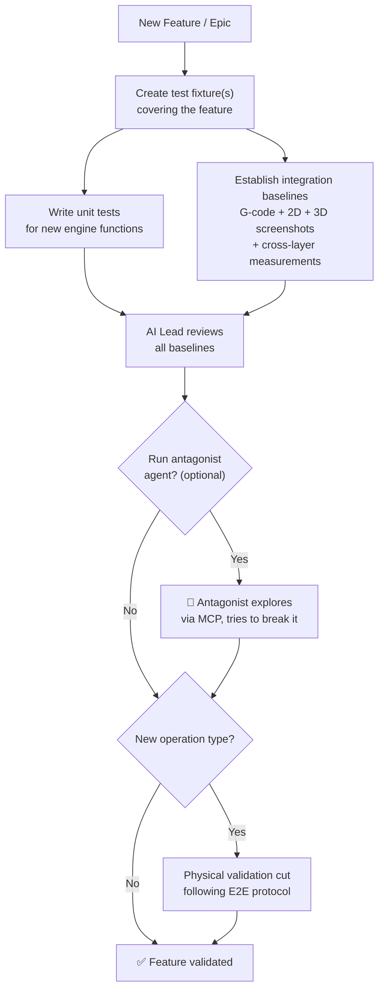

**Rules:**

1. **Every new feature must have at least one fixture.** No exceptions. The fixture is created during story breakdown (Step 1).
2. **G-code baselines are mandatory.** If the feature affects G-code output, integration test baselines must be established before the PR is merged.
3. **Visual baselines are mandatory for UI-affecting changes.** If it changes what the design tab or sim tab renders, screenshot baselines must be established.
4. **Cross-layer measurement assertions are mandatory for spatial features.** If the feature places or moves things on the canvas, measurement assertions must verify consistency between design and sim tabs.
5. **Physical validation is required only for new operation types.** New cut type, new edge treatment, new toolpath algorithm → needs a real cut. Bug fixes and UI changes do not.
6. **Fixture updates require human review.** When a fixture baseline changes, the diff must be reviewed by the human before accepting. No rubber-stamping.
7. **Antagonist testing is encouraged for complex features.** Connect an antagonist agent via MCP to exploratory-test the new feature. Not mandatory for every PR, but strongly recommended for new operation types and coordinate-affecting changes.

> 📝 **PROCESS NOTE:** This testing strategy should be extracted into the epic design doc template after this epic is finalized. Every future epic should include a "Testing Strategy" section that references these rules and specifies which fixtures will be created.

---

### Integration Test Strategy

How integration tests are structured and maintained as the codebase grows:

**Test organization:**

```
cncmill-app/
├── src/
│   ├── __fixtures__/              # JSON fixtures + golden files
│   └── __tests__/
│       ├── integration/
│       │   ├── gcode.test.ts      # G-code assertion tests (all fixtures)
│       │   ├── visual.test.ts     # Screenshot comparison tests (all fixtures)
│       │   └── measurement.test.ts # Cross-layer measurement tests
│       └── ...                    # Existing unit tests
├── playwright.config.ts           # Visual test configuration
└── package.json                   # Test scripts
```

**Writing a new integration test:**

1. Create a fixture directory under `__fixtures__/` with `fixture.json`
2. Run `npm run test:integration -- --update` to generate initial baselines
3. **Review the baselines manually** — do the G-code, screenshots, and measurements look correct?
4. Commit the fixture + baselines together
5. From this point forward, any change that affects this fixture's output will cause a test failure

**When tests fail:**

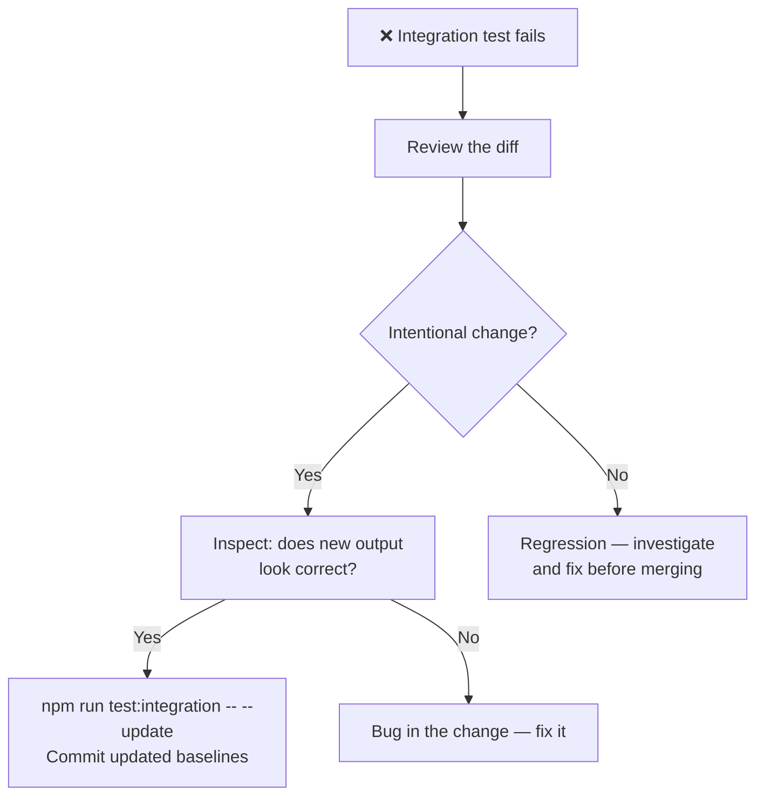

**Avoiding flaky visual tests:**

- Lock viewport size: `1280×720` for all Playwright screenshots
- Lock theme: light mode
- Lock camera angles: standard angles defined in fixture or test config
- Pixel-diff tolerance: allow ~1-2% pixel difference for anti-aliasing
- Run on consistent environment (same browser version)
- If a test is persistently flaky, increase tolerance or switch to structural assertion

**Mass baseline updates (UI changes):**

When a UI change (CSS restyle, canvas rendering update, theme tweak) breaks multiple visual baselines at once:

1. Run `npm run test:integration:visual` — see which fixtures fail
2. Run `npm run test:integration:visual -- --update` — regenerate all screenshot baselines
3. Review the **batch diff** — a gallery of before/after screenshots across all fixtures
4. Verify: do the new visuals look correct? Is anything unexpectedly shifted or missing?
5. Commit the updated baselines with the UI change PR

This is working as designed — a UI change SHOULD force review of all visual baselines. The test breakage surfaces the full visual impact of the change. G-code and measurement tests are unaffected by pure UI changes, so those still pass and confirm the engine is untouched.

**Agent prompt template — integration test section:**

Every sub-agent prompt for implementation work should include:

```
## Verification
After implementation:
1. Run `npm test -- --run` — all unit tests must pass
2. Run `npm run test:integration:gcode` — all G-code assertions must pass
3. If your change affects G-code output:
   - Review the diffs carefully
   - Update baselines with `npm run test:integration:gcode -- --update`
   - Include baseline diffs in PR description for human review
4. If your change affects UI rendering:
   - Run `npm run test:integration:visual`
   - Update baselines with `npm run test:integration:visual -- --update`
   - Include before/after screenshot comparisons in PR description
5. Do NOT rubber-stamp baseline updates — review every diff
```

**Antagonist agent (optional, for complex changes):**

The antagonist is NOT a sub-agent that runs on every PR. It's a separate agent spawned by the AI Lead when extra confidence is needed — typically for new operation types, coordinate-affecting changes, or complex multi-system features. The antagonist connects via MCP and runs exploratory tests. Its findings are advisory — the human makes the final call.

---

## Edge Cases & Gotchas

| Scenario | Expected Behavior | Why It's Tricky |
|----------|-------------------|-----------------|
| Screenshot test fails due to rendering engine update | Pixel diff flags change | Need tolerance threshold; anti-aliasing differences are noise, not signal |
| G-code assertion fails after intentional change | Developer updates `.expected.nc` after reviewing diff | Easy to rubber-stamp — need discipline |
| Imperial vs metric fixtures | All fixtures use mm internally | Display unit shouldn't affect G-code, but need to verify |
| Tool settings defaults change | Assertions break if defaults change | Fixtures specify ALL settings explicitly, never rely on defaults |
| Multiple operations change ordering | G-code assertion catches it | Operation ordering logic is complex — assertion is the safety net |
| 3D camera angle changes | Sim screenshots fail | Camera locked to standard angles in test harness |
| Canvas/viewport resize | Design screenshots fail | Viewport size locked in test harness |
| Coordinate system changes | ALL assertions break (expected) | This is the point — forced review of all outputs after coordinate changes |
| Theme changes (dark/light) | Screenshots differ | Lock theme in test harness (light mode for consistency) |
| `window.__routr` available in prod | Security/bundle size concern | Dev/test default; staging with feature flag; prod only when product feature requires it |
| Measurement disagrees between 2D and 3D | Coordinate bug | This is exactly what cross-layer measurement tests are designed to catch |
| Antagonist agent finds a real bug | Protagonist must fix before merge | Great outcome — the pattern is working |

---

## Risks

| Risk | Likelihood | Impact | Mitigation |
|------|-----------|--------|------------|
| Screenshot tests are flaky across environments | Medium | High | Fixed viewport, fixed theme, tolerance threshold, consistent environment |
| Integration tests create false confidence | Medium | High | Tests catch *regressions*. Initial baselines must be validated by physical cuts + human review. |
| Fixture maintenance burden as features grow | Medium | Medium | One concern per fixture. Comprehensive fixture catches interaction bugs. |
| Physical validation bottleneck (Dan = only CNC) | High | High | Minimize physical cuts. Integration tests handle regressions. Physical only for new ops. |
| Playwright screenshot tests are slow | Medium | Low | Run visual tests separately from unit/G-code tests. Split test commands. |
| AI-accessible interface scope creep | Medium | Medium | Start with minimum viable API surface. Expand as needs emerge. |
| MCP server maintenance overhead | Medium | Low | Separate package keeps it isolated. Thin wrapper over `window.__routr`. |
| Kerf line flip contaminates table saw baselines | High | Medium | Fix bug BEFORE establishing table saw fixture baseline. |
| Antagonist agent is too aggressive (false positives) | Medium | Low | Human reviews antagonist findings before acting. Findings are suggestions, not blockers. |

---

## Features

Features extracted from this epic. Each becomes a set of implementable stories during Step 1.

| Feature | Summary | Dependencies | Status |
|---------|---------|-------------|--------|
| F1 | **AI-Accessible Interface** — `window.__routr` dev-mode API: fixture loading, G-code generation, canvas capture, measurement | None | |
| F2 | **MCP Server (routr-tools)** — Separate package, Model Context Protocol wrapper for AI-driven testing and future product features | F1 | |
| F3 | **Test Fixture Library** — JSON fixture format, TypeScript types, initial set of fixtures (including comprehensive multi-operation fixture) | F1 | |
| F4 | **G-code Integration Tests** — Load fixture → generate G-code → assert matches `.expected.nc` + CI pipeline + test report generation | F1, F3 | |
| F5 | **Visual Regression + Cross-Layer Tests** — Playwright harness for 2D + 3D screenshot capture, pixel-diff, fixed camera angles, AND cross-layer coordinate assertions (design measurements vs G-code positions) | F1, F3 | |
| F6 | **In-App Measurement Tool** — Point-to-point and shape-to-edge measurement in both 2D design tab and 3D sim tab, top toolbar "Measure" mode (Fusion 360 style) | F1 | |
| F7 | **Physical Validation Protocol** — Lightweight pass/fail recording, validation matrix tracker | F3, F6 | |

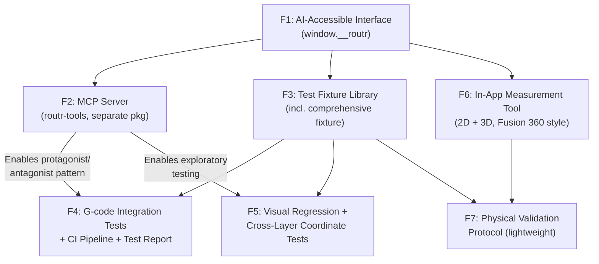

*Features are broken down into implementable stories during Step 1 (Story Breakdown). This table is the feature index.*

---

## Story Breakdown

### Implementation Batches

Stories are organized into dependency-ordered batches:

```
Batch 1: F1 (AI Interface) → F3 (Fixtures) → F4 (G-code Integration Tests)
  → First real regression protection, fast feedback loop

Batch 2: F5 (Visual Regression + Cross-Layer) → F2 (MCP Server)
  → Screenshot baselines, cross-layer assertions, GitHub Actions visual CI, then external AI access

Batch 3: F7 (Physical Validation Protocol)
  → Human on the CNC, protocol + recording templates
```

### F1: AI-Accessible Interface — Stories

**Dependency graph:**

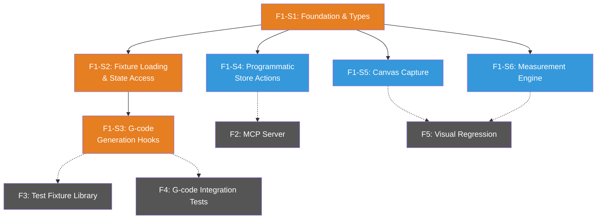

*🟠 Orange = critical path (serial). 🔵 Blue = parallelizable after S1.*

#### Code Investigation Notes

These findings informed story scoping:

- **Feature flags**: Two patterns in use — `featureFlags.ts` (compile-time booleans) and hostname checks (runtime). Neither is a proper env-driven system. For `window.__routr`, we'll use `import.meta.env.VITE_EXPOSE_DEV_API` so Vite tree-shakes the entire module out of production builds. This is scoped to S1 — we're not overhauling the existing feature flag patterns.
- **2D canvas (BoardCanvas)**: Raw HTML `<canvas>` via `useRef<HTMLCanvasElement>`. Capture is trivial — `canvasRef.current.toDataURL()` gives a PNG directly.
- **3D canvas (Preview3D/Scene3D)**: `@react-three/fiber` wrapping Three.js. WebGL renderer (`gl`) is accessible inside the R3F `<Canvas>` context via `useThree()`. Capture via `gl.domElement.toDataURL()`, but requires calling from inside R3F context. Needs camera positioning to standard orthographic angles before capture, then restore.
- **Measurement engine (F1-S6)**: Scope is the programmatic API only (`measureDistance`, `measureFromEdge`). The in-app measurement tool UI (toolbar mode, click-to-measure, visual overlays) is deferred to a separate epic.

| Story | Name | Size | Description | Acceptance Criteria |
|-------|------|------|-------------|-------------------|
| **F1-S1** | Foundation & Types | Small | Create the `window.__routr` namespace, TypeScript types for the full API surface, and env-based conditional exposure. The scaffold everything else hangs on. | ① `window.__routr` object exists in dev/test builds. ② Not present in production builds (tree-shaken via `VITE_EXPOSE_DEV_API`). ③ TypeScript types exported: `TestFixture`, `BoardConfig`, `ShapeConfig`, `ToolSettings`, `EdgeTreatmentConfig`, `Point`, `ProjectState`. ④ Types match the fixture JSON schema defined in the epic design doc. ⑤ `window.__routr` is an empty shell — methods are stubs that throw "not implemented" until subsequent stories wire them. ⑥ Unit test confirms the namespace exists in dev mode and is absent when env flag is unset. |
| **F1-S2** | Fixture Loading & State Access | Medium | Implement `loadFixture()` to hydrate the Zustand store from a JSON fixture, and `getState()` to read current store state. This is the core input mechanism for all testing. | ① `loadFixture(fixture: TestFixture)` clears existing project state and hydrates the store with the fixture's board, shapes, tool settings, and edge treatments. ② `getState()` returns the current `ProjectState` matching the Zustand store shape. ③ Loading a fixture then calling `getState()` returns state consistent with the fixture input. ④ Invalid fixtures throw descriptive errors (missing required fields, invalid shape types). ⑤ Optional fixture fields (e.g., `edgeTreatments`) default gracefully when omitted. ⑥ Unit tests cover: valid fixture load, state round-trip, missing fields, invalid types, empty shapes array, and state clearing (loading a second fixture fully replaces the first). |
| **F1-S3** | G-code Generation Hooks | Small | Expose `generateGcode()` and `generateToolpaths()` on the API surface. These wrap existing engine pipeline functions for programmatic access. | ① `generateGcode()` returns a G-code string identical to what the Export button produces. ② `generateToolpaths()` returns the intermediate `ToolpathOperation[]` array. ③ After `loadFixture()` → `generateGcode()`, the output is deterministic (same fixture = same G-code, every time). ④ Calling `generateGcode()` with no project loaded returns an empty string or throws a descriptive error. ⑤ Unit test: load a simple fixture (one board, one shape), generate G-code, assert output is non-empty and contains expected G-code structure (`G21`, `G90`, `M3`, etc.). |
| **F1-S4** | Programmatic Store Actions | Small–Med | Expose `addBoard()`, `addShape()`, `setToolSettings()`, `addEdgeTreatment()` for building projects programmatically (individual mutations vs. fixture bulk-load). These become the foundation for MCP tool surface. | ① `addBoard(config: BoardConfig)` creates a board and returns its ID. ② `addShape(boardId, shape: ShapeConfig)` adds a shape to the specified board and returns its ID. ③ `setToolSettings(settings: ToolSettings)` updates global tool settings. ④ `addEdgeTreatment(boardId, treatment: EdgeTreatmentConfig)` adds an edge treatment to the specified board. ⑤ Invalid `boardId` references throw descriptive errors. ⑥ State after programmatic actions matches state after loading an equivalent fixture. ⑦ Unit tests cover: add board → add shape → generate G-code round-trip; invalid board ID; all shape types (`rectangle`, `circle`, `line`, `path`, `slot`, `surfacing`). |
| **F1-S5** | Canvas Capture | Small–Med | Implement `captureDesignCanvas()` and `captureSimCanvas()` for programmatic screenshot capture from both the 2D design tab and 3D simulator. | ① `captureDesignCanvas()` returns a base64 PNG data URL of the current 2D design canvas. ② `captureSimCanvas()` returns a base64 PNG data URL of the current 3D sim canvas. ③ `captureSimCanvas()` accepts an optional `angle` parameter: `'top-down'` (default) or `'front'` — camera is positioned to the standard orthographic angle before capture. ④ Camera state is restored after capture (user's view isn't disrupted). ⑤ Output dimensions are consistent regardless of window size (locked to a standard capture resolution). ⑥ Returns a descriptive error if the target canvas is not mounted/visible. ⑦ Integration test via Playwright: load fixture → capture both canvases → assert output is valid PNG data URL with non-zero dimensions. |
| **F1-S6** | Measurement Engine | Medium | Implement `measureDistance()` and `measureFromEdge()` — pure geometry math against store state. No UI, no overlays. This is the programmatic measurement API that the future in-app measurement tool UI will consume. | ① `measureDistance(pointA: Point, pointB: Point)` returns the Euclidean distance in project units (mm). ② `measureFromEdge(shapeId, edge: 'top' \| 'bottom' \| 'left' \| 'right')` returns the distance from the shape's nearest boundary to the specified board edge. ③ Measurements use the shape's actual geometry (not bounding box) — a circle's distance to an edge is measured from its circumference, not its center. ④ Invalid `shapeId` throws a descriptive error. ⑤ Results are consistent with the coordinate system used by the G-code pipeline (no coordinate flip discrepancies). ⑥ Unit tests cover: point-to-point distance, rectangle-to-edge for all 4 edges, circle-to-edge, shape at board boundary (distance = 0), shape centered on board. |

---

### F3: Test Fixture Library — Stories

**Dependency graph:**

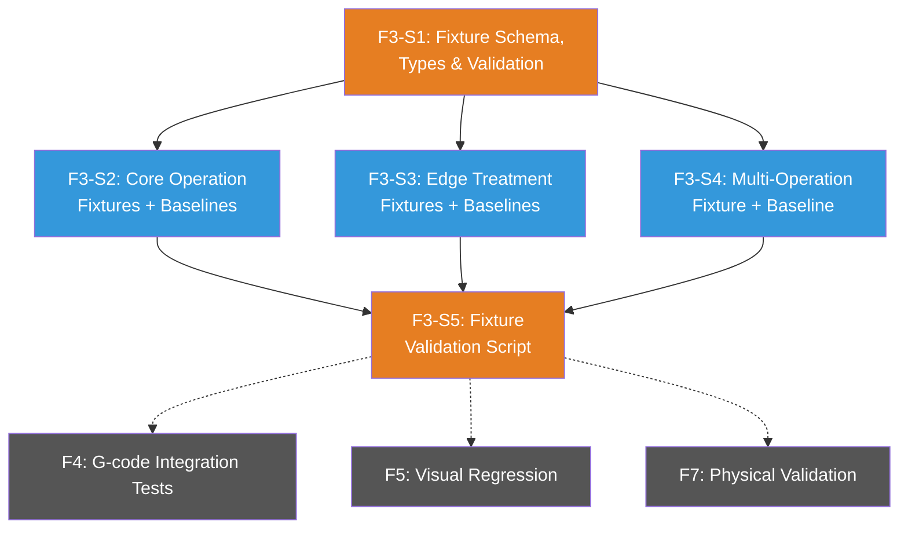

*🟠 Orange = serial (must happen in order). 🔵 Blue = parallelizable after S1.*

#### Design Notes

- **Fixture format**: Each fixture is a standalone JSON file in `src/__fixtures__/` containing board config, shapes, tool settings, and optionally edge treatments. The JSON schema matches the `TestFixture` type from F1-S1.
- **Baseline convention**: Each fixture `{name}.fixture.json` has a corresponding `{name}.expected.nc` in the same directory. Fixtures without baselines (e.g., blocked on a bug) have no `.expected.nc` file — the validation script skips baseline assertions for these.
- **Baseline generation**: Baselines are generated via `window.__routr` — load fixture → `generateGcode()` → write output as `.expected.nc`. This means baselines reflect the *current* G-code pipeline output. When the pipeline changes intentionally, baselines are regenerated. When it changes unintentionally, F4's integration tests catch the drift.
- **`straight-cut-basic` is blocked**: The table saw kerf line flip bug means this fixture's baseline would encode incorrect behavior. Create the fixture JSON (the board config is valid), skip the baseline. Revisit after the kerf fix ships.

| Story | Name | Size | Description | Acceptance Criteria |
|-------|------|------|-------------|-------------------|
| **F3-S1** | Fixture Schema, Types & Validation Utilities | Small | Define the canonical fixture JSON schema, TypeScript types (leveraging F1-S1's `TestFixture` type), and a validation utility that confirms a fixture file is well-formed before use. This is the contract that F4, F5, and F7 all depend on. | ① Fixture JSON schema is documented in a `README.md` inside `src/__fixtures__/` — human-readable description of every field, required vs. optional, valid values. ② TypeScript `validateFixture(json: unknown): TestFixture` function that parses raw JSON, validates required fields, checks shape/operation types against allowed values, and returns a typed `TestFixture` or throws descriptive errors. ③ Validation catches: missing board dimensions, invalid shape types, missing tool settings for operations that require them, edge treatment referencing non-existent edges. ④ `src/__fixtures__/` directory created with README and validation utility. ⑤ Unit tests cover: valid fixture passes, missing required fields rejected, invalid shape type rejected, optional fields default gracefully, edge treatment validation. |
| **F3-S2** | Core Operation Fixtures + Baselines | Medium | Create fixture JSON files and `.expected.nc` G-code baselines for the core CNC operations: router pocket, drill, profile cut, and table saw straight cut. These cover the bread-and-butter operations users will run most. | ① `pocket-rectangle.fixture.json` — single board, one rectangular pocket shape, standard tool settings. Corresponding `pocket-rectangle.expected.nc` baseline generated via `window.__routr`. ② `drill-basic.fixture.json` — single board, one drill hole. Corresponding `.expected.nc` baseline. ③ `profile-cut.fixture.json` — single board, profile cut operation with tabs. Corresponding `.expected.nc` baseline. ④ `straight-cut-basic.fixture.json` — single board, table saw vertical cut. **No `.expected.nc` baseline** (blocked on kerf line flip bug). JSON fixture is valid and passes `validateFixture()`. ⑤ All fixture JSON files pass `validateFixture()`. ⑥ All baselines are generated deterministically — running generation twice produces identical output. ⑦ Each `.expected.nc` contains valid G-code structure: header (`G21`, `G90`), spindle start (`M3`), operations, spindle stop (`M5`), program end (`M2` or `M30`). |
| **F3-S3** | Edge Treatment Fixtures + Baselines | Small | Create fixture JSON files and `.expected.nc` baselines for edge treatment operations. These specifically target the coordinate bug class that triggered this epic — chamfers on top vs. bottom edges must produce demonstrably different G-code. | ① `edge-chamfer-top.fixture.json` — single board, chamfer on top edge, appropriate chamfer bit in tool settings. Corresponding `.expected.nc` baseline. ② `edge-chamfer-bottom.fixture.json` — single board, chamfer on bottom edge, same bit. Corresponding `.expected.nc` baseline. ③ The two baselines are **verifiably different** — a diff between them shows Z-axis and/or coordinate differences consistent with top vs. bottom edge placement. This is the regression test for the coordinate flip bug class. ④ All fixtures pass `validateFixture()`. ⑤ Baselines generated deterministically. |
| **F3-S4** | Multi-Operation Fixture + Baseline | Medium | Create a comprehensive fixture that combines multiple operation types on a single board — the "torture test" that exercises the full G-code pipeline. This fixture is the most valuable regression detector because changes to any operation type will show up here. | ① `multi-operation.fixture.json` — single board with: at least one pocket, at least one drill hole, a profile cut, and at least one edge treatment. Realistic dimensions and tool settings (not contrived). ② Corresponding `multi-operation.expected.nc` baseline. ③ Baseline contains distinct G-code sections for each operation type — identifiable by comments or tool change commands. ④ Fixture passes `validateFixture()`. ⑤ Baseline generated deterministically. ⑥ A brief comment block at the top of the fixture JSON (or in the README) describes what this fixture is designed to catch — it's the "if only one fixture survives, keep this one" fixture. |
| **F3-S5** | Fixture Validation Script | Small | Create a script that loads every fixture in `src/__fixtures__/`, validates it, generates G-code, and confirms no errors. This is F3's quality gate — the proof that all fixtures are well-formed and functional. Also generates/regenerates `.expected.nc` baselines on demand. | ① `scripts/validate-fixtures.ts` (or `.mjs`) script that: discovers all `*.fixture.json` files in `src/__fixtures__/`, runs `validateFixture()` on each, loads each via `window.__routr.loadFixture()`, calls `generateGcode()`, and reports pass/fail per fixture. ② Script has two modes: `--validate` (default — load + generate + confirm no errors, compare against existing baselines if present) and `--generate` (load + generate + write/overwrite `.expected.nc` files). ③ In `--validate` mode, if a fixture has no `.expected.nc` (e.g., `straight-cut-basic`), it still validates the fixture loads and generates G-code without errors — it just skips the baseline comparison. ④ Script exits with non-zero code if any fixture fails validation or baseline mismatch. ⑤ Output is human-readable: fixture name, status (✅/❌), and error details on failure. ⑥ Script can run in CI (no browser required — uses Vitest or Node environment with `window.__routr` available). ⑦ `npm run validate-fixtures` added to `package.json` scripts. |

---

### F4: G-code Integration Tests — Stories

**Dependency graph:**

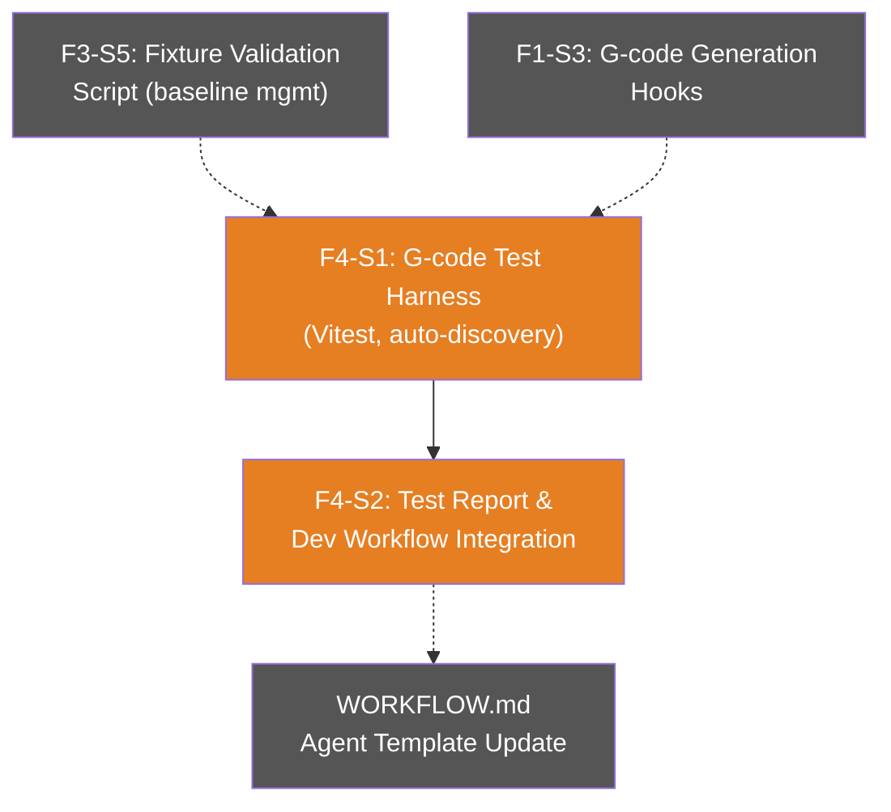

*Both stories are serial — S2 builds on S1. Only two stories because the scope is focused: no CI, baseline management lives in F3.*

#### Design Notes

- **No GitHub Actions CI.** All tests run locally as part of sub-agent verification. CI deferred to a Future ticket (see CI/CD Strategy section and Decisions Log). The test infrastructure is CI-ready if/when we add it — Vitest, no browser, deterministic.
- **Baseline management is F3's responsibility.** F4 reads `.expected.nc` baselines but does not create or update them. To regenerate baselines after intentional changes: `npm run validate-fixtures -- --generate` (F3-S5's script). Clean separation: F3 owns fixtures + baselines, F4 owns assertions + reporting.
- **Dynamic fixture discovery.** The test harness auto-discovers `*.fixture.json` files in `src/__fixtures__/`. Adding a new fixture + baseline automatically adds a test case. Zero boilerplate.
- **Fixtures without baselines are skipped, not failed.** `straight-cut-basic` (and any future fixture blocked on a bug) appears in the report as `⏭️ SKIPPED — No baseline` rather than pass or fail. When the baseline is generated, the test automatically activates.

| Story | Name | Size | Description | Acceptance Criteria |
|-------|------|------|-------------|-------------------|
| **F4-S1** | G-code Integration Test Harness | Medium | Create a Vitest test suite that dynamically discovers all fixtures in `src/__fixtures__/`, loads each via `window.__routr.loadFixture()`, generates G-code via `generateGcode()`, and asserts the output matches the corresponding `.expected.nc` baseline. This is the core regression detection mechanism for the G-code pipeline. | ① Single test file `src/__tests__/integration/gcode.test.ts` that auto-discovers all `*.fixture.json` files in `src/__fixtures__/`. ② For each fixture with a corresponding `.expected.nc`: loads fixture via `loadFixture()`, calls `generateGcode()`, asserts character-by-character match against baseline. ③ For each fixture without a `.expected.nc` (e.g., `straight-cut-basic`): loads fixture, calls `generateGcode()`, asserts no errors thrown, marks test as skipped (not failed). ④ On assertion failure, the test output includes a readable diff showing exactly which lines changed between expected and actual G-code. ⑤ `npm run test:integration:gcode` added to `package.json` — runs only the G-code integration tests (not unit tests, not visual). ⑥ All existing unit tests continue to pass (`npm test -- --run`). ⑦ Test runs in under 5 seconds for the initial fixture set (fast enough for sub-agent verification loops). |
| **F4-S2** | Test Report & Dev Workflow Integration | Small | Create a markdown report generator that summarizes G-code integration test results in a format suitable for PR descriptions. Update the agent prompt template in WORKFLOW.md to include integration test commands as a mandatory verification step. | ① After running `npm run test:integration:gcode`, a markdown report is generated (either to stdout or a file) showing per-fixture results: ✅ PASS (matches baseline), ❌ FAIL (diff summary), ⏭️ SKIPPED (no baseline). ② Report includes a summary line: `X/Y fixtures pass | Z skipped | W failed`. ③ On failure, the report includes the first ~20 lines of diff per failing fixture (enough context without overwhelming the PR description). ④ Report format is copy-pasteable into a GitHub PR description body — valid markdown, renders correctly. ⑤ WORKFLOW.md agent prompt template updated: verification section includes `npm run test:integration:gcode` as a mandatory step, with instructions to include the report in PR descriptions. ⑥ WORKFLOW.md documents the baseline update workflow: "If G-code output changed intentionally → review the diff → run `npm run validate-fixtures -- --generate` → commit updated baselines with the PR." |

---

### F5: Visual Regression + Cross-Layer Tests — Stories

**Dependency graph:**

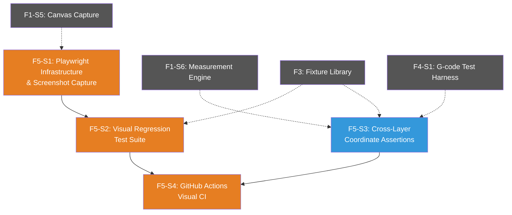

*🟠 Orange = Playwright chain (serial — S1 → S2 → S4). 🔵 Blue = S3 is independent (Vitest, no browser) and can run in parallel with S1/S2.*

#### Design Notes

- **F6 dependency removed.** The measurement engine (`measureFromEdge`, `measureDistance`) shipped in F1-S6. F5's cross-layer assertions use the programmatic API, not the measurement tool UI. F6 (UI) is fully decoupled — separate epic.
- **Cross-layer assertion model:** Three sources of truth that must agree: ① `measureFromEdge()` returns the design intent (shape position relative to board edge), ② G-code output contains the execution positions (parsed X/Y/Z coordinates), ③ Screenshots show the visual position in both design and sim tabs. F5-S3 asserts ① vs ② programmatically. F5-S2 captures ③ for visual verification. A coordinate flip bug (like the kerf line flip) would cause ① and ② to disagree — the shape is at X=100 from the left, but the G-code moves to X=100 from the *right*.
- **No dedicated toolpath measurement API.** Parsing G-code X/Y positions and comparing against `measureFromEdge()` achieves cross-layer detection without a new API. If this proves too brittle after F5 ships, a `measureToolpathFromEdge()` API can be added as a follow-up.
- **Visual tests run on every PR via GitHub Actions.** Even non-UI changes can shift rendering (toolpath algorithm changes, coordinate fixes). The whole point is catching *unexpected* visual changes. 30-60 seconds is acceptable overhead.
- **Golden baselines committed to git.** ~21 PNG files (~5-10MB total) in `src/__fixtures__/` alongside fixture JSON and `.expected.nc` files. Manageable at current fixture count. Revisit with Git LFS if fixture count grows significantly. Diff images are ephemeral GitHub Actions artifacts (auto-expire, no repo bloat).
- **Pixel-diff tolerance.** Anti-aliasing causes 1-2% pixel variation across renders. Tests use a tolerance threshold (configurable per fixture if needed). `pixelmatch` library handles this — same library Playwright uses internally.

| Story | Name | Size | Description | Acceptance Criteria |
|-------|------|------|-------------|-------------------|
| **F5-S1** | Playwright Infrastructure & Screenshot Capture | Medium | Set up Playwright test infrastructure for the cncmill-app: config file, dev server lifecycle, screenshot capture helpers, and baseline management utilities. This is the foundation for all visual testing. | ① `playwright.config.ts` created with: `webServer` config that auto-starts Vite dev server on a test port (e.g., 5183), headless Chromium browser, locked viewport `1280×720`, base URL pointing to the test server. ② Screenshot capture helper function that: navigates to the app, loads a fixture via `window.__routr.loadFixture()`, switches to the target tab (Board Setup / Simulator), waits for render completion, and captures a PNG screenshot. ③ Helper supports the two standard camera angles for sim tab: `top-down` and `front` (using `window.__routr.captureSimCanvas()` angle parameter or equivalent Playwright interaction). ④ Design tab capture uses `captureDesignCanvas()` or direct Playwright screenshot of the canvas element. ⑤ Baseline management: `--update` flag regenerates golden screenshots. Without the flag, tests compare against existing baselines. ⑥ `npm run test:integration:visual` added to `package.json` — runs Playwright visual tests. ⑦ Playwright and `pixelmatch` (or equivalent pixel-diff library) added as dev dependencies. |
| **F5-S2** | Visual Regression Test Suite | Medium | Create the Playwright test suite that auto-discovers fixtures, captures screenshots from both the 2D design tab and 3D sim tab, and pixel-diffs against golden baselines. Each fixture produces up to 3 screenshots: `design.png`, `sim-top.png`, `sim-front.png`. | ① Test file `src/__tests__/integration/visual.test.ts` (or Playwright test equivalent) auto-discovers all `*.fixture.json` files in `src/__fixtures__/`. ② For each fixture: loads via `loadFixture()`, captures design tab screenshot, captures sim tab at top-down angle, captures sim tab at front angle. ③ Compares each screenshot against golden baseline using pixel-diff with configurable tolerance (default ~1-2% pixel difference threshold). ④ Fixtures without golden screenshots (no `.design.png` etc.) are skipped, not failed — same pattern as F4's G-code baseline handling. ⑤ On diff failure: generates a diff image highlighting changed pixels (red overlay on a combined before/after image). Diff images saved to a test output directory. ⑥ Test output includes per-fixture results: ✅ PASS (within tolerance), ❌ FAIL (diff percentage + diff image path), ⏭️ SKIPPED (no baseline). ⑦ `npm run test:integration:visual -- --update` regenerates all golden screenshots (same `--update` pattern from S1). ⑧ All existing tests (unit + G-code integration) continue to pass. |
| **F5-S3** | Cross-Layer Coordinate Assertions | Small | Create Vitest tests that assert design-intent measurements are consistent with G-code output positions. This is the programmatic detection mechanism for coordinate flip bugs — no browser needed, pure math + string parsing. | ① Test file `src/__tests__/integration/cross-layer.test.ts` auto-discovers fixtures in `src/__fixtures__/`. ② For each fixture: loads via `loadFixture()`, calls `measureFromEdge()` for each shape on relevant edges (left, right, top, bottom), calls `generateGcode()`, parses G-code for operation X/Y positions. ③ Asserts that `measureFromEdge()` distances are consistent with G-code positions within a tolerance (±0.1mm to account for floating point). ④ For edge treatments: asserts the G-code Z positions are consistent with top vs bottom edge placement — a chamfer on the top edge should have different Z coordinates than a chamfer on the bottom edge. ⑤ A coordinate flip bug (shape at X=100 from left, G-code at X=100 from right) causes a clear test failure with a descriptive message: "Shape X is 47mm from left edge but G-code moves to X=153 (expected X=47)." ⑥ Fixtures without baselines are skipped (consistent with F4/F5-S2 pattern). ⑦ `npm run test:integration:cross-layer` added to `package.json`. ⑧ Runs in Vitest (no browser required) — fast enough for local sub-agent verification. |
| **F5-S4** | GitHub Actions Visual CI | Medium | Create a GitHub Actions workflow that runs visual regression tests on every PR, uploads diff images as artifacts, and posts a PR comment with the visual test report including before/after screenshot comparisons. | ① `.github/workflows/visual-tests.yml` workflow triggered on PRs to `main`. ② Workflow steps: checkout, install Node + deps, install Playwright browsers (`npx playwright install --with-deps chromium`), run `npm run test:integration:visual`. ③ On test failure: diff images uploaded as GitHub Actions artifacts (auto-expire after 30 days). ④ Workflow posts a PR comment with the visual test report: per-fixture pass/fail/skipped status, and for failures, embedded diff images (referenced from artifacts or committed to a temporary location). ⑤ On test success: brief PR comment confirming all visual tests pass, with screenshot count. ⑥ Workflow configured as a **required status check** — PRs cannot merge with visual regression failures without explicit baseline update. ⑦ Workflow runs in under 3 minutes for the initial fixture set. ⑧ `README.md` or `WORKFLOW.md` updated with instructions for: how to update visual baselines locally (`npm run test:integration:visual -- --update`), how to interpret CI visual test failures, and how to review diff images from artifacts. |

---

### F2: MCP Server (routr-tools) — Stories

**Dependency graph:**

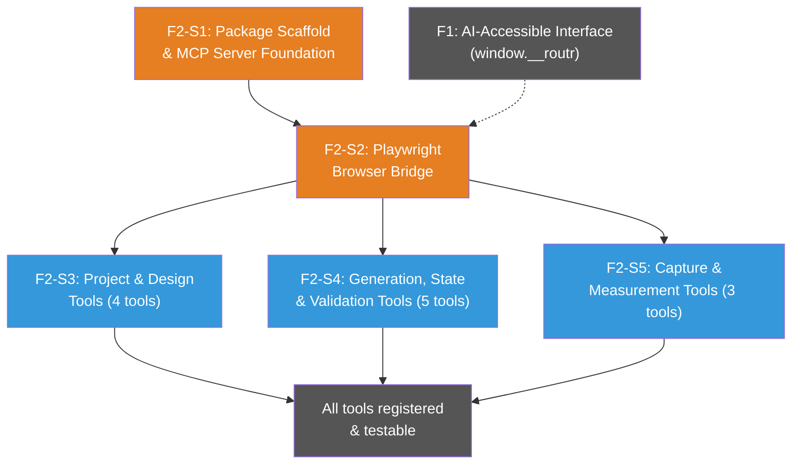

*🟠 Orange = serial (S1 → S2 must happen in order). 🔵 Blue = S3/S4/S5 parallelizable after S2 (with worktrees!).*

#### Design Notes

- **Separate package**: `packages/routr-mcp/` with its own `package.json`, `tsconfig.json`, build config. Monorepo structure — the app doesn't depend on this package. Independent versioning.
- **MCP SDK**: `@modelcontextprotocol/sdk` — official TypeScript SDK. Handles protocol plumbing (JSON-RPC, tool registration, transport). We write tool definitions + handlers, SDK does the rest.
- **Transport**: stdio only for v1. Server is spawned as a child process by MCP clients (Claude Desktop, OpenClaw). Config entry is just `{ "command": "node", "args": ["packages/routr-mcp/dist/index.js"] }`.
- **Playwright bridge**: The MCP server launches a Chromium browser via Playwright, navigates to the running Routr dev server, and executes tool handlers via `page.evaluate(() => window.__routr.someMethod(...))`. All 13 tools go through the browser — headed-only for v1.
- **Dev-only**: MCP server is a dev dependency. Not in staging, not in production. Same category as Vitest and Playwright. Does not affect app builds or deployment.
- **Tool descriptions are the documentation**: Each tool carries rich descriptions and parameter schemas as part of the MCP protocol. When a client connects, it receives the full tool catalog with context — the LLM knows when, why, and how to use each tool without external docs.
- **Lightweight testing**: Tools are thin wrappers over `window.__routr` (already tested in F1). MCP layer tests verify: tool registration, parameter validation/schema correctness, and that handlers call the right `window.__routr` methods. Don't re-test engine logic.
- **Tool grouping rationale**: Stories split by conceptual domain rather than dependency chain because: (a) all tools depend equally on the Playwright bridge (S2), (b) domain grouping keeps related tool descriptions and schemas together for coherent review, (c) enables parallel execution with worktrees after S2 ships.

#### Tool Surface Reference

| Tool | Story | Domain |
|------|-------|--------|
| `create_board` | S3 | Project & Design |
| `add_shape` | S3 | Project & Design |
| `add_edge_treatment` | S3 | Project & Design |
| `set_tool_settings` | S3 | Project & Design |
| `import_svg` | Deferred | Project & Design (not in `window.__routr` yet — add when product features need it) |
| `generate_toolpaths` | S4 | Generation & Validation |
| `generate_gcode` | S4 | Generation & Validation |
| `get_project_state` | S4 | Generation & Validation |
| `load_fixture` | S4 | Generation & Validation |
| `validate_gcode` | S4 | Generation & Validation |
| `capture_design_view` | S5 | Capture & Measurement |
| `capture_sim_view` | S5 | Capture & Measurement |
| `measure_distance` | S5 | Capture & Measurement |

| Story | Name | Size | Description | Acceptance Criteria |
|-------|------|------|-------------|-------------------|
| **F2-S1** | Package Scaffold & MCP Server Foundation | Small | Create the `packages/routr-mcp/` package with project structure, MCP SDK setup, server initialization, and stdio transport. The empty shell that all tools plug into. | ① `packages/routr-mcp/` created with its own `package.json`, `tsconfig.json`, and build script (`npm run build` produces `dist/`). ② `@modelcontextprotocol/sdk` installed as a dependency. ③ `src/index.ts` initializes an MCP server with stdio transport — starts up, responds to `initialize` handshake, and returns an empty tool list on `tools/list`. ④ Server metadata includes name (`routr-tools`), version (from package.json), and description. ⑤ `npm run dev` script for development (watch mode or equivalent). ⑥ Server can be started standalone: `node dist/index.js` launches and waits for MCP client connection via stdin/stdout. ⑦ README.md documents: what this package is, how to build, how to connect from Claude Desktop (config snippet), prerequisites (Routr dev server must be running). ⑧ Not added to the app's dependencies — fully independent package. |
| **F2-S2** | Playwright Browser Bridge | Medium | Implement the connection layer between the MCP server and the running Routr app. Server launches Playwright, navigates to the dev server, and provides a shared `page` context for all tool handlers to execute against. | ① `src/browser.ts` module that: launches Playwright Chromium (headed or headless browser — configurable via env var, default headless), navigates to the Routr dev server URL (configurable, default `http://localhost:5173`), and waits for `window.__routr` to be available. ② Exports a `getPage()` function that tool handlers use to access the Playwright `Page` instance. ③ Browser launches on first tool invocation (lazy init), not on server startup — avoids blocking the MCP handshake. ④ Graceful shutdown: browser closes when MCP server disconnects or process exits. ⑤ Descriptive error if Routr dev server isn't running or `window.__routr` isn't available (e.g., prod build without the env flag). ⑥ Configurable via environment variables: `ROUTR_URL` (dev server), `ROUTR_HEADLESS` (browser visibility), `ROUTR_VIEWPORT` (default `1280x720`). ⑦ Viewport locked to configured size for consistent screenshot capture. ⑧ Playwright added as a dev dependency of `packages/routr-mcp`. ⑨ Integration test: server starts, connects to a running Routr instance, confirms `window.__routr` is accessible via `page.evaluate()`. |
| **F2-S3** | Project & Design Tools | Small–Med | Implement the 4 tools for building projects programmatically: `create_board`, `add_shape`, `add_edge_treatment`, `set_tool_settings`. These are the "write" tools — they mutate project state via `window.__routr`. (`import_svg` deferred — not yet wired into `window.__routr`. Add when product features need it.) | ① All 4 tools registered on the MCP server with descriptive names, rich descriptions explaining when/why to use each, and Zod parameter schemas matching the `window.__routr` API types from F1. ② `create_board` — accepts width, height, thickness, optional material name. Returns board ID. Description guides LLM: "Use to set up a new workpiece before adding shapes." ③ `add_shape` — accepts boardId + shape config (type, position, dimensions, depth, cutType). Returns shape ID. Validates boardId exists. Description includes valid type/cutType combinations (e.g., "Use type 'line-cut' for table saw operations, 'rectangle' with cutType 'pocket' for router pockets"). ④ `add_edge_treatment` — accepts boardId + treatment config (edge, type, dimensions). Validates boardId and edge. ⑤ `set_tool_settings` — accepts bit diameter, feed rate, plunge rate, step down, safe height, spindle speed. All parameters have sensible descriptions with units (e.g., "Feed rate in mm/min"). ⑥ Invalid parameters return MCP error responses with descriptive messages (not silent failures). ⑦ Each tool handler calls the corresponding `window.__routr` method via `page.evaluate()`. ⑧ Unit tests: verify all 4 tools appear in `tools/list`, parameter schemas are valid, handlers call correct `window.__routr` methods (mock `page.evaluate`). |
| **F2-S4** | Generation, State & Validation Tools | Medium | Implement the 5 tools for generating output, reading state, loading fixtures, and validating: `generate_toolpaths`, `generate_gcode`, `get_project_state`, `load_fixture`, `validate_gcode`. These are the "read/generate" tools — core of the testing workflow. | ① All 5 tools registered with descriptive names, rich descriptions, and Zod schemas. ② `generate_toolpaths` — no required params. Returns toolpath operations array as JSON. Description: "Generate intermediate toolpath operations from current project state. Use to inspect operations before G-code generation." ③ `generate_gcode` — optional format param (default "grbl"). Returns G-code as text string. Description: "Call after loading a fixture or building a project. Returns the same G-code the Export button produces." ④ `get_project_state` — no params. Returns current Zustand store state as JSON. Description: "Read the full project state — boards, shapes, tool settings, edge treatments. Use to verify state after mutations." ⑤ `load_fixture` — accepts fixture JSON object matching the `TestFixture` schema from F1/F3. Clears existing state and hydrates. Description: "Load a complete test fixture to set up a known project state. Use for testing and validation." ⑥ `validate_gcode` — accepts generated G-code string + expected G-code string. Returns diff results (match/mismatch + line-by-line diff on failure). Description: "Compare generated G-code against an expected baseline. Returns pass/fail with diff details." ⑦ Invalid fixture JSON returns descriptive MCP error. ⑧ Each handler calls corresponding `window.__routr` method via `page.evaluate()`. ⑨ Unit tests: verify all 5 tools registered, schemas valid, handlers call correct `window.__routr` methods (mock `page.evaluate`). |
| **F2-S5** | Capture & Measurement Tools | Small–Med | Implement the 3 tools for visual capture and dimensional measurement: `capture_design_view`, `capture_sim_view`, `measure_distance`. These enable visual regression testing and cross-layer verification via MCP. | ① All 3 tools registered with descriptive names, rich descriptions, and Zod schemas. ② `capture_design_view` — no required params. Returns base64 PNG of the 2D design canvas as an MCP image content block. Description: "Capture a screenshot of the current 2D design tab. Use to verify visual layout of shapes on the board." ③ `capture_sim_view` — optional `angle` param (`top-down` or `front`, default `top-down`). Returns base64 PNG of the 3D sim at the specified orthographic angle as an MCP image content block. Description: "Capture the 3D simulator view at a standard orthographic angle. Use 'top-down' for X/Y verification, 'front' for edge treatment Z-axis verification." ④ `measure_distance` — two modes: point-to-point (accepts two `{x, y}` points, returns distance in mm) OR shape-to-edge (accepts shapeId + edge name, returns distance from shape boundary to board edge). Description explains both modes with usage guidance. ⑤ Screenshot tools return MCP `image` content type (not text with base64 — actual image blocks the LLM can "see"). ⑥ Invalid shapeId or unrecognized angle returns descriptive MCP error. ⑦ Screenshots captured at locked viewport size (from S2 config) for consistency. ⑧ Unit tests: verify all 3 tools registered, schemas valid, image tools return correct content type, measurement tool handles both modes. |

---

## Decisions Log

| Date | Decision | Rationale | Alternatives Considered |
|------|----------|-----------|------------------------|
| 2026-03-23 | Kerf line flip bug is standalone, not in this epic | Bug fix, not validation concern. Blocks table saw baseline. | Include in epic (rejected — different concern) |
| 2026-03-23 | Full pipeline vision in one doc; layers become features | Complete picture in one doc; incremental execution | Only G-code testing (rejected — misses visual regression where real bugs were) |
| 2026-03-23 | First forward-looking design doc | Designing before building prevents the bug class that triggered this epic | Code first, doc later (rejected — caused the coordinate bugs) |
| 2026-03-23 | JSON test fixtures over hardcoded test data | Readable, shareable, used by both G-code and visual tests | Hardcoded TS (rejected — can't share across test types) |
| 2026-03-23 | Visual regression via Playwright screenshots | Catches cross-layer inconsistencies (design vs sim) that G-code tests miss | No visual testing (rejected — chamfer flip proved this is necessary) |
| 2026-03-23 | Simulator validation = human eyeball | Automated photo comparison too complex; eyeball is faster and sufficient | Pixel comparison with physical photos (rejected — brittle) |
| 2026-03-23 | ±0.5mm starting tolerance | Conservative; will adjust after first measurements | — |
| 2026-03-23 | Include measurement tool in this epic | Dual purpose (validation + user feature); enables E2E protocol and cross-layer verification | Separate epic (rejected — too tightly coupled to validation) |
| 2026-03-23 | Three-layer testing model (unit → integration → E2E) | Cleaner than four layers; sim eyeball is part of E2E, not its own layer | Four layers (rejected — over-granular) |
| 2026-03-23 | Build AI-accessible interface (window.__routr) | App is built by AI — should be testable by AI. Hooks enable testing AND future AI features (PDF-to-G-code). Core architectural pattern for AI-designed apps. | Playwright-only UI automation (rejected — fragile, slow, fights against the grain) |
| 2026-03-23 | Hybrid CI/CD: GitHub Actions for deterministic tests, local for visual/AI-driven | CI catches regressions between sessions without token cost; sub-agents handle dev-loop testing | All-CI or all-local (both rejected — see CI/CD section) |
| 2026-03-23 | CI blocks PR merges (required status check) | Quality gate — same principle as all other gates in the pipeline | Advisory only (rejected — too easy to ignore) |
| 2026-03-23 | MCP server as separate package | Clean separation of concerns; independent versioning; positions for distribution beyond testing | Part of app (rejected — couples testing infra to app) |
| 2026-03-23 | MCP server wrapping `window.__routr` for AI-driven testing | MCP gives LLMs structured tool access with context — enables exploratory testing AND future product features. Testing infrastructure IS the product integration layer. | Raw API only (rejected — misses LLM context layer) |
| 2026-03-23 | Protagonist/antagonist agent pattern for QA | Adversarial testing drives quality — antagonist has different incentives than protagonist | Single agent does both (rejected — conflicting goals) |
| 2026-03-24 | Measurement tool in both 2D design tab and 3D sim tab | Cross-layer measurement catches coordinate bugs (like kerf line flip) with numbers, not just visuals | Design tab only (rejected — misses the cross-layer verification value) |
| 2026-03-24 | Measurement tool UX: top toolbar "Measure" mode (Fusion 360 style) | Consistent across 2D/3D contexts; established UX pattern from industry-standard CAD tools | Panel-based (rejected — panels are tab-specific; toolbar is global) |
| 2026-03-24 | `window.__routr` on staging behind feature flag, not in production yet | Staging enables AI feature experimentation without production risk | Dev only (rejected — limits experimentation), Prod (rejected — premature) |
| 2026-03-24 | E2E validation records are pass/fail with comments; photos optional | Photos are documentation, not test mechanisms. Consistent physical photos are impractical. | Mandatory photos (rejected — too rigid, inconsistent results) |
| 2026-03-24 | AI interface as core architectural pattern for AI-designed apps | If AI designs, writes, tests, and will power features of the app — a first-class AI interaction layer is as fundamental as choosing state management. Should be considered for all CSDLC projects. | Treat as optional tooling (rejected — misses the architectural significance) |
| 2026-03-25 | Defer protagonist/antagonist codification in PROCESS.md until pattern is tested | Don't commit untested patterns to the methodology. Design it in the epic, validate during implementation, then codify. | Codify immediately (rejected — premature standardization) |
| 2026-03-25 | Measurement tool: engine in this epic, UI in separate epic | Validation needs programmatic `measureDistance`/`measureFromEdge`. The toolbar mode, click-to-measure UX, and visual overlays are a user-facing feature with its own design concerns. | All in one epic (rejected — couples validation timeline to UI design) |
| 2026-03-25 | `VITE_EXPOSE_DEV_API` env flag for `window.__routr` | Vite tree-shakes the entire module out of prod builds. Dev/test always-on, staging via env var. Scoped to this API — not overhauling existing feature flag patterns. | Compile-time boolean like `featureFlags.ts` (rejected — can't toggle on staging without rebuild). Hostname check (rejected — fragile, not tree-shakeable). |
| 2026-03-25 | Keep F1-S2 and F1-S3 as separate stories | S2 (fixture loading) is the most complex F1 story — JSON→Zustand mapping, state clearing, validation. S3 (G-code hooks) is thin wrappers. Separating them keeps S2 focused and prevents delays if fixture loading hits complications. | Combine S2+S3 (rejected — reliability over speed) |
| 2026-03-25 | Implementation batches: F1→F3→F4, then F2→F5, then F7 | Fastest path to regression protection (Batch 1). MCP layer comes online when there's something to wrap (Batch 2). Physical validation last since it depends on everything + machine time (Batch 3). | Build MCP first (rejected — nothing to wrap yet) |
| 2026-03-24 | Consolidated features: 7 instead of 9 | Comprehensive fixture absorbed into F3 (it's just another fixture). Cross-layer measurement tests absorbed into F5 (it's 3 lines of assertion code per fixture, not a standalone feature). Eliminates overhead without losing coverage. | Keep all 9 (rejected — added process overhead without proportional value) |
| 2026-03-26 | Generate `.expected.nc` baselines in F3, not F4 | Eliminates ambiguity about F4 scope — F4 is purely "build the test harness + reporting." F3 delivers complete fixture packages (JSON + baseline). | Defer baselines to F4 (rejected — makes F4 scope ambiguous) |
| 2026-03-26 | Create `straight-cut-basic` fixture without baseline | Fixture JSON is valid regardless of kerf flip bug. Baseline deferred until bug is fixed. Validation script skips baseline comparison when no `.expected.nc` exists. | Skip fixture entirely (rejected — wastes valid work), Create baseline with known-bad output (rejected — encodes incorrect behavior) |
| 2026-03-26 | Fixture validation script as F3 quality gate | The script is how the AI Lead proves to the human that F3 is complete — "all fixtures load and generate G-code without errors." Without it, F3 is just JSON files with no proof they work. | No validation script (rejected — no quality gate) |
| 2026-03-26 | Fixtures in `src/__fixtures__/` (not alongside tests) | Fixtures are consumed by F4, F5, AND F7 — shared test data, not coupled to one test suite. Central location keeps them accessible to all downstream consumers. | Alongside devApi tests (rejected — couples to one consumer) |
| 2026-03-26 | Keep stories in epic doc (don't split) | One epic, one doc. F1 stories already live here. Splitting creates navigation friction ("which doc?"). Context fatigue managed by not loading the full doc in sub-agent prompts, not by splitting the source of truth. | Separate stories doc (rejected — navigation overhead, split source of truth) |
| 2026-03-26 | Split CI strategy: local for text tests, GitHub Actions for visual tests | Text-based tests (unit, G-code, cross-layer) are deterministic and fast — local sub-agent verification is sufficient. Visual tests have a unique workflow problem: screenshot artifacts need consistent rendering environments and attachment to PRs. GitHub Actions solves both. Not CI for CI's sake — CI where it solves a real problem. | All local (rejected — manual screenshot uploading is clunky), All CI (rejected — overhead for text tests that don't need it) |
| 2026-03-26 | Consolidate baseline management in F3 | F3-S5's validation script handles baseline generation/regeneration. F4 reads baselines and asserts. One tool, one command, one place to maintain. Avoids two scripts doing the same thing. | Separate F4 update command (rejected — duplication) |
| 2026-03-26 | F4 test harness auto-discovers fixtures | Single test file dynamically discovers `*.fixture.json` files. Adding a new fixture automatically adds a test case — zero boilerplate. | Per-fixture test files (rejected — manual maintenance, boilerplate) |
| 2026-03-26 | Fixtures without baselines → skipped (not failed) | `straight-cut-basic` blocked on kerf flip. Skipping is accurate — "no baseline" ≠ "test failed." When baseline is generated, test automatically activates. | Skip fixture entirely (rejected — loses visibility), Fail (rejected — inaccurate) |
| 2026-03-26 | Markdown test report (not HTML) for F4 | Renders natively in GitHub PR descriptions. Sub-agents paste report directly into PR body. HTML makes sense for F5 when screenshot galleries are needed. | HTML report (rejected for F4 — no screenshots to display, adds hosting complexity) |
| 2026-03-26 | Update WORKFLOW.md agent template as part of F4 | Sub-agents must run integration tests as a verification step. Template update ensures this is baked into every future sub-agent prompt. Compensates for deferred CI — the template IS the quality gate. | Separate ticket (rejected — tightly coupled to F4's test harness) |
| 2026-03-26 | F5 dependency on F6 removed | Measurement engine shipped in F1-S6. F5 cross-layer assertions use the programmatic API, not the measurement tool UI. F6 (UI) is a separate epic. F5 moves from Batch 2 dependency chain to directly after F3/F4. | Keep F6 dependency (rejected — F6 UI not needed for programmatic assertions) |
| 2026-03-26 | Cross-layer assertion: measureFromEdge vs parsed G-code positions | Three sources of truth (measurement API, G-code, screenshots) must agree. Programmatic assertion compares ① and ② without a dedicated toolpath measurement API. G-code X/Y parsing is sufficient. Add `measureToolpathFromEdge()` later if this proves brittle. | Build toolpath measurement API first (rejected — premature, G-code parsing achieves the same detection) |
| 2026-03-26 | Golden screenshots committed to git, diff images as CI artifacts | ~21 PNGs (~5-10MB) is manageable in git. Diff images are ephemeral (auto-expire from GitHub Actions). No orphan branch gymnastics. Revisit with Git LFS if fixture count grows. | Git LFS (rejected — tooling overhead at current scale), Orphan branch (rejected — CI artifacts are cleaner) |
| 2026-03-26 | Visual tests run on every PR, not gated by file changes | Non-UI changes can shift rendering (toolpath algorithm, coordinate fixes). Gating on file changes misses exactly the bug class we're catching. 30-60 seconds is acceptable. | Only run on UI file changes (rejected — misses the point) |
| 2026-03-24 | Orthographic views only: top-down + front | Perspective projection introduces angle distortion that makes pixel-diff unreliable — a shift could be real or just a projection artifact. Orthographic views map pixel positions directly to board positions. Top-down covers X/Y, front covers X/Z. All three dimensions verified without angle correction math. | Perspective-45 + front (rejected — perspective distortion complicates position verification), four angles (rejected — two orthographic + measurement API provides complete coverage) |
| 2026-03-24 | Auto-generated test report for proving validity to human | Human reviews evidence (report with diffs, screenshots, measurements), not code. Test runner generates the proof automatically — no manual screenshot capturing. | Manual PR screenshots (rejected — tedious, inconsistent, nobody does it reliably) |
| 2026-03-27 | Headed-only for F2 v1 (no headless mode) | Headless mode requires importing Zustand + engine outside browser context — non-trivial. Headed mode (Playwright bridge) covers all 13 tools including screenshots. Headless is a future optimization. | Headless-first (rejected — can't do screenshots), Both modes (rejected — premature complexity) |
| 2026-03-27 | stdio transport only for F2 v1 (no SSE) | Minimal viable implementation. stdio is standard for local MCP tools (Claude Desktop, OpenClaw). SSE/Streamable HTTP needed only for remote/cloud connections — future follow-up. | SSE from start (rejected — over-engineering, no remote use case yet) |
| 2026-03-27 | Lightweight MCP layer tests (don't re-test engine) | Tools are thin wrappers over `window.__routr` (tested in F1). MCP tests verify tool registration, parameter schemas, and that handlers call correct `__routr` methods. Engine logic already has unit + integration test coverage. | Full integration tests per tool (rejected — duplicates F1 test coverage), No MCP tests (rejected — need to verify the wrapper layer) |
| 2026-03-27 | MCP server is dev-only (not in staging or prod) | Same category as Vitest and Playwright. Does not affect app builds or deployment. Future product features (PDF-to-G-code, AI design assistant) would need a deployed MCP server — separate epic. | Deploy to staging (rejected — premature, no product use case yet) |
| 2026-03-27 | Tool stories split by conceptual domain (not dependency chain) | All tools depend equally on the Playwright bridge (S2). Domain grouping keeps related schemas together for coherent review. Enables parallel execution with worktrees after S2 ships. | One mega-story for all tools (rejected — too large for one agent), Per-tool stories (rejected — 13 stories is excessive for thin wrappers) |
| 2026-03-27 | Defer `import_svg` from F2 | Not wired into `window.__routr` in F1. Not needed for testing workflows (fixtures handle setup). Add when product features (PDF-to-G-code, AI design assistant) need it. Drops S3 from 5 to 4 tools. | Include and wire up in F1 first (rejected — no current use case, adds scope to two features) |
| 2026-03-27 | No per-cut-type MCP tools | `add_shape` handles all cut types via `type` + `cutType` params. Tool description guides LLM on valid combinations. One flexible tool > 6 specialized ones. | Separate tools per cut type (rejected — redundant, inflates tool surface) |
| 2026-03-27 | Lazy browser init (first tool invocation, not server startup) | Avoids blocking the MCP handshake while Playwright launches. Client connects fast, browser spins up on first actual use. | Eager init on startup (rejected — slow handshake, browser may not be needed for tool listing) |
| 2026-03-27 | validate_gcode diff logic lives in MCP tool | Tool accepts generated + expected G-code strings, returns pass/fail with line-by-line diff. Self-contained — client doesn't need diff logic. | Return raw G-code, let client compare (rejected — pushes complexity to every client) |
| 2026-03-27 | Defer `import_svg` from F2 | Not wired into `window.__routr` (F1 didn't include it). Not needed for testing workflows — fixtures handle test setup. Add when product features (PDF-to-G-code) need it. F2 ships with 12 tools, not 13. | Include and add to __routr first (rejected — scope creep, no current use case) |
| 2026-03-27 | No per-cut-type MCP tools | `add_shape` handles all cut types via `type` + `cutType` params. Tool description documents valid combinations. One flexible tool > many rigid ones. | Separate tools per cut type (rejected — redundant, explodes tool count) |

---

## Future Work: MCP Tool Surface Expansion

*Captured March 25, 2026 — context: protagonist/antagonist agentic testing pattern.*

The current 12-tool surface is write-heavy (create, set, generate). For the antagonist agent pattern to work effectively, we need **read-back, mutation, and chaos tools**. The protagonist needs tools to build; the antagonist needs tools to inspect, mutate, and break.

### Proposed Additional Tools

| Tool | Category | Rationale |
|------|----------|-----------|
| `clear_project` / `undo` | State Management | Reset between adversarial runs without full page reload |
| `get_shape` / `list_shapes` | Read-back | Antagonist needs to verify mutations took effect, inspect current state at shape level |
| `resize_board` / `move_shape` | Mutation | Current tools only create — need to modify existing objects for regression testing |
| `delete_shape` | Chaos | What happens with zero shapes? With overlapping deletions? Edge cases. |
| `get_tool_settings` | Read-back | Verify settings were applied correctly (complement to `set_tool_settings`) |
| `import_svg` | Design Input | Deferred from F2 — antagonist would throw malformed/complex SVGs. Requires `window.__routr` wiring first. |
| `set_tab` / `navigate` | Navigation | Switch tabs programmatically — test cross-tab state consistency |

### Guiding Principle

**Protagonist = write tools (build projects, generate output). Antagonist = read + chaos tools (inspect state, mutate, break things).** The current surface is ~80% protagonist. Expanding read-back and mutation tools enables the adversarial testing pattern described in the epic design notes.

### Implementation Notes

- Each new tool needs a corresponding `window.__routr` method in the devApi
- Read-back tools (`get_shape`, `list_shapes`, `get_tool_settings`) are thin — just expose existing Zustand state
- Mutation tools (`resize_board`, `move_shape`, `delete_shape`) need new store actions
- Scope as a follow-up epic or add incrementally as the antagonist pattern is validated

---

## Known Issues / Tech Debt

| Issue | Severity | Notes |
|-------|----------|-------|
| Kerf line flip (table saw) | High | Blocks table saw fixture baseline. Standalone ticket. |
| No CI/CD test automation | Medium | Tests run locally only. G-code integration tests are ideal first CI candidate. |
| Roundover disabled | Low | No validation needed until feature is re-enabled. |

---

*This epic doc is refined collaboratively (Step 0) before stories are broken down (Step 1). Once refined, the AI Lead extracts context from this doc to craft sub-agent prompts (Step 2).*
*Update this doc as implementation reveals new information — design docs are living documents.*
