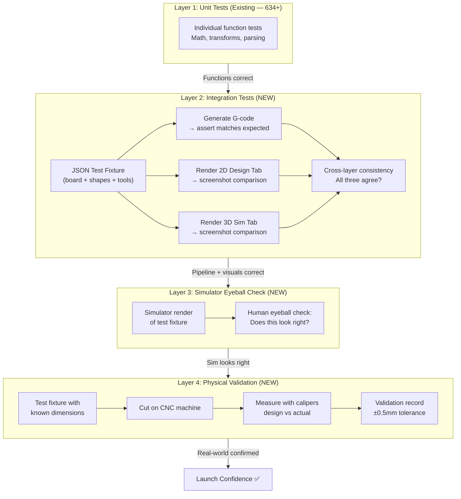
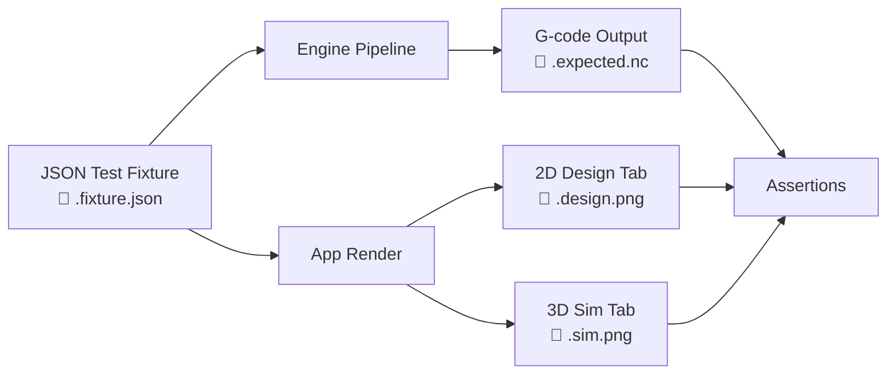
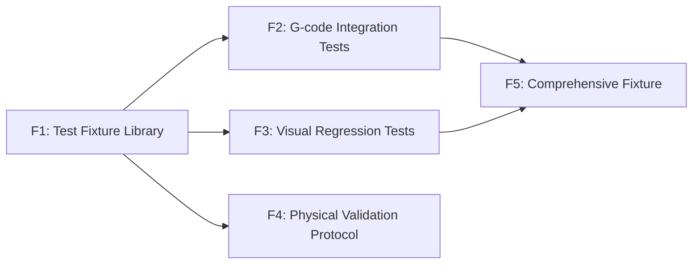

# Validation Pipeline — Epic Design Doc

*Status: 🔄 In Refinement (Step 0)*
*Authors: Dan Hannah & Clay*
*Created: March 23, 2026*

---

## Overview

### What Is This Epic?

The Validation Pipeline is Routr's quality assurance backbone — a multi-layered system that ensures G-code generated by the app produces dimensionally accurate, safe cuts on real CNC machines. It bridges the gap between "the app works in the browser" and "this G-code is safe to run on wood."

This is Routr's first forward-looking design doc. Every previous doc was retroactive. This one designs before building.

### Problem Statement

Routr has 634+ unit tests that prove individual functions produce correct math. But there is **no automated way to verify that the full pipeline — from board configuration to final G-code output — produces correct results.** And beyond digital verification, there's no formal process for validating that G-code performs correctly on a physical CNC machine.

**What's broken today:**

- A change to the toolpath generator could silently alter G-code output for every operation type, and no test would catch it
- Coordinate system bugs (like the edge treatment flip and kerf line flip) made it to real cuts before being discovered
- The design tab, simulator, and G-code can each show *different* things — a chamfer placed on the top edge in the design tab showed up on the bottom in the sim tab but cut correctly in real life. No automated test catches cross-layer visual inconsistencies.
- There's no "known good" G-code baseline to compare against
- Physical validation cuts have been done ad hoc — no formal protocol, no documented results, no traceability from design dimensions to measured dimensions

**What triggered this work:**

The coordinate flip bug class — the same category of bug appeared in edge treatments and table saw kerf lines. Both were caught during physical cuts, not by tests. The chamfer top/bottom flip between design and sim tabs proved that **G-code correctness alone isn't sufficient** — visual consistency across the app's layers matters too. With launch approaching, the question is: what else might be wrong that we haven't cut yet?

### Goals

- Define the complete validation pipeline from automated tests to physical verification
- Establish integration tests driven by JSON test fixtures that validate G-code output, 2D canvas rendering, AND 3D simulator rendering
- Create a formal physical validation protocol with documented results
- Make "is this operation validated?" answerable for any feature at any time
- Enable fast, confident iteration on the codebase without fear of silent regressions

### Non-Goals

- **Not building a CI/CD pipeline** — tests will run locally (CI/CD is a separate concern)
- **Not fixing the kerf line flip bug** — that's a standalone ticket
- **Not adding roundover validation** — roundover is feature-flagged off for launch
- **Not automating physical cuts** — the human runs the CNC machine; this epic defines the protocol
- **Not building an in-app measurement tool** — that's a related but separate feature (see Related Work below)

---

## Context

### Current State

**What exists today:**

| Layer | Status | Coverage |
|-------|--------|----------|
| Unit tests | ✅ 634+ tests | Individual toolpath generators, edge mapping, bit offset, arc G-code, coordinate transforms, SVG parsing |
| Integration tests (JSON fixtures) | ❌ None | No end-to-end pipeline tests |
| Visual regression tests | ❌ None | No screenshot comparison for 2D or 3D canvases |
| Physical validation | 🟡 Ad hoc | Dan has cut most operations but results aren't formally documented |

**Test files by area (56 total):**

- `engine/toolpath/` — 15 test files (straightCut, pocketCuts, drillCuts, edgeTreatmentCuts, arcGcode, miterCuts, etc.)
- `engine/svg/` — 3 test files (parser, import, pocket detection)
- `components/` — 10+ test files (simulator, preview3d, panels)
- `__tests__/` — root-level integration-adjacent tests (edge treatments, auto-link, solver)

The unit tests are solid but test functions in isolation. None of them test the **full pipeline**: "given this board with these shapes and these tool settings, the G-code output should be exactly X and the 2D canvas should look exactly like Y and the sim should look exactly like Z."

### Affected Systems

| System / Layer | How It's Affected |
|---------------|-------------------|
| G-code Pipeline | Primary target — integration tests validate end-to-end G-code output |
| Workshop Mode (2D Canvas) | Visual regression screenshots validate design tab rendering |
| Simulator (3D Canvas) | Visual regression screenshots validate 3D sim rendering |
| Coordinate Systems | Cross-layer visual tests catch coordinate transform inconsistencies |
| Edge Treatments | Specific validation needed for each treatment type × edge combination |
| SVG Import | Engrave and pocket toolpaths need integration test coverage |

### Dependencies

- **Coordinate flip fix (SHIPPED)** — centralized `edgeMapping.ts` must be in place before establishing baselines
- **Kerf line flip bug (OPEN)** — should be fixed before table saw baselines are established
- **Playwright** — already available as a skill; needed for screenshot capture automation

### Dependents

- **Production launch** — launch requires minimum validation confidence per operation type
- **Future features** — any new operation type enters the pipeline through this framework
- **In-app measurement tool** — a future feature that would make physical validation faster (see Related Work)

---

## Design

### The Four Validation Layers



Each layer catches different categories of bugs:

| Layer | What It Catches | Cost | Frequency |
|-------|----------------|------|-----------|
| **Unit tests** | Math errors, logic bugs, type mismatches | Free (seconds) | Every code change |
| **Integration tests** | G-code pipeline regressions, coordinate bugs, visual rendering inconsistencies between 2D/3D/G-code | Free (seconds) | Every code change |
| **Simulator eyeball** | "Does the sim output look like what I'd expect this cut to look like?" | Low (minutes) | After baseline changes |
| **Physical validation** | Real-world factors: tool deflection, material variance, machine quirks, dimensional accuracy | High (material + time) | New operation types, coordinate changes, pre-launch |

### Layer 2: Integration Tests (Detail)

This is the core of the epic. Integration tests tie together three outputs from a single input:



**The JSON Test Fixture**

A fixture file fully describes a project state — everything needed to reproduce a specific board configuration deterministically:

```json
{
  "name": "straight-cut-basic",
  "description": "Single vertical table saw cut through a 200x100mm board",
  "board": {
    "width": 200,
    "height": 100,
    "thickness": 19
  },
  "shapes": [
    {
      "type": "rectangle",
      "cutType": "table-saw",
      "position": { "x": 100, "y": 0 },
      "params": { "width": 0, "height": 100 },
      "depth": 19
    }
  ],
  "toolSettings": {
    "bitDiameter": 6.35,
    "feedRate": 1000,
    "plungeRate": 500,
    "stepDown": 3,
    "safeHeight": 5,
    "spindleSpeed": 18000
  },
  "edgeTreatments": [],
  "units": "metric"
}
```

**Fixture design principles:**

- Each fixture tests **one concern** — a straight cut fixture, a pocket fixture, etc.
- Use **known, simple dimensions** — easy to mentally verify
- Specify **ALL settings explicitly** — never rely on defaults (defaults change, fixtures shouldn't)
- A **comprehensive fixture** combines multiple operations to test ordering and tool changes

**Three assertion types from each fixture:**

**1. G-code assertion** — Generate G-code from the fixture through the engine pipeline. Compare against a stored `.expected.nc` file. Character-by-character match. If it differs, the test fails — developer reviews the diff and either updates the expected file (intentional change) or fixes the regression.

**2. 2D canvas screenshot** — Load the fixture into the app, render the design tab, capture a screenshot with Playwright. Compare against a stored `.design.png` golden image using pixel-diff with a tolerance threshold (to absorb anti-aliasing and rendering engine differences). Catches: shapes rendered in wrong positions, cuts drawn on wrong side, visual artifacts.

**3. 3D sim screenshot** — Same fixture, switch to simulator tab, generate toolpaths, capture screenshot. Compare against `.sim.png` golden image. Catches: the chamfer-on-wrong-edge class of bugs — where the design tab shows one thing and the sim shows another.

**Cross-layer consistency is the killer feature.** The chamfer flip bug would have been caught: the 2D screenshot would show the chamfer on top, the 3D screenshot would show it on the bottom, and a human reviewing the test output would immediately see the discrepancy.

> 🟡 **OPEN QUESTION:** Should the 3D sim screenshot use a fixed camera angle for consistency? Or multiple angles? Fixed angle is simpler and more deterministic. We can always add angles later.

**File structure:**

```
cncmill-app/src/engine/__fixtures__/
├── straight-cut-basic/
│   ├── fixture.json          # Input: board + shapes + tools
│   ├── expected.nc           # Expected G-code output
│   ├── design.png            # Golden 2D canvas screenshot
│   └── sim.png               # Golden 3D sim screenshot
├── pocket-rectangle/
│   ├── fixture.json
│   ├── expected.nc
│   ├── design.png
│   └── sim.png
├── drill-basic/
│   └── ...
├── edge-chamfer-top/
│   └── ...
├── svg-engrave/
│   └── ...
└── multi-operation/          # Comprehensive: multiple ops on one board
    └── ...
```

**Fixture inventory (initial set):**

| Fixture | What It Tests | Priority |
|---------|--------------|----------|
| `straight-cut-basic` | Table saw vertical cut | 🔴 High (blocked on kerf flip fix) |
| `pocket-rectangle` | Router rectangular pocket | 🔴 High |
| `pocket-circle` | Router circular pocket | 🟡 Medium |
| `drill-basic` | Single drill hole | 🔴 High |
| `drill-grid` | Multiple drill holes | 🟡 Medium |
| `profile-cut` | Board outline profile with tabs | 🔴 High |
| `edge-chamfer-top` | Chamfer on top edge | 🔴 High |
| `edge-chamfer-bottom` | Chamfer on bottom edge | 🔴 High |
| `edge-chamfer-left` | Chamfer on left edge | 🟡 Medium |
| `edge-chamfer-right` | Chamfer on right edge | 🟡 Medium |
| `edge-dado` | Dado on edge | 🟡 Medium |
| `edge-rabbet` | Rabbet on edge | 🟡 Medium |
| `svg-engrave` | SVG import with engrave toolpath | 🟡 Medium |
| `svg-pocket` | SVG with pocket detection | 🟡 Medium |
| `surfacing` | Planer/surfacing operation | 🟢 Low |
| `multi-operation` | Comprehensive: straight cut + pocket + drill + edge treatment | 🔴 High |

### Layer 3: Simulator Eyeball Check (Detail)

**Purpose:** A lightweight human sanity check — does the simulator output look like what you'd expect this cut to produce?

**How it works:**

This is NOT automated pixel comparison. It's a human looking at the simulator render and saying "yeah, that looks right" or "wait, that chamfer is on the wrong edge." The simulator already exists and works — this layer just formalizes the practice of reviewing sim output before cutting.

**When to do it:**

- After establishing new fixture baselines
- After any coordinate system changes
- Before physical validation cuts (preview what you're about to cut)

**Record format:**

| Fixture | Eyeball Check | Date | Notes |
|---------|:---:|------|-------|
| `straight-cut-basic` | ✅ | 2026-03-XX | Looks correct |
| `edge-chamfer-top` | ✅ | 2026-03-XX | Chamfer renders on correct edge |

### Layer 4: Physical Validation Protocol (Detail)

**Purpose:** Confirm that G-code, when run on a real CNC machine, produces parts within acceptable tolerance.

**Protocol for each validation cut:**

1. **Design** — Load test fixture in Routr (or create the design matching the fixture)
2. **Eyeball** — Check sim tab (Layer 3) — does it look right?
3. **Export** — Generate G-code
4. **Setup** — Load G-code on CNC, set origin, verify material dimensions with calipers
5. **Cut** — Run the program
6. **Measure** — Use calipers to measure critical dimensions
7. **Record** — Document: design dimension → actual dimension → delta → pass/fail
8. **Photo** — Take a photo of the cut piece for the record

**Tolerance target: ±0.5mm (±0.020")**

Starting point. Tighter than most hobby CNC work but achievable with proper setup. Will adjust based on real measurement data.

| Decision | Date | Rationale |
|----------|------|-----------|
| ±0.5mm starting tolerance | 2026-03-23 | Conservative starting point; adjust after first round of measurements |

**Validation matrix:**

| Operation Type | Previously Cut? | Needs Re-cut Pre-Launch? | Status |
|---------------|:-:|:-:|--------|
| Table saw (straight cut) | ✅ | 🔴 Yes (kerf line flip) | Blocked on bug fix |
| Router pocket (rectangle) | ✅ | 🟡 Re-verify dimensions | — |
| Router pocket (circle) | ✅ | 🟡 Re-verify dimensions | — |
| Router pocket (freeform/path) | ✅ | 🟡 Re-verify dimensions | — |
| Drill holes | ✅ | 🟡 Re-verify dimensions | — |
| Profile cut (board outline) | ✅ | 🟡 Re-verify dimensions | — |
| Edge treatment (chamfer) | ✅ | 🟡 Re-verify post-coordinate fix | — |
| Edge treatment (dado) | ❌ | 🔴 Yes (never cut) | Simple cut, low risk |
| Edge treatment (rabbet) | ❌ | 🔴 Yes (never cut) | Simple cut, low risk |
| SVG engrave | ✅ | 🟡 Re-verify | — |
| SVG pocket | ✅ | 🟡 Re-verify | — |
| Surfacing (planer) | ✅ | 🟢 Low priority | Simple operation |

> 🟡 **OPEN QUESTION:** For the "re-verify dimensions" items — is it worth doing a full dimensional accuracy test on all of them, or just re-cut the ones where the coordinate fix could have changed behavior? Dan's instinct here is key.

---

## Related Work

### In-App Measurement Tool (Future Feature — Not This Epic)

During refinement, Dan identified that an **in-app measurement tool** would dramatically simplify physical validation. The idea: click two points in the design tab and the app tells you the distance. "This hole center is 47.5mm from the left edge and 32mm from the top edge."

Then during physical validation, you measure the same dimensions on the cut piece with calipers and compare. The app already knows all these dimensions internally — this tool would just surface them in a validation-friendly way.

**Why it's not in this epic:** It's a UI feature, not a testing infrastructure concern. But it's a natural companion to Layer 4 (physical validation) and should be considered as a separate story or small epic.

---

## Edge Cases & Gotchas

| Scenario | Expected Behavior | Why It's Tricky |
|----------|-------------------|-----------------|
| Screenshot test fails due to rendering engine update | Pixel diff flags change | Need tolerance threshold in pixel comparison; anti-aliasing differences are noise |
| G-code assertion fails after intentional change | Developer updates `.expected.nc` | Easy to rubber-stamp updates without reviewing — need discipline |
| Imperial vs metric fixtures | All fixtures use mm internally | Display unit shouldn't affect G-code, but need to verify |
| Tool settings change default values | Assertions break if defaults change | Fixtures specify ALL settings explicitly, never rely on defaults |
| Multiple operations change ordering | G-code assertion catches it | Operation ordering logic is complex — assertion is the safety net |
| 3D camera angle changes | Sim screenshots fail | Must lock camera position/angle in test harness |
| Canvas resize changes | Design screenshots fail | Must lock viewport size in test harness |
| Coordinate system changes | ALL assertions break (expected) | This is the point — forced review of all outputs after coordinate changes |
| Theme changes (dark/light) | Screenshots could differ | Lock theme in test harness — probably light mode for consistency |

---

## Risks

| Risk | Likelihood | Impact | Mitigation |
|------|-----------|--------|------------|
| Screenshot tests are flaky (rendering differences across environments) | Medium | High | Fixed viewport, fixed theme, tolerance threshold, run on consistent environment |
| Integration tests create false confidence | Medium | High | Integration tests catch *regressions*. Initial baselines must be validated by physical cuts + human review. |
| Fixture maintenance burden as features grow | Medium | Medium | Keep fixtures minimal. One concern per fixture. Comprehensive fixture catches interaction bugs. |
| Physical validation bottleneck (Dan = only CNC) | High | High | Minimize required physical cuts. Integration tests + sim eyeball handle regressions. Physical only for new ops. |
| Playwright screenshot tests are slow | Medium | Low | Run visual tests separately from unit tests. Fast feedback for G-code assertions, slower for visual. |
| Kerf line flip bug contaminates table saw baselines | High | Medium | Fix bug BEFORE establishing table saw fixture baseline. |

---

## Stories

Features extracted from this epic. Each becomes a set of implementable stories during Step 1.

| Feature | Summary | Dependencies | Status |
|---------|---------|-------------|--------|
| F1 | **Test Fixture Library** — JSON fixture format, TypeScript types, initial set of fixtures, fixture loading utilities | None | |
| F2 | **G-code Integration Tests** — Load fixture → run engine pipeline → assert G-code matches `.expected.nc` | F1 | |
| F3 | **Visual Regression Tests** — Playwright harness to load fixture in app, capture 2D design + 3D sim screenshots, pixel-diff against golden images | F1 | |
| F4 | **Physical Validation Protocol** — Measurement recording template, validation matrix tracker, photo archive structure | F1 | |
| F5 | **Comprehensive Fixture** — Multi-operation board exercising full pipeline (straight cut + pocket + drill + edge treatment) | F1, F2, F3 | |



*Features are broken down into implementable stories during Step 1 (Story Breakdown). This table is the index.*

---

## Decisions Log

| Date | Decision | Rationale | Alternatives Considered |
|------|----------|-----------|------------------------|
| 2026-03-23 | Kerf line flip bug is a standalone ticket, not part of this epic | It's a bug fix, not a validation concern. But it blocks table saw fixture baseline. | Include in epic (rejected — different concern) |
| 2026-03-23 | Full pipeline vision in one doc; layers become features for incremental execution | Design doc captures complete picture; execution is incremental | Only document G-code testing (rejected — misses visual regression, which is where the real bugs were) |
| 2026-03-23 | First forward-looking design doc (not retroactive) | Designing before building prevents the bug class that triggered this epic | Code first, document later (rejected — that approach caused the coordinate bugs) |
| 2026-03-23 | JSON test fixtures over hardcoded test data | Fixtures are readable, shareable, and can be used by both G-code tests AND visual tests | Hardcoded TypeScript fixtures (rejected — can't share across test types) |
| 2026-03-23 | Visual regression via Playwright screenshots | Catches cross-layer inconsistencies (design shows X, sim shows Y) that G-code tests miss | No visual testing (rejected — chamfer flip bug proved this is necessary) |
| 2026-03-23 | Simulator validation = human eyeball, not automated image comparison | Automated camera/photo comparison would require consistent physical setup; eyeball is faster and sufficient | Pixel comparison with physical photos (rejected — too complex, brittle) |
| 2026-03-23 | ±0.5mm starting tolerance | Conservative starting point for dimensional accuracy; will adjust after first measurements | — |
| 2026-03-23 | In-app measurement tool is related but out of scope | It's a UI feature that supports validation, not testing infrastructure itself | Include in epic (rejected — different concern, future feature) |

---

## Known Issues / Tech Debt

| Issue | Severity | Notes |
|-------|----------|-------|
| Kerf line flip (table saw) | High | Blocks table saw fixture baseline. Standalone ticket. |
| No CI/CD test automation | Medium | Tests run locally only. Integration tests amplify the value of adding CI later. |
| Roundover disabled | Low | No validation needed until feature is re-enabled. |
| No in-app measurement tool | Low | Would speed up physical validation. Future feature. |

---

*This epic doc is refined collaboratively (Step 0) before stories are broken down (Step 1). Once refined, the AI Lead extracts context from this doc to craft sub-agent prompts (Step 2).*
*Update this doc as implementation reveals new information — design docs are living documents.*
