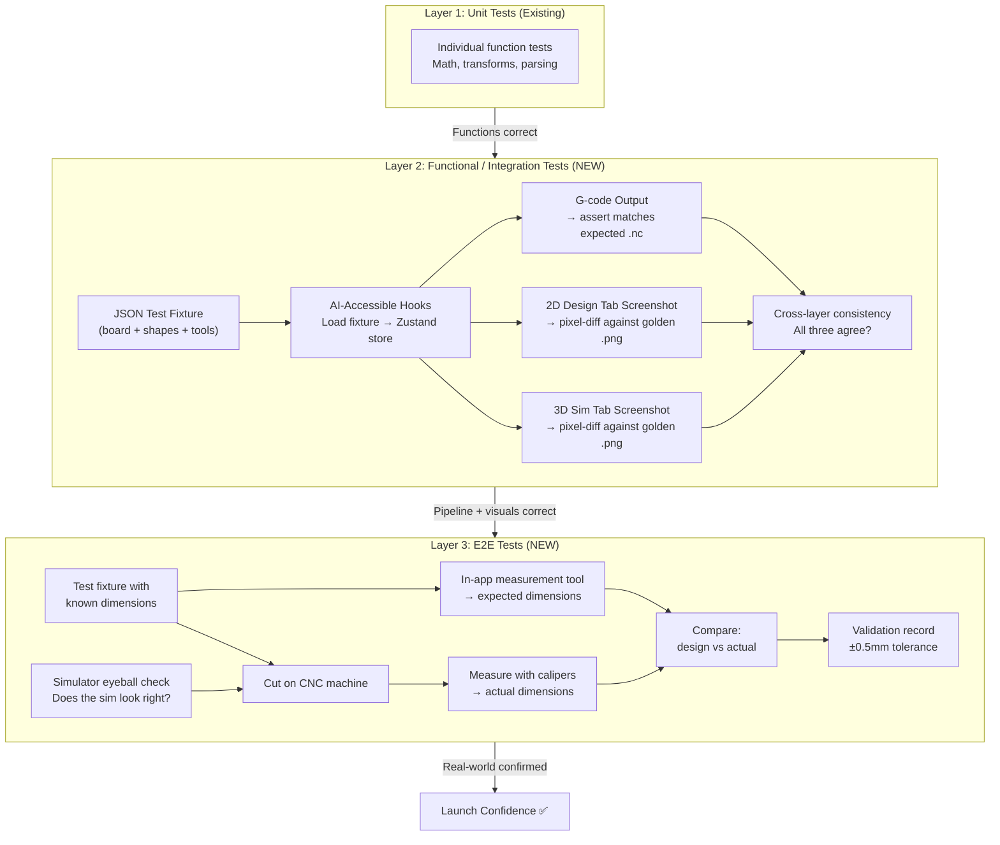
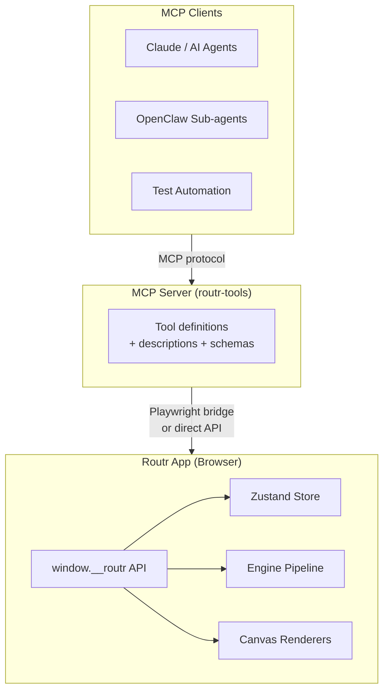
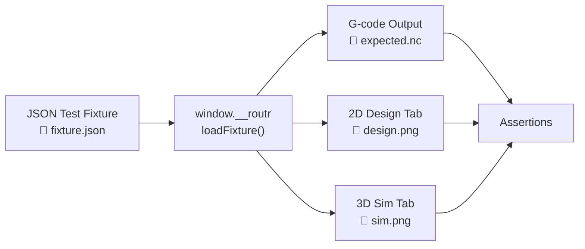
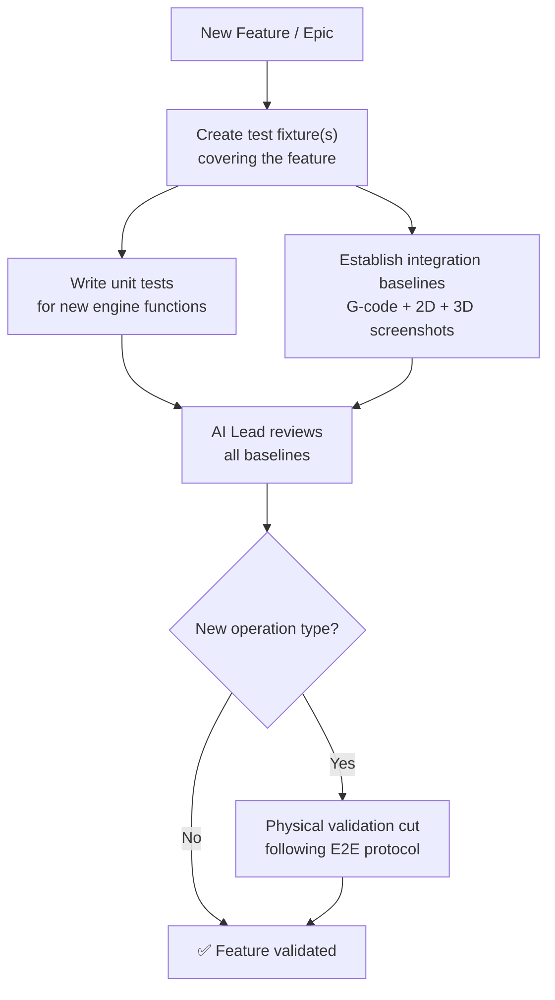
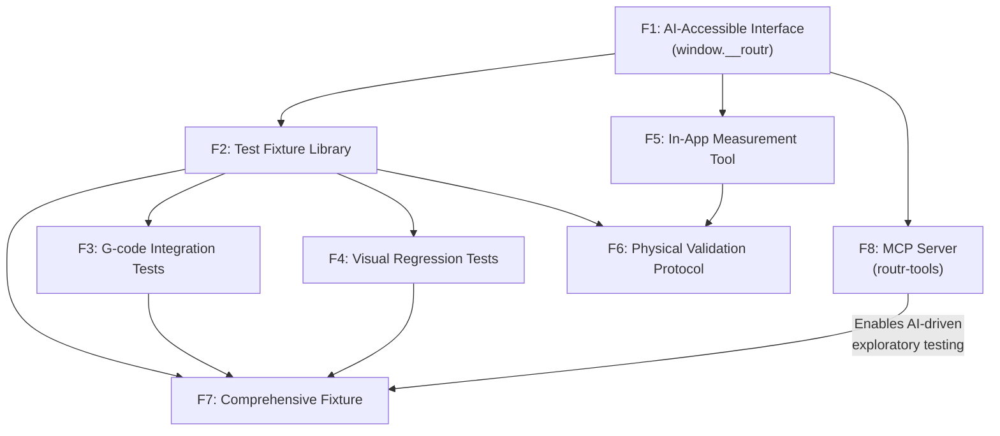

# Validation Pipeline — Epic Design Doc

*Status: 🔄 In Refinement (Step 0)*
*Authors: Dan Hannah & Clay*
*Created: March 23, 2026*

---

## Overview

### What Is This Epic?

The Validation Pipeline is Routr's quality assurance backbone — a multi-layered testing system that ensures the app produces dimensionally accurate, safe G-code for real CNC machines. It bridges the gap between "the app works in the browser" and "this G-code is safe to run on wood."

This is Routr's first forward-looking design doc. Every previous doc was retroactive — reading existing code and documenting what was already built. This one designs before building. That's the CSDLC leveling up.

### Problem Statement

Routr has solid unit test coverage across toolpath generators, coordinate transforms, and SVG parsing. But there is **no automated way to verify that the full pipeline — from board configuration to final G-code output — produces correct results.** And beyond digital verification, there's no formal process for validating that G-code performs correctly on a physical CNC machine.

**What's broken today:**

- A change to the toolpath generator could silently alter G-code output for every operation type, and no test would catch it
- Coordinate system bugs (like the edge treatment flip and kerf line flip) made it to real cuts before being discovered
- The design tab, simulator, and G-code can each show *different* things — a chamfer placed on the top edge in the design tab showed up on the bottom in the sim tab but cut correctly in real life. No automated test catches cross-layer visual inconsistencies.
- There's no "known good" G-code baseline to compare against
- Physical validation cuts have been done ad hoc — no formal protocol, no documented results, no traceability from design dimensions to measured dimensions
- There's no way for AI sub-agents to programmatically interact with the app for testing — all interaction requires UI automation through a human-designed interface

**What triggered this work:**

The coordinate flip bug class — the same category of bug appeared in edge treatments and table saw kerf lines. Both were caught during physical cuts, not by tests. The chamfer top/bottom flip between design and sim tabs proved that **G-code correctness alone isn't sufficient** — visual consistency across the app's layers matters too. With launch approaching, the question is: what else might be wrong that we haven't cut yet?

### Goals

- Define the complete validation pipeline from automated tests to physical verification
- Establish integration tests driven by JSON test fixtures that validate G-code output, 2D canvas rendering, AND 3D simulator rendering
- Create a formal physical validation protocol with documented results
- Build an in-app measurement tool for fast dimensional comparison between design and physical cuts
- Define AI-accessible hooks that let sub-agents programmatically drive and test the app
- Make "is this operation validated?" answerable for any feature at any time
- Enable fast, confident iteration on the codebase without fear of silent regressions
- Establish a testing strategy pattern that applies to all future epics/features

### Non-Goals

- **Not fixing the kerf line flip bug** — that's a standalone ticket
- **Not adding roundover validation** — roundover is feature-flagged off for launch
- **Not automating physical cuts** — the human runs the CNC machine; this epic defines the protocol

---

## Context

### Current State

**What exists today:**

| Layer | Status | Coverage |
|-------|--------|----------|
| Unit tests | ✅ Solid | Individual toolpath generators, edge mapping, bit offset, arc G-code, coordinate transforms, SVG parsing |
| Functional/Integration tests | ❌ None | No end-to-end pipeline tests, no JSON fixtures, no visual regression |
| E2E tests | ❌ None | No formal physical validation protocol, no dimensional measurement tooling |

**The unit tests are solid but test functions in isolation.** None of them test the full pipeline: "given this board with these shapes and these tool settings, the G-code output should be exactly X and the 2D canvas should look exactly like Y and the sim should look exactly like Z."

### Affected Systems

| System / Layer | How It's Affected |
|---------------|-------------------|
| G-code Pipeline | Primary target — integration tests validate end-to-end G-code output |
| Workshop Mode (2D Canvas) | Visual regression screenshots validate design tab rendering |
| Simulator (3D Canvas) | Visual regression screenshots validate 3D sim rendering |
| Coordinate Systems | Cross-layer visual tests catch coordinate transform inconsistencies |
| Edge Treatments | Specific validation needed for each treatment type × edge combination |
| SVG Import | Engrave and pocket toolpaths need integration test coverage |
| Zustand Store | AI-accessible hooks need programmatic store access |

### Dependencies

- **Coordinate flip fix (SHIPPED)** — centralized `edgeMapping.ts` must be in place before establishing baselines
- **Kerf line flip bug (OPEN)** — should be fixed before table saw baselines are established
- **Playwright** — already available; needed for screenshot capture and AI-driven app interaction

### Dependents

- **Production launch** — launch requires minimum validation confidence per operation type
- **Future epics/features** — every new feature enters the pipeline through this testing framework
- **PDF-to-G-code pipeline** — AI hooks built for testing become the foundation for AI-driven app features
- **Epic design template** — testing strategy pattern from this epic gets extracted into the template for all future epics

---

## Design

### Three-Layer Testing Architecture



Each layer catches different categories of bugs:

| Layer | What It Catches | Cost | Frequency |
|-------|----------------|------|-----------|
| **Unit tests** | Math errors, logic bugs, type mismatches | Free (seconds) | Every code change |
| **Functional/Integration** | G-code pipeline regressions, coordinate bugs, visual rendering inconsistencies between 2D design/3D sim/G-code | Free (seconds–minutes) | Every code change |
| **E2E** | Real-world factors: tool deflection, material variance, machine quirks, dimensional accuracy, simulator visual trust | High (material + time) | New operation types, coordinate changes, pre-launch |

### CI/CD Strategy

**Hybrid approach: GitHub Actions CI for cheap, repetitive checks + local execution for AI-driven work.**

| Test Type | Where It Runs | Why |
|-----------|--------------|-----|
| Unit tests | **GitHub Actions CI** | Fast, deterministic, zero token cost. Catches regressions on every PR without spending AI compute. |
| G-code integration tests | **GitHub Actions CI** | Deterministic string comparison — perfect for CI. No rendering needed. |
| Visual regression tests (screenshots) | **Local first, CI later** | Playwright screenshot tests can be flaky across environments. Start local, promote to CI once stable. |
| E2E (physical validation) | **Local only** | Human runs the CNC machine. |

The sub-agent development workflow makes traditional CI/CD less critical for the *development* loop — the AI Lead reviews and tests before PRs are created. But CI adds a safety net *between* sessions: a PR that sneaks in a coordinate bug gets caught on push, even if no one ran the tests manually. CI is the overnight security guard; sub-agents are the daytime crew.

> 🟡 **OPEN QUESTION:** Do we want CI to block PR merges (required status check) or just report (advisory)? Blocking is safer but can slow down Lightning Strikes if CI is slow.

---

### Cross-Cutting Concern: AI-Accessible Interface

Since this app is designed and written by AI, it makes sense to build first-class interfaces for AI to drive and test it. This isn't just about testing — it's about making the app AI-native. The hooks built here for validation become the foundation for future AI features like PDF-to-G-code.

**Dev-mode API (`window.__routr`):**

Exposed only in development/test builds. Gives programmatic access to everything a sub-agent needs:

```typescript
// Proposed dev-mode API surface
window.__routr = {
  // Fixture loading
  loadFixture(fixture: TestFixture): void,      // Load JSON fixture into Zustand store
  getState(): ProjectState,                       // Read current store state

  // G-code
  generateGcode(): string,                        // Trigger pipeline, return G-code string
  generateToolpaths(): ToolpathOperation[],        // Get intermediate toolpath data

  // Measurement
  measureDistance(pointA: Point, pointB: Point): number,  // Distance between two points (mm)
  measureFromEdge(shapeId: string, edge: 'top' | 'bottom' | 'left' | 'right'): number,

  // Canvas capture
  captureDesignCanvas(): Promise<ImageData>,       // 2D canvas screenshot
  captureSimCanvas(): Promise<ImageData>,          // 3D sim screenshot

  // Store actions
  addBoard(config: BoardConfig): string,           // Returns board ID
  addShape(boardId: string, shape: ShapeConfig): string,
  setToolSettings(settings: ToolSettings): void,
  addEdgeTreatment(boardId: string, treatment: EdgeTreatmentConfig): void,
};
```

**Why this matters:**

- **Testing**: Sub-agents call `loadFixture()` + `generateGcode()` instead of clicking through UI
- **Reliability**: No flaky CSS selectors, no waiting for animations, no "button didn't render yet"
- **Speed**: Direct function calls are orders of magnitude faster than Playwright UI automation
- **Future features**: PDF-to-G-code AI reads a plan, calls `addBoard()` + `addShape()` to build the design programmatically
- **Validation**: `measureDistance()` and `measureFromEdge()` make dimensional verification instant

> 🟡 **OPEN QUESTION:** Should this API be available in production behind a feature flag (for future AI features)? Or strictly dev/test only for now?

#### MCP Server: AI-Native Tool Interface

The `window.__routr` API gives programmatic access from within the browser. But to let AI agents **reason about and drive the app from outside** — connecting from Claude, OpenClaw sub-agents, or any MCP-compatible client — we wrap the same capabilities in an [MCP (Model Context Protocol)](https://modelcontextprotocol.io/) server.

**What MCP adds over a raw API:**

MCP doesn't just expose endpoints — it gives each tool rich descriptions, parameter schemas, and contextual guidance so the LLM knows *when, why, and how* to use each tool. The AI doesn't just know "there's a `loadFixture` function." It knows "use `loadFixture` when you want to set up a test scenario — it takes a fixture JSON describing a board with shapes and tool settings, and after loading you can generate G-code or capture screenshots to verify the result."

**Proposed MCP tool surface:**

```
MCP Server: routr-tools
├── create_board          — Create a board with dimensions and material
├── add_shape             — Add a cut, pocket, hole, path, or slot to a board
├── add_edge_treatment    — Apply chamfer, dado, or rabbet to a board edge
├── set_tool_settings     — Configure bit, feeds, speeds
├── import_svg            — Import an SVG file for engrave/pocket
├── generate_toolpaths    — Generate toolpath operations from current state
├── generate_gcode        — Generate G-code and return as string
├── capture_design_view   — Screenshot the 2D design canvas
├── capture_sim_view      — Screenshot the 3D simulator at a standard angle
├── measure_distance      — Measure between two points or shape-to-edge
├── load_fixture          — Load a test fixture JSON into the app
├── get_project_state     — Read the current Zustand store state
└── validate_gcode        — Compare generated G-code against an expected file
```

**This unlocks AI-driven exploratory testing:**

Scripted integration tests (fixtures + assertions) catch regressions. But an AI agent connected via MCP can do something far more powerful — **creative, exploratory testing:**

- *"Design a board with a 2-inch pocket centered on a 6×12 board, generate the G-code, and verify the pocket coordinates are correct"*
- *"Try every edge treatment on every edge and check for visual inconsistencies between the design and sim tabs"*
- *"Create a stress test — maximum shapes, weird dimensions, overlapping cuts — and report what breaks"*
- *"Verify that changing the bit diameter correctly adjusts all toolpath offsets"*

The AI understands woodworking concepts, understands the app's capabilities, and can creatively find edge cases that no human would think to write a fixture for. This is a fundamentally different testing paradigm — not "did it change?" (regression) but "is it correct?" (verification).

**The product vision connection:**

The MCP server built for testing IS the integration layer for Routr's AI product features:

| Use Case | How MCP Enables It |
|----------|-------------------|
| **AI-driven testing** | Sub-agents connect via MCP, design test scenarios, execute, report findings |
| **PDF-to-G-code** | AI reads a woodworking plan PDF, connects to Routr via MCP, calls `create_board` + `add_shape` to build the design, exports G-code |
| **AI Design Assistant** | "I want a cutting board with a juice groove" → AI agent uses MCP tools to design it in Routr |
| **Plan Marketplace ingestion** | Automated pipeline that takes uploaded plans and converts them to Routr projects |

**Architecture:**



The MCP server connects to the running Routr app (via Playwright for browser-based interaction, or directly to the engine for headless G-code generation). This means we can run both:

- **Headed mode**: MCP drives the actual app UI (for visual testing)
- **Headless mode**: MCP calls engine functions directly (for fast G-code testing)

> 🟡 **OPEN QUESTION:** Should the MCP server be a separate package in the repo, or part of the app's dev tooling? Separate package is cleaner for distribution but adds maintenance overhead.

---

### Layer 2: Functional / Integration Tests (Detail)

This is the core of the epic. Integration tests tie together three outputs from a single input:



#### The JSON Test Fixture

A fixture file fully describes a project state — everything needed to reproduce a specific board configuration deterministically:

```json
{
  "name": "straight-cut-basic",
  "description": "Single vertical table saw cut through a board",
  "board": {
    "width": 200,
    "height": 100,
    "thickness": 19
  },
  "shapes": [
    {
      "type": "rectangle",
      "cutType": "table-saw",
      "position": { "x": 100, "y": 0 },
      "params": { "width": 0, "height": 100 },
      "depth": 19
    }
  ],
  "toolSettings": {
    "bitDiameter": 6.35,
    "feedRate": 1000,
    "plungeRate": 500,
    "stepDown": 3,
    "safeHeight": 5,
    "spindleSpeed": 18000
  },
  "edgeTreatments": [],
  "units": "metric"
}
```

**Fixture design principles:**

- Each fixture tests **one concern** — a straight cut fixture, a pocket fixture, etc.
- Use **known, simple dimensions** — easy to mentally verify
- Specify **ALL settings explicitly** — never rely on defaults (defaults change, fixtures shouldn't)
- A **comprehensive fixture** combines multiple operations to test ordering and tool changes

#### Three Assertion Types

**1. G-code assertion** — Load fixture via `window.__routr.loadFixture()`, call `generateGcode()`, compare against stored `.expected.nc` file. Character-by-character match. If it differs → developer reviews diff → update expected file (intentional) or fix regression.

**2. 2D canvas screenshot** — Load fixture, capture design tab canvas via `captureDesignCanvas()` or Playwright screenshot. Compare against golden `.design.png` using pixel-diff with tolerance threshold (absorbs anti-aliasing differences). Catches: shapes in wrong positions, cuts on wrong side, visual artifacts.

**3. 3D sim screenshot** — Load fixture, generate toolpaths, capture sim tab at a **fixed camera angle**. Compare against golden `.sim.png`. Catches the chamfer-on-wrong-edge class of bugs — where design tab shows one thing and sim shows another.

**Cross-layer consistency is the killer feature.** The chamfer flip bug would have been caught: 2D screenshot shows chamfer on top, 3D screenshot shows it on bottom → test surfaces the discrepancy immediately.

#### Standard Camera Angles for 3D Sim Screenshots

Consistent camera angles ensure deterministic screenshots:

| Angle | Name | Use Case |
|-------|------|----------|
| **Default perspective** | `perspective-45` | 45° elevation, front-right corner. Standard angle for most fixtures. |
| **Top-down orthographic** | `top-down` | Bird's eye view. Useful for verifying XY positions of cuts, pockets, drill holes. |
| **Front orthographic** | `front` | Straight-on front view. Critical for edge treatment fixtures — shows which edge the treatment is on. |
| **Right orthographic** | `right-side` | Side view. Useful for depth verification. |

Most fixtures use `perspective-45` only. Edge treatment fixtures should also capture `front` to explicitly verify top vs. bottom edge rendering.

#### File Structure

```
cncmill-app/src/__fixtures__/
├── straight-cut-basic/
│   ├── fixture.json          # Input: board + shapes + tools
│   ├── expected.nc           # Expected G-code output
│   ├── design.png            # Golden 2D canvas screenshot
│   └── sim.png               # Golden 3D sim screenshot (perspective-45)
├── pocket-rectangle/
│   └── ...
├── drill-basic/
│   └── ...
├── edge-chamfer-top/
│   ├── fixture.json
│   ├── expected.nc
│   ├── design.png
│   ├── sim.png               # perspective-45
│   └── sim-front.png         # front view (verify correct edge)
├── svg-engrave/
│   └── ...
└── multi-operation/          # Comprehensive: multiple ops on one board
    └── ...
```

#### Fixture Inventory

| Fixture | What It Tests | Priority |
|---------|--------------|----------|
| `straight-cut-basic` | Table saw vertical cut | 🔴 High (blocked on kerf flip fix) |
| `pocket-rectangle` | Router rectangular pocket | 🔴 High |
| `pocket-circle` | Router circular pocket | 🟡 Medium |
| `drill-basic` | Single drill hole | 🔴 High |
| `drill-grid` | Multiple drill holes | 🟡 Medium |
| `profile-cut` | Board outline profile with tabs | 🔴 High |
| `edge-chamfer-top` | Chamfer on top edge | 🔴 High |
| `edge-chamfer-bottom` | Chamfer on bottom edge | 🔴 High |
| `edge-chamfer-left` | Chamfer on left edge | 🟡 Medium |
| `edge-chamfer-right` | Chamfer on right edge | 🟡 Medium |
| `edge-dado` | Dado on edge | 🟡 Medium |
| `edge-rabbet` | Rabbet on edge | 🟡 Medium |
| `svg-engrave` | SVG import with engrave toolpath | 🟡 Medium |
| `svg-pocket` | SVG with pocket detection | 🟡 Medium |
| `surfacing` | Planer/surfacing operation | 🟢 Low |
| `multi-operation` | Comprehensive: straight cut + pocket + drill + edge treatment | 🔴 High |

---

### Layer 3: E2E Tests (Detail)

E2E testing is the full loop: design in app → verify in simulator → cut on CNC → measure physical piece → compare against design dimensions.

#### Simulator Eyeball Check

Before cutting anything, the human reviews the simulator render: "Does this look like what I'd expect this cut to produce?" This is NOT automated — it's a human judgment call. The simulator already exists and works; this just formalizes reviewing sim output before committing material.

**When to do it:**

- After establishing new fixture baselines
- After any coordinate system changes
- Before physical validation cuts (preview what you're about to cut)

#### Physical Validation Protocol

**For each validation cut:**

1. **Design** — Load test fixture in Routr (or create the design matching the fixture)
2. **In-app measurement** — Use the measurement tool to record expected dimensions (e.g., "hole center is 47.5mm from left edge, 32mm from top edge")
3. **Eyeball sim** — Check sim tab — does it look right?
4. **Export** — Generate G-code
5. **Setup** — Load G-code on CNC, set origin, verify material dimensions with calipers
6. **Cut** — Run the program
7. **Measure** — Use calipers to measure the same dimensions recorded in step 2
8. **Record** — Document: expected → actual → delta → pass/fail
9. **Photo** — Take a photo of the cut piece for the record

**Tolerance target: ±0.5mm (±0.020")**

Starting point. Tighter than most hobby CNC work but achievable with proper setup. Will adjust based on real measurement data.

#### Validation Matrix

| Operation Type | Previously Cut? | Needs Re-cut Pre-Launch? | Status |
|---------------|:-:|:-:|--------|
| Table saw (straight cut) | ✅ | 🔴 Yes (kerf line flip) | Blocked on bug fix |
| Router pocket (rectangle) | ✅ | 🟡 Re-verify dimensions | — |
| Router pocket (circle) | ✅ | 🟡 Re-verify dimensions | — |
| Router pocket (freeform/path) | ✅ | 🟡 Re-verify dimensions | — |
| Drill holes | ✅ | 🟡 Re-verify dimensions | — |
| Profile cut (board outline) | ✅ | 🟡 Re-verify dimensions | — |
| Edge treatment (chamfer) | ✅ | 🟡 Re-verify post-coordinate fix | — |
| Edge treatment (dado) | ❌ | 🔴 Yes (never cut) | Simple cut, low risk |
| Edge treatment (rabbet) | ❌ | 🔴 Yes (never cut) | Simple cut, low risk |
| SVG engrave | ✅ | 🟡 Re-verify | — |
| SVG pocket | ✅ | 🟡 Re-verify | — |
| Surfacing (planer) | ✅ | 🟢 Low priority | Simple operation |

#### Validation Record Template

```markdown
## [Fixture Name] — Physical Validation Record

**Date:** YYYY-MM-DD
**Fixture:** `__fixtures__/[name]/fixture.json`
**Material:** [species, dimensions]
**Machine:** [CNC model]
**Bit:** [type, diameter]

### Measurements

| Dimension | Expected (app) | Actual (calipers) | Delta | Pass/Fail |
|-----------|:-:|:-:|:-:|:-:|
| Cut position from left edge | 100.0mm | 99.8mm | -0.2mm | ✅ |
| Cut depth | 19.0mm | 18.7mm | -0.3mm | ✅ |

### Sim Eyeball Check
- [ ] Sim visual matches design tab
- [ ] Cut positions look correct
- [ ] Edge treatments on correct edges

### Photos
- [ ] Full piece photo
- [ ] Detail photos of measured dimensions

### Result: ✅ PASS / ❌ FAIL
**Notes:** [observations, anomalies, lessons]
```

---

### In-App Measurement Tool

**Purpose:** Surface the dimensional data the app already knows internally in a way that's useful for physical validation (and for users generally).

**How it works:**

The app already stores exact positions, dimensions, and relationships between shapes. The measurement tool exposes this data:

- **Point-to-point distance** — Click two points on the canvas, see the distance in current units
- **Shape-to-edge distance** — Select a shape, see its distance from each board edge
- **Shape dimensions** — Select a shape, see its width, height, depth, position

**For validation:** Before cutting, use the measurement tool to record expected dimensions. After cutting, measure the same dimensions with calipers. Compare.

**For users:** "How far is this pocket from the edge?" is a question users ask constantly. This tool answers it without mental math.

**Implementation approach:**

This integrates with the AI-accessible interface — `measureDistance()` and `measureFromEdge()` in the `window.__routr` API serve both the in-app UI tool and automated testing.

> 🟡 **OPEN QUESTION:** Should the measurement tool live in the design tab as an overlay/mode? Or as a panel? Dan's UX instinct needed here.

---

## Testing Strategy for New Features

When a new epic or feature is built, it enters the validation pipeline through a standard process:



**Rules:**

1. **Every new feature must have at least one fixture.** No exceptions. The fixture is created during story breakdown (Step 1).
2. **G-code baselines are mandatory.** If the feature affects G-code output, integration test baselines must be established before the PR is merged.
3. **Visual baselines are mandatory for UI-affecting changes.** If it changes what the design tab or sim tab renders, screenshot baselines must be established.
4. **Physical validation is required only for new operation types.** New cut type, new edge treatment, new toolpath algorithm → needs a real cut. Bug fixes and UI changes do not.
5. **Fixture updates require human review.** When a fixture baseline changes, the diff must be reviewed by the human before accepting. No rubber-stamping.

> 📝 **PROCESS NOTE:** This testing strategy should be extracted into the epic design doc template after this epic is finalized. Every future epic should include a "Testing Strategy" section that references these rules.

---

## Edge Cases & Gotchas

| Scenario | Expected Behavior | Why It's Tricky |
|----------|-------------------|-----------------|
| Screenshot test fails due to rendering engine update | Pixel diff flags change | Need tolerance threshold; anti-aliasing differences are noise, not signal |
| G-code assertion fails after intentional change | Developer updates `.expected.nc` after reviewing diff | Easy to rubber-stamp — need discipline |
| Imperial vs metric fixtures | All fixtures use mm internally | Display unit shouldn't affect G-code, but need to verify |
| Tool settings defaults change | Assertions break if defaults change | Fixtures specify ALL settings explicitly, never rely on defaults |
| Multiple operations change ordering | G-code assertion catches it | Operation ordering logic is complex — assertion is the safety net |
| 3D camera angle changes | Sim screenshots fail | Camera locked to standard angles in test harness |
| Canvas/viewport resize | Design screenshots fail | Viewport size locked in test harness |
| Coordinate system changes | ALL assertions break (expected) | This is the point — forced review of all outputs after coordinate changes |
| Theme changes (dark/light) | Screenshots differ | Lock theme in test harness (light mode for consistency) |
| `window.__routr` available in prod | Security/bundle size concern | Gate behind `import.meta.env.DEV` or feature flag |

---

## Risks

| Risk | Likelihood | Impact | Mitigation |
|------|-----------|--------|------------|
| Screenshot tests are flaky across environments | Medium | High | Fixed viewport, fixed theme, tolerance threshold, consistent environment |
| Integration tests create false confidence | Medium | High | Tests catch *regressions*. Initial baselines must be validated by physical cuts + human review. |
| Fixture maintenance burden as features grow | Medium | Medium | One concern per fixture. Comprehensive fixture catches interaction bugs. |
| Physical validation bottleneck (Dan = only CNC) | High | High | Minimize physical cuts. Integration tests handle regressions. Physical only for new ops. |
| Playwright screenshot tests are slow | Medium | Low | Run visual tests separately from unit/G-code tests. |
| AI-accessible interface scope creep | Medium | Medium | Start with minimum viable API surface. Expand as needs emerge. |
| Kerf line flip contaminates table saw baselines | High | Medium | Fix bug BEFORE establishing table saw fixture baseline. |

---

## Features

Features extracted from this epic. Each becomes a set of implementable stories during Step 1.

| Feature | Summary | Dependencies | Status |
|---------|---------|-------------|--------|
| F1 | **AI-Accessible Interface** — `window.__routr` dev-mode API: fixture loading, G-code generation, canvas capture, measurement | None | |
| F2 | **Test Fixture Library** — JSON fixture format, TypeScript types, initial set of fixtures | F1 | |
| F3 | **G-code Integration Tests** — Load fixture → generate G-code → assert matches `.expected.nc` | F1, F2 | |
| F4 | **Visual Regression Tests** — Playwright harness for 2D + 3D screenshot capture, pixel-diff against golden images, fixed camera angles | F1, F2 | |
| F5 | **In-App Measurement Tool** — Point-to-point and shape-to-edge distance display, both UI and API | F1 | |
| F6 | **Physical Validation Protocol** — Measurement recording template, validation matrix tracker, photo archive | F2, F5 | |
| F7 | **Comprehensive Fixture** — Multi-operation board exercising full pipeline | F2, F3, F4 | |
| F8 | **MCP Server (routr-tools)** — Model Context Protocol wrapper for AI-driven exploratory testing and future product features | F1 | |



*Features are broken down into implementable stories during Step 1 (Story Breakdown). This table is the feature index.*

---

## Decisions Log

| Date | Decision | Rationale | Alternatives Considered |
|------|----------|-----------|------------------------|
| 2026-03-23 | Kerf line flip bug is standalone, not in this epic | Bug fix, not validation concern. Blocks table saw baseline. | Include in epic (rejected — different concern) |
| 2026-03-23 | Full pipeline vision in one doc; layers become features | Complete picture in one doc; incremental execution | Only G-code testing (rejected — misses visual regression where real bugs were) |
| 2026-03-23 | First forward-looking design doc | Designing before building prevents the bug class that triggered this epic | Code first, doc later (rejected — caused the coordinate bugs) |
| 2026-03-23 | JSON test fixtures over hardcoded test data | Readable, shareable, used by both G-code and visual tests | Hardcoded TS (rejected — can't share across test types) |
| 2026-03-23 | Visual regression via Playwright screenshots | Catches cross-layer inconsistencies (design vs sim) that G-code tests miss | No visual testing (rejected — chamfer flip proved this is necessary) |
| 2026-03-23 | Simulator validation = human eyeball | Automated photo comparison too complex; eyeball is faster and sufficient | Pixel comparison with physical photos (rejected — brittle) |
| 2026-03-23 | ±0.5mm starting tolerance | Conservative; will adjust after first measurements | — |
| 2026-03-23 | Include measurement tool in this epic | Dual purpose (validation + user feature); enables E2E protocol | Separate epic (rejected — too tightly coupled to validation) |
| 2026-03-23 | Three-layer testing model (unit → integration → E2E) | Cleaner than four layers; sim eyeball is part of E2E, not its own layer | Four layers (rejected — over-granular) |
| 2026-03-23 | Build AI-accessible interface (window.__routr) | App is built by AI — should be testable by AI. Hooks enable testing AND future AI features (PDF-to-G-code). | Playwright-only UI automation (rejected — fragile, slow, fights against the grain) |
| 2026-03-23 | Hybrid CI/CD: GitHub Actions for deterministic tests, local for visual/AI-driven | CI catches regressions between sessions without token cost; sub-agents handle dev-loop testing | All-CI (rejected — visual tests too flaky initially) or all-local (rejected — misses between-session regressions) |
| 2026-03-23 | MCP server wrapping `window.__routr` for AI-driven testing | MCP gives LLMs structured tool access with context — enables exploratory testing AND future product features (PDF-to-G-code, AI Design Assistant). The testing infrastructure IS the product integration layer. | Raw API only (rejected — misses the LLM context layer), no MCP (rejected — leaves AI testing as brittle Playwright scripting) |

---

## Known Issues / Tech Debt

| Issue | Severity | Notes |
|-------|----------|-------|
| Kerf line flip (table saw) | High | Blocks table saw fixture baseline. Standalone ticket. |
| No CI/CD test automation | Medium | Tests run locally only. G-code integration tests are ideal first CI candidate. |
| Roundover disabled | Low | No validation needed until feature is re-enabled. |

---

*This epic doc is refined collaboratively (Step 0) before stories are broken down (Step 1). Once refined, the AI Lead extracts context from this doc to craft sub-agent prompts (Step 2).*
*Update this doc as implementation reveals new information — design docs are living documents.*
