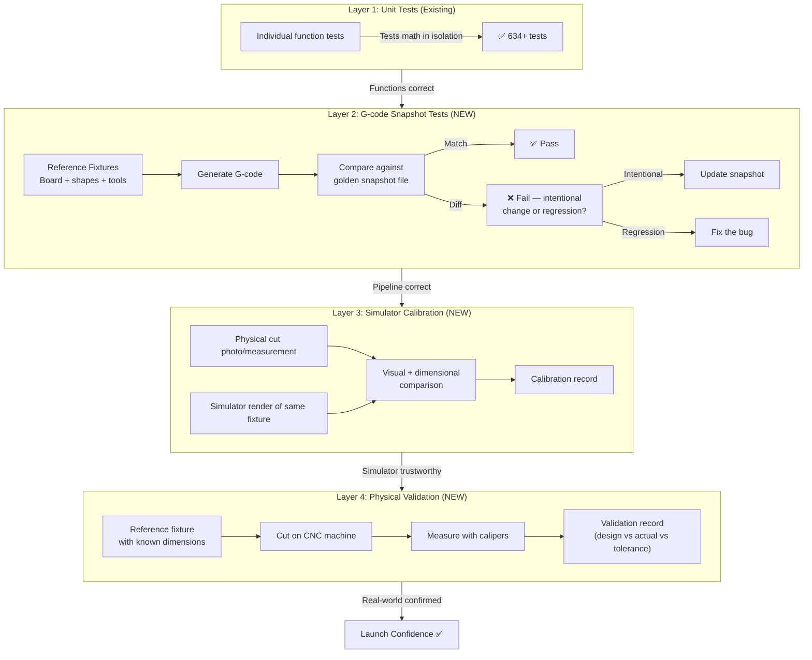

# Validation Pipeline — Epic Design Doc

*Status: 🔄 In Refinement (Step 0)*
*Authors: Dan Hannah & Clay*
*Created: March 23, 2026*

---

## Overview

### What Is This Epic?

The Validation Pipeline is Routr's quality assurance backbone — a multi-layered system that ensures G-code generated by the app produces dimensionally accurate, safe cuts on real CNC machines. It bridges the gap between "the app works in the browser" and "this G-code is safe to run on wood."

This is Routr's first forward-looking design doc. Every previous doc was retroactive. This one designs before building.

### Problem Statement

Routr has 634+ unit tests that prove individual functions produce correct math. But there is **no automated way to verify that the full pipeline — from board configuration to final G-code output — produces correct results.** And beyond digital verification, there's no formal process for validating that G-code performs correctly on a physical CNC machine.

**What's broken today:**

- A change to the toolpath generator could silently alter G-code output for every operation type, and no test would catch it
- Coordinate system bugs (like the edge treatment flip and kerf line flip) made it to real cuts before being discovered
- There's no "known good" G-code baseline to compare against
- Physical validation cuts have been done ad hoc — no formal protocol, no documented results, no traceability from design dimensions to measured dimensions
- The simulator hasn't been calibrated against real cuts, so it can't serve as a regression safety net

**What triggered this work:**

The coordinate flip bug class — the same category of bug appeared in edge treatments and table saw kerf lines. Both were caught during physical cuts, not by tests. With launch approaching, the question is: what else might be wrong that we haven't cut yet?

### Goals

- Define the complete validation pipeline from automated tests to physical verification
- Establish G-code snapshot testing as the primary regression safety net
- Create a formal physical validation protocol with documented results
- Calibrate the simulator against real cuts so it becomes a reliable visual regression tool
- Make "is this operation validated?" answerable for any feature at any time

### Non-Goals

- **Not building a CI/CD pipeline** — tests will run locally (CI/CD is a separate concern)
- **Not fixing the kerf line flip bug** — that's a standalone ticket
- **Not adding roundover validation** — roundover is feature-flagged off for launch
- **Not automating physical cuts** — the human runs the CNC machine; this epic defines the protocol

---

## Context

### Current State

**What exists today:**

| Layer | Status | Coverage |
|-------|--------|----------|
| Unit tests | ✅ 634+ tests | Individual toolpath generators, edge mapping, bit offset, arc G-code, coordinate transforms, SVG parsing |
| G-code snapshot tests | ❌ None | Zero coverage |
| Simulator calibration | ❌ Not calibrated | Simulator runs but hasn't been compared against real cuts |
| Physical validation | 🟡 Ad hoc | Dan has done cuts for most operations, but results aren't formally documented |

**Test files by area (56 total):**

- `engine/toolpath/` — 15 test files (straightCut, pocketCuts, drillCuts, edgeTreatmentCuts, arcGcode, miterCuts, etc.)
- `engine/svg/` — 3 test files (parser, import, pocket detection)
- `components/` — 10+ test files (simulator, preview3d, panels)
- `__tests__/` — root-level integration-adjacent tests (edge treatments, auto-link, solver)

The unit tests are solid but test functions in isolation. None of them test the **full pipeline**: "given this board with these shapes and these tool settings, the G-code output should be exactly X."

### Affected Systems

| System / Layer | How It's Affected |
|---------------|-------------------|
| G-code Pipeline | Primary target — snapshot tests validate end-to-end output |
| Workshop Mode | Every operation type needs a reference fixture |
| Coordinate Systems | Validation catches coordinate transform bugs (the whole reason this epic exists) |
| Simulator | Calibration layer uses simulator as visual regression tool |
| Edge Treatments | Specific validation needed for each treatment type × edge combination |
| SVG Import | Engrave and pocket toolpaths need snapshot coverage |

### Dependencies

- **Coordinate flip fix (SHIPPED)** — centralized `edgeMapping.ts` must be in place before establishing "known good" baselines
- **Kerf line flip bug (OPEN)** — should be fixed before table saw snapshots are baselined, or the snapshots will lock in the bug

### Dependents

- **Production launch** — launch requires minimum validation confidence per operation type
- **Future features** — any new operation type enters the pipeline through this framework
- **Simulator trust** — once calibrated, simulator becomes the fast-feedback loop for all future work

---

## Design

### The Four Validation Layers



Each layer catches different categories of bugs:

| Layer | Catches | Cost to Run | Frequency |
|-------|---------|-------------|-----------|
| Unit tests | Math errors, logic bugs, type mismatches | Free (seconds) | Every code change |
| Snapshot tests | Pipeline regressions, coordinate bugs, operation ordering changes | Free (seconds) | Every code change |
| Simulator calibration | Visual discrepancies between expected and actual cuts | Low (minutes) | After snapshot baseline changes |
| Physical validation | Real-world factors: tool deflection, material variance, machine quirks | High (material + time) | New operation types, coordinate changes, pre-launch |

### Layer 2: G-code Snapshot Testing (Detail)

**How it works:**

1. Define **reference fixtures** — minimal board configurations that exercise specific features
2. Generate G-code for each fixture using the current pipeline
3. Store the output as **golden snapshot files** (`.nc` files in a `__snapshots__/` directory)
4. On every test run, regenerate G-code and compare character-by-character against the snapshot
5. If output differs, the test fails — developer decides whether to update the snapshot (intentional change) or fix the regression

**Reference fixture design principles:**

- Each fixture tests **one concern** (a straight cut fixture, a pocket fixture, etc.)
- Fixtures use **known, simple dimensions** — easy to mentally verify (e.g., 200mm × 100mm board, 50mm × 50mm pocket at position 25,25)
- Fixtures include **tool settings** so G-code is fully deterministic
- A **comprehensive fixture** combines multiple operations on one board to test operation ordering and tool changes

```typescript
// Example: Reference fixture definition
const STRAIGHT_CUT_FIXTURE: ReferenceFixture = {
  name: 'straight-cut-basic',
  description: 'Single vertical table saw cut through a 200x100mm board',
  board: {
    width: 200, // mm
    height: 100,
    thickness: 19, // 3/4" nominal
  },
  shapes: [{
    type: 'rectangle',
    cutType: 'table-saw',
    position: { x: 100, y: 0 },
    params: { width: 0, height: 100 }, // full-height cut line
    depth: 19, // through cut
  }],
  toolSettings: {
    bitDiameter: 6.35, // 1/4"
    feedRate: 1000,
    plungeRate: 500,
    stepDown: 3,
    safeHeight: 5,
    spindleSpeed: 18000,
  },
};
```

**Snapshot file location:**
```
cncmill-app/src/engine/__snapshots__/
├── straight-cut-basic.nc
├── pocket-basic.nc
├── drill-basic.nc
├── edge-chamfer-basic.nc
├── svg-engrave-basic.nc
├── multi-operation.nc        # comprehensive fixture
└── ...
```

> 🔴 **FLAG FOR REVIEW:** What's the right fixture list? Dan — which operations do you consider validated from your existing cuts? Which ones need fresh cuts post-coordinate-fix?

### Layer 3: Simulator Calibration (Detail)

**Purpose:** Make the simulator trustworthy enough to serve as a fast visual regression tool.

**How it works:**

1. For each physical validation cut, capture:
   - Photo of the actual cut piece
   - Simulator screenshot of the same fixture
   - Measurements of both
2. Document discrepancies and adjust simulator rendering if needed
3. Once calibrated, simulator visual regressions become meaningful signals

**Calibration record format:**

| Fixture | Sim Screenshot | Cut Photo | Dimensional Match | Visual Match | Notes |
|---------|---------------|-----------|-------------------|-------------|-------|
| straight-cut-basic | [link] | [link] | ±0.5mm | ✅ | — |

> 🔴 **FLAG FOR REVIEW:** How detailed do we want simulator calibration? Is it enough to eyeball "sim looks like the cut" or do we need pixel-level comparison? My instinct says eyeball is fine for launch.

### Layer 4: Physical Validation Protocol (Detail)

**Purpose:** Confirm that G-code, when run on a real CNC machine, produces parts within acceptable tolerance.

**Protocol for each validation cut:**

1. **Design** — Create a reference fixture with known dimensions in Routr
2. **Export** — Generate G-code, save a copy as the golden snapshot
3. **Setup** — Load G-code on CNC, set origin, verify material dimensions
4. **Cut** — Run the program
5. **Measure** — Use calipers to measure critical dimensions
6. **Record** — Document design dimension vs. actual dimension vs. tolerance
7. **Pass/Fail** — Within tolerance = pass. Out of tolerance = investigate.

**Tolerance target:**

> 🔴 **FLAG FOR REVIEW:** What's an acceptable tolerance for Routr's target users? My suggestion: **±0.5mm (±0.020")** for dimensional accuracy. This is tighter than most hobby CNC work but achievable with proper setup. Thoughts?

**Validation matrix — what needs a physical cut:**

| Operation Type | Previous Cut? | Post-Coordinate-Fix Cut Needed? | Status |
|---------------|--------------|-------------------------------|--------|
| Table saw (straight cut) | ✅ Yes | 🔴 Yes (kerf line flip bug) | Blocked on bug fix |
| Router pocket (rectangle) | ✅ Yes | 🟡 Maybe? | Needs Dan's input |
| Router pocket (circle) | ? | ? | Needs Dan's input |
| Router pocket (freeform/path) | ? | ? | Needs Dan's input |
| Drill holes | ✅ Yes | 🟡 Maybe? | Needs Dan's input |
| Profile cut (board outline) | ? | ? | Needs Dan's input |
| Edge treatment (chamfer) | ✅ Yes | 🟡 Maybe? | Post-coordinate fix |
| Edge treatment (dado) | ✅ Yes | 🟡 Maybe? | Post-coordinate fix |
| Edge treatment (rabbet) | ✅ Yes | 🟡 Maybe? | Post-coordinate fix |
| SVG engrave | ? | ? | Needs Dan's input |
| SVG pocket | ? | ? | Needs Dan's input |
| Surfacing (planer) | ? | ? | Needs Dan's input |

> 🔴 **FLAG FOR REVIEW:** Dan — fill in the blanks! Which operations have you cut? Which were pre or post coordinate fix? This is the critical input for planning the remaining validation cuts.

---

## Edge Cases & Gotchas

| Scenario | Expected Behavior | Why It's Tricky |
|----------|-------------------|-----------------|
| Snapshot test fails after intentional change | Developer updates snapshot after reviewing diff | Easy to rubber-stamp updates without reviewing — need discipline |
| Imperial vs metric fixtures | All fixtures use mm internally | Display unit shouldn't affect G-code, but need to verify |
| Tool settings change default values | Snapshots break if defaults change | Fixtures must specify ALL tool settings explicitly, never rely on defaults |
| Multiple operations on one board change ordering | Snapshot catches it | Operation ordering logic is complex — snapshot is the safety net |
| Coordinate system changes | All snapshots break (expected) | This is the point — forced review of all G-code output after coordinate changes |
| Machine-specific G-code flavor | Routr generates generic GRBL | Snapshot tests validate one flavor; users with different controllers are out of scope |

---

## Risks

| Risk | Likelihood | Impact | Mitigation |
|------|-----------|--------|------------|
| Snapshot tests create false confidence ("tests pass = G-code is correct") | Medium | High | Snapshots only catch *regressions*. Initial baselines must be validated by physical cuts. |
| Snapshot maintenance burden as features grow | Medium | Medium | Keep fixtures minimal and focused. One concern per fixture. |
| Physical validation bottleneck (Dan is the only one with a CNC) | High | High | Minimize required physical cuts. Use snapshots + simulator for regression; physical only for new operation types. |
| Tolerance spec is too tight/loose | Medium | Medium | Start with ±0.5mm, adjust based on real measurements. |
| Kerf line flip bug contaminates table saw snapshots | High | Medium | Fix bug BEFORE establishing table saw snapshot baseline. |

---

## Stories

Features/stories extracted from this epic. Each becomes a ticket for sub-agent execution.

| Story | Summary | Status | PR |
|-------|---------|--------|----|
| F1 | **Reference Fixture Library** — Define fixture data structures + initial set of fixtures | | |
| F2 | **G-code Snapshot Test Framework** — Vitest snapshot infrastructure, golden file management, diff reporting | | |
| F3 | **Physical Validation Protocol & Records** — Template, measurement recording, validation matrix tracking | | |
| F4 | **Simulator Calibration Framework** — Side-by-side comparison tooling, calibration records | | |
| F5 | **Comprehensive Fixture** — Multi-operation board that exercises the full pipeline in one test | | |

*Stories are broken down during Step 1 (Story Breakdown) with full acceptance criteria. This table is the index.*

---

## Decisions Log

| Date | Decision | Rationale | Alternatives Considered |
|------|----------|-----------|------------------------|
| 2026-03-23 | Kerf line flip bug is a standalone ticket, not part of this epic | It's a bug fix, not a validation concern. But it blocks table saw snapshot baseline. | Include it in this epic (rejected — different concern) |
| 2026-03-23 | Scope is full pipeline vision; individual layers become separate features | Design doc captures the complete picture; execution is incremental | Only document snapshot testing (rejected — misses the bigger picture) |
| 2026-03-23 | First forward-looking design doc (not retroactive) | Validation pipeline doesn't exist yet — designing before building | Write code first, document later (rejected — that's what caused coordinate bugs) |

---

## Known Issues / Tech Debt

| Issue | Severity | Notes |
|-------|----------|-------|
| Kerf line flip (table saw) | High | Blocks table saw snapshot baseline. Standalone ticket. |
| No CI/CD test automation | Medium | Tests run locally only. Snapshot tests amplify the value of adding CI later. |
| Roundover disabled | Low | No validation needed until feature is re-enabled. |

---

*This epic doc is refined collaboratively (Step 0) before stories are broken down (Step 1). Once refined, the AI Lead extracts context from this doc to craft sub-agent prompts (Step 2).*
*Update this doc as implementation reveals new information — design docs are living documents.*
