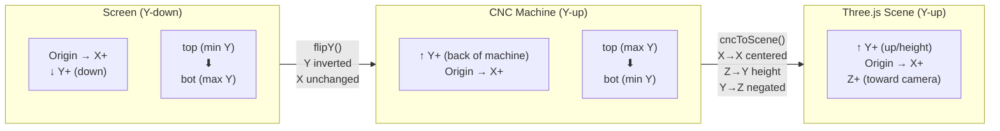

# Coordinate Systems — Epic Design Doc (Cross-Cutting Concern)

*Retroactive design doc — documents the implemented system as of March 2026.*
*This doc exists because coordinate confusion has caused repeated bugs. Read it before touching any code that deals with positions, edges, or G-code output.*

## Flags for Review

> **🔴 CRITICAL — Read before changing any coordinate-related code**

1. **Edge treatments do NOT flipY coordinates, but shapes DO.** Shape G-code in `workshopOperations.ts` calls `flipY()` on every position/point before passing to G-code generators. Edge treatments (`edgeTreatmentCuts.ts`) do NOT flip — they receive board placement coordinates directly and use `getCncEdgeLine()` which already works in CNC space. **If you add a new operation type, you must decide which convention it follows.**

2. **Edge treatment edge names are NOT flipped.** After three rounds of bug fixes (`5a07977` → `93d7e03` → `39b2dc9`), the current code does NOT call `screenEdgeToCncEdge()` for edge treatments. The comment in `workshopOperations.ts` explains: "No edge name flip needed: coordinates are in screen space (Y-down) and go directly to G-code. Flipping the name without flipping coords produces cuts on the wrong edge." This means edge treatment coordinates are implicitly in screen space treated as CNC space — which works because Workshop Mode places boards at origin with `placement = {x: 0, y: 0}`.

3. **`screenEdgeToCncEdge()` exists and is imported but NOT used in the main code path.** It's imported in `workshopOperations.ts` but the call was removed. It IS tested and correct — it just doesn't have a consumer yet. It would be needed if/when Factory Mode places boards at non-origin positions on stock sheets.

4. **Heightmap uses "stock coordinate space"** (`toolX`, `toolY` in mm) which corresponds to CNC coordinates (Y-up). The heightmap `rows` dimension maps to "Y in toolpath coords" per the comment. This is consistent with G-code output.

5. **Three.js scene has a non-obvious axis mapping:** CNC X→scene X, CNC Y→scene Z (negated), CNC Z→scene Y. The Z-negation in `cncToScene()` means increasing CNC Y (toward back of machine) maps to decreasing scene Z. This is correct but easy to get wrong.

## Overview

### What Is This Epic?

A cross-cutting architectural concern documenting the three coordinate systems used in Routr and how data flows between them. This is not a feature epic — it's a reference doc for every developer touching position, edge, or G-code code.

### Problem Statement

Routr operates across three coordinate systems with different Y-axis directions. Coordinate confusion has caused **at least 5 bug-fix commits** over the project's history:

| Commit | Issue |
|--------|-------|
| `d543099` | "fix: Y-axis flip for CNC coordinate system (screen Y-down → CNC Y-up)" |
| `de024f1` | "fix(#338): align edge treatment coordinates with canvas/miter convention" |
| `5a07977` | "fix: Y-flip edge treatment coordinates to match CNC space" |
| `93d7e03` | "fix: remove incorrect screenEdgeToCncEdge flip for edge treatments" |
| `39b2dc9` | "fix: remove incorrect Y-flip from edge treatment G-code" |
| `afb3ed3` | "fix(E20-S2): Edge coordinate mapping — centralized 2D↔CNC↔3D mapper" |

The last three are particularly telling — they show the edge treatment coordinate handling was changed back and forth before settling on the current approach.

### Goals & Non-Goals

**Goals:**
- Single reference for how coordinates flow through the system
- Prevent future coordinate bugs by documenting every transform
- Document the "why" behind non-obvious decisions

**Non-Goals:**
- Changing the coordinate systems (they work, just need documentation)
- Unifying all code to a single coordinate convention (too risky for the benefit)

## The Three Coordinate Systems

### Screen/Canvas Coordinates

- **Origin:** Top-left of the board/canvas
- **X:** Right is positive
- **Y:** Down is positive (standard browser convention)
- **Units:** Millimeters
- **Where used:** All `<canvas>` components, shape positions in the store, user-facing UI, edge treatment names ("top" = top of screen = min Y)

All shape positions (`shape.position.x`, `shape.position.y`) are stored in screen coordinates. When the user places a shape at the "top" of the board, `position.y` is small.

### CNC Machine Coordinates

- **Origin:** Front-left of the machine bed (bottom-left when viewed from above)
- **X:** Right is positive (same as screen)
- **Y:** Away from operator is positive (UP when viewed from above — **opposite of screen Y**)
- **Z:** Up is positive (toward spindle)
- **Units:** Millimeters
- **Where used:** All G-code output, `getCncEdgeLine()`, `getCncDadoLine()`, heightmap simulator

The critical difference: **screen top (min Y) = CNC bottom (min Y = front of machine)**. When you flip Y via `boardHeight - screenY`, the smallest screen Y values become the largest CNC Y values.

### Three.js Scene Coordinates

- **Origin:** Center of the stock sheet (translated for centering)
- **X:** Scene X = CNC X, centered: `cncX * S - (stockWidth/2) * S`
- **Y:** Scene Y = CNC Z (up) — `cncZ * S`
- **Z:** Scene Z = inverted CNC Y — `(stockHeight/2) * S - cncY * S`
- **Scale:** `const S = 0.01` (mm to scene units)
- **Where used:** `Preview3D.tsx`, `BoardMeshShared.tsx`, `EdgeTreatmentMesh.tsx`

The axis remapping: CNC is a flat XY plane with Z height. Three.js uses Y-up, so CNC's Z (depth/height) becomes scene Y, and CNC's Y (depth into machine) becomes scene Z (negated so CNC-front = scene-front).

### Coordinate System Diagram



**Key mappings:**

- Screen "top" (min Y) ═══► CNC "bottom" (min Y) — **Y inverted**
- Screen "left" ═══► CNC "left" — **X unchanged**
- CNC → Scene: `scene.x = cncX * S - halfStockWidth * S` (centered), `scene.y = cncZ * S` (Z→Y, height), `scene.z = halfStockHeight * S - cncY * S` (Y→Z, negated, centered)

## The Transforms

### flipY — Screen to CNC

**Where:** `workshopOperations.ts`, line 175

```typescript
function flipY(point: { x: number; y: number }, boardHeight: number) {
  return { x: point.x, y: boardHeight - point.y };
}
```

**What it does:** Converts a screen-space point to CNC-space by inverting Y around the board height. `x` is unchanged.

**Who calls it:** `generateShapeGcode()` calls `flipY()` on every shape position and path point before passing them to individual G-code generators (`generateStraightCutGcode`, `generateDrillGcode`, `generatePocketGcode`, `generateBandSawPathGcode`, `generatePocketPathGcode`, `generateRouterSlotGcode`).

**Who does NOT call it:** Edge treatment G-code generators (`generateChamferGcode`, `generateRabbetGcode`, `generateDadoGcode`). These use `getCncEdgeLine()`/`getCncDadoLine()` from `edgeMapping.ts`, which produce coordinates in CNC space directly from placement coordinates. In Workshop Mode, placement is always `{x: 0, y: 0}` so this works without explicit flipY.

### Edge Mapping — Top/Bottom Swap

**Where:** `edgeMapping.ts` — `screenEdgeToCncEdge()`

```typescript
export function screenEdgeToCncEdge(edge: Edge): Edge {
  switch (edge) {
    case 'top':    return 'bottom';
    case 'bottom': return 'top';
    default:       return edge;   // left/right unchanged
  }
}
```

**Why:** Screen "top" (min screen-Y) corresponds to CNC "bottom" (min CNC-Y, front of machine). This function translates edge names, not coordinates.

**Current usage:** The function is **imported but not called** in the active code path. After multiple rounds of fixes, the edge treatment pipeline passes edge names unchanged. The `getCncEdgeLine()` and `getCncDadoLine()` functions interpret edge names in CNC space (top=max-Y, bottom=min-Y), and Workshop Mode's `{x:0, y:0}` placement makes this work correctly.

**The function IS tested** (round-trip property: applying it twice returns the original) and would be needed for Factory Mode where boards are placed at arbitrary positions on stock sheets.

### CNC → Three.js Scene Conversion

**Where:** `edgeMapping.ts` — `cncToScene()`

```typescript
export function cncToScene(cncX, cncY, cncZ, stockWidth, stockHeight, scale): ScenePoint {
  return {
    x: cncX * scale - (stockWidth / 2) * scale,    // centered on stock
    y: cncZ * scale,                                 // CNC Z → scene Y (height)
    z: (stockHeight / 2) * scale - cncY * scale,    // CNC Y → scene Z (negated, centered)
  };
}
```

### Scale — mm to Scene Units

**Where:** `Preview3D.tsx` line 8, `BoardMeshShared.tsx` line 38

```typescript
export const S = 0.01;  // 1mm = 0.01 scene units
```

**Applied:** Throughout `BoardMeshShared.tsx` when constructing Three.js geometry from board dimensions. Also used in `cncToScene()` as the `scale` parameter.

**Why 0.01:** Three.js default camera/lighting works best with scene objects in the 1-10 unit range. A typical board (600×400mm) becomes 6×4 scene units.

## Edge Cases & Gotchas

### 1. Edge treatments vs shapes use different coordinate pipelines

Shapes: screen coords → `flipY()` → G-code generators (all expect CNC coords)
Edge treatments: placement coords → `getCncEdgeLine()` → G-code (already in CNC space)

**Trap:** If you copy the shape pattern for a new edge-related operation, you'll double-flip.

### 2. The edge name confusion

Screen "top" = visual top of canvas = min screen-Y = min CNC-Y = CNC "bottom" = front of machine.

This has caused at least 3 commits of churn. The current solution: don't flip edge names at all in Workshop Mode, because edge treatments use `getCncEdgeLine()` which already interprets "top" as max-Y and "bottom" as min-Y in CNC space.

### 3. SVG imports have centroid-relative coordinates

SVG path segments store points relative to the shape's centroid (0,0). `applyShapeTransforms()` translates them to absolute screen-space coordinates before `flipY()` is applied. Missing this offset produces shapes cut at the wrong location.

### 4. `transformShapePoints()` is coordinate-system agnostic

It applies scale-then-rotate around a center point. It works in whatever coordinate space the input is in — but this means the caller must ensure consistent space. Currently called in screen space before flipY.

### 5. Heightmap Y corresponds to CNC Y

The heightmap's `rows` dimension maps to CNC Y (toolpath coords). Since G-code is already in CNC space, heightmap stamping works directly with G-code coordinates. No flip needed.

### 6. Three.js Z is negated CNC Y

`cncToScene()` computes `z = halfStock * S - cncY * S`. This means:
- CNC Y=0 (front) → scene Z = positive (toward camera) ✓
- CNC Y=max (back) → scene Z = negative (away from camera) ✓

If you manually place objects in the Three.js scene using CNC Y directly, they'll be mirrored front-to-back.

### 7. Board rotation in `applyShapeTransforms`

Shape rotation uses standard math convention (CCW positive) applied in screen space. After flipY, the rotation appears CW in CNC space. This is correct for G-code but could confuse someone debugging in CNC coordinates.

## Design

### Affected Systems

| System | Coordinate Space | Transform Applied |
|--------|-----------------|-------------------|
| Canvas UI / Store | Screen (Y-down) | None — native space |
| Shape G-code generation | CNC (Y-up) | `flipY()` in `workshopOperations.ts` |
| Edge treatment G-code | CNC (Y-up) | `getCncEdgeLine()`/`getCncDadoLine()` |
| Box joint G-code | CNC (Y-up) | `generateBoxJointCuts()` (own coordinate logic) |
| 3D Preview | Three.js scene | `cncToScene()` or manual `S` scaling |
| Heightmap simulator | CNC (Y-up) | Direct from G-code coordinates |
| Surfacing G-code | CNC (Y-up) | Uses board width/height directly (no flip — operates on full board) |

### Key Algorithms / Logic

**`generateShapeGcode()` (workshopOperations.ts):** The central dispatch function. Applies `applyShapeTransforms()` (rotation/scale in screen space), then calls `flipY()` on positions before dispatching to shape-specific generators. Each generator receives CNC-space coordinates.

**`getCncEdgeLine()` / `getCncDadoLine()` (edgeMapping.ts):** Given a CNC-space edge name and board placement, returns line start/end in CNC coordinates. Top=max-Y, bottom=min-Y, left=min-X, right=max-X. Inset parameter moves the line inward from the edge.

**`cncToScene()` (edgeMapping.ts):** Converts CNC point to Three.js scene point with axis remapping (X→X, Y→Z negated, Z→Y) and centering around stock midpoint.

## Known Issues / Tech Debt

1. **`screenEdgeToCncEdge` is imported but unused.** It should either be removed or its intended use case (Factory Mode with non-origin placements) should be documented with a TODO.

2. **Two `const S = 0.01` declarations.** Both `Preview3D.tsx` and `BoardMeshShared.tsx` declare `S`. The one in `BoardMeshShared.tsx` is exported; the one in `Preview3D.tsx` is local and potentially redundant (though Preview3D.tsx imports from BoardMeshShared indirectly).

3. **Edge treatment coordinate path is fragile.** The current approach works because Workshop Mode always uses `placement = {x: 0, y: 0}`. If Factory Mode is implemented with boards at arbitrary stock positions, the edge treatment pipeline will need revisiting — likely requiring `screenEdgeToCncEdge()` plus a proper position transform.

4. **No single `toGcode()` transform function.** Shape G-code uses an inline `flipY()`. Edge treatments use `getCncEdgeLine()`. Surfacing uses raw board dimensions. A unified screen→CNC transform utility would reduce the surface area for bugs.

5. **Roundover edge treatment is disabled.** The code has `continue` before `generateRoundoverGcode()` with comment "Roundover disabled for launch — skip toolpath generation (E20-S4)". When re-enabled, it will need coordinate validation.

## Decisions Log

| Date | Decision | Rationale |
|------|----------|-----------|
| Pre-2026 | Y-down for screen, Y-up for CNC | Industry standard for both domains |
| ~E20-S2 | Centralized edge mapping in `edgeMapping.ts` | After scattered coordinate logic caused bugs (`afb3ed3`) |
| ~E20-S2 | Added `cncToScene()` to edgeMapping | Single source of truth for CNC→3D transform |
| Post-E20 | Removed `screenEdgeToCncEdge()` from edge treatment pipeline | Three commits of churn proved that flipping edge names without flipping coordinates produces wrong results. In Workshop Mode (board=stock at origin), the names don't need flipping. |
| Post-E20 | Edge treatments use `getCncEdgeLine()` directly | Avoids the flipY path entirely — cleaner for line-based operations along edges |
