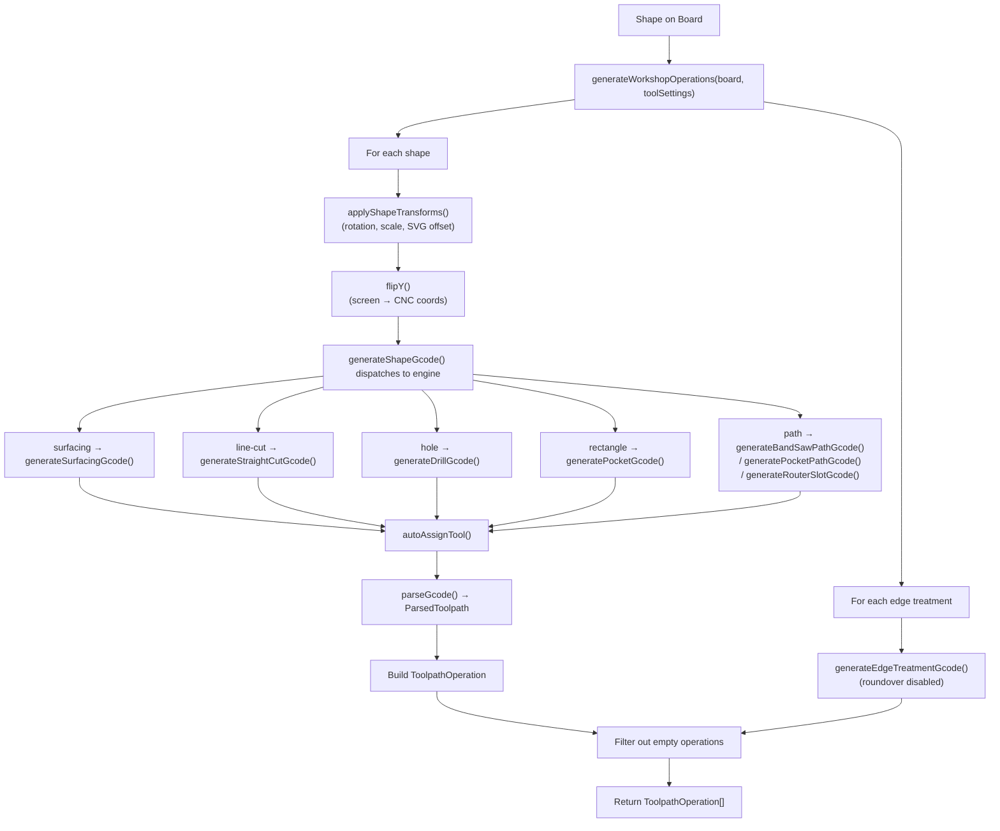
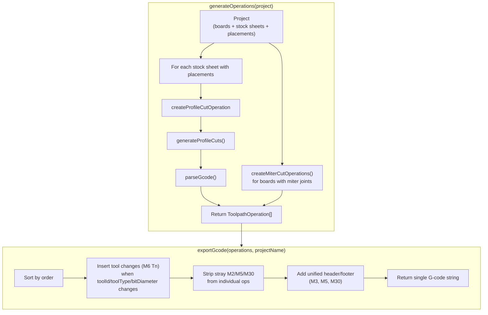
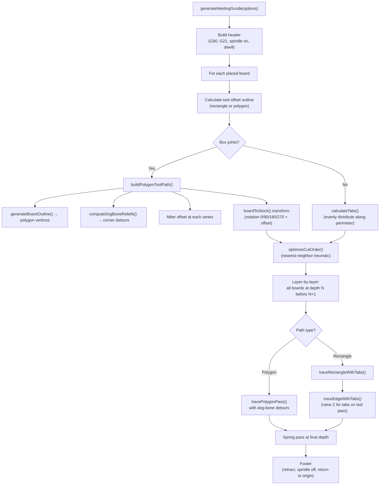

# G-code Pipeline — Epic Design Doc

*Retroactive design doc — documents the implemented system as of March 2026.*

## Flags for Review

1. **Two parallel G-code generation systems.** `src/engine/gcode/generator.ts` (Assembly Mode) and `src/engine/toolpath/workshopOperations.ts` (Workshop Mode) are completely independent codepaths with different architectures. The generator.ts system builds G-code inline from shape geometry; workshopOperations delegates to specialized engine files (`pocketCuts.ts`, `drillCuts.ts`, `straightCut.ts`, etc.). These share no code and could drift.

2. **`bitOffset.ts` does not exist.** The task list references `src/engine/toolpath/bitOffset.ts` but only a test file (`bitOffset.test.ts`) exists. The `BitOffset` type (`'left' | 'center' | 'right'`) is defined in `src/types/index.ts` and consumed by `Shape.bitOffset`, but the offset logic is inlined into the individual cut generators (e.g., `straightCut.ts`, `pathCuts.ts`), not centralized.

3. **Roundover edge treatment is dead code.** In `workshopOperations.ts` line ~270, roundover generation has `continue;` before the actual call to `generateRoundoverGcode()`. The code after `continue` is unreachable. Comment says "Roundover disabled for launch — skip toolpath generation (E20-S4)."

4. **Assembly Mode generator.ts uses outside-profile offset for circles but the workshopOperations system doesn't.** `circularProfile()` in generator.ts adds `toolRadius` to cut outside; the workshop system delegates to separate engine files with their own offset logic. Verify these agree.

5. **M2/M30 stripping in `exportGcode()` is fragile.** The function strips `M2`, `M5`, and `M30` from individual operation G-code by string matching (`upper.startsWith('M2 ') || upper === 'M2'`). This won't catch `m2` (lowercase) or lines with leading whitespace before M-codes, though in practice all generators produce uppercase.

6. **Tab placement on polygon paths (box joint boards) is not implemented.** `tracePolygonPass()` in `nestingGcode.ts` ignores `tabSettings` entirely — the `isLastPass` and `tabSettings` parameters are accepted but tabs are never generated for polygon profiles. Only rectangular profiles get tabs.

7. **Circular pocket spiral is mathematically suspect.** In `generator.ts`, `circularPocket()` starts the spiral with `I${f(currentRadius / 2)}` (half-radius offset for the first arc), which would produce an arc that doesn't pass through center. This may produce unexpected geometry on the first ring.

8. **Stale `createBoxJointCutOperations()` function.** In `operations.ts`, this function exists but is never called — the comment at line ~50 says "Box joint cuts are now integrated into the profile cut operation." The function is dead code.

9. **Tool change detection compares `toolType` as string but the type is limited to `'flat end mill' | 'v-bit'`.** If more tool types are added (ball end mill, drill), `ToolpathOperation.toolType` will need expansion.

10. **`nestingGcode.ts` tab search uses floating-point rounding (`Math.round(dist * 1000)`)** as map keys, plus a secondary 0.1mm-step scan loop. This dual approach is fragile and could miss or duplicate tabs near edge boundaries.

---

## Overview

### What Is This Epic?

The G-code pipeline transforms user-defined board designs (shapes, joints, edge treatments) into machine-executable G-code files (`.nc`). It covers two distinct modes:

- **Assembly Mode** (nesting): Multiple boards placed on stock sheets, profile-cut with tabs, joints, and tool changes.
- **Workshop Mode**: Single board as its own stock, each shape becomes an individual operation.

### Problem Statement

A CNC workshop planning app needs to produce valid, safe G-code from a visual design canvas. The pipeline must handle multiple shape types, tool libraries, feeds/speeds calculation, coordinate transforms (screen Y-down → CNC Y-up), operation ordering, tool changes, and post-processor differences.

### Goals & Non-Goals

**Goals:**
- Generate valid G-code for GRBL, LinuxCNC, and Mach3 post-processors
- Support profile cuts, pockets, drills, slots, surfacing, engraving, edge treatments
- Auto-assign tools from imported tool libraries (Fusion 360 JSON, CSV, ZIP)
- Layer-by-layer cutting strategy for nesting with tab support
- 3D visualization of toolpaths via parsed segments
- Export with automatic tool change insertion

**Non-Goals:**
- Adaptive clearing / HSM toolpaths
- Tool wear compensation
- Multi-axis (4th/5th axis) support
- Real-time machine communication (streaming G-code)

---

## Context

### Affected Systems

| System | Path | Role |
|--------|------|------|
| Assembly G-code generator | `src/engine/gcode/generator.ts` | Legacy per-board G-code (shapes + box joints) |
| Nesting G-code generator | `src/engine/gcode/nestingGcode.ts` | Stock-sheet-level profile cuts with tabs + polygon paths |
| Workshop operations | `src/engine/toolpath/workshopOperations.ts` | Shape → operation mapping for Workshop Mode |
| Operation model | `src/engine/toolpath/operations.ts` | Operation creation, ordering, export, tool changes |
| Tool library | `src/engine/tools/toolLibrary.ts` | Import, parse, auto-assign tools |
| Tool validation | `src/engine/tools/toolValidation.ts` | Runtime warnings (no tool, step-down > flute length) |
| V-bit geometry | `src/engine/tools/vBitGeometry.ts` | Angled edge depth calculation |
| Simulator | `src/components/simulator/` | 3D visualization + playback timeline |
| Type definitions | `src/types/index.ts` | All shared types |

### Dependencies

- `src/engine/joints/boxJoint.ts` — generates box joint finger/slot geometry
- `src/engine/nesting/projection.ts` — `getEffectiveDimensions()` for rotated boards
- `src/engine/toolpath/boardOutline.ts` — `generateBoardOutline()`, `computeDogBoneReliefs()`
- `src/engine/toolpath/gcodeParser.ts` — `parseGcode()` converts G-code strings to `ParsedToolpath`
- Specialized cut generators: `surfacingCuts.ts`, `straightCut.ts`, `drillCuts.ts`, `pocketCuts.ts`, `pathCuts.ts`, `pocketPathCuts.ts`, `edgeTreatmentCuts.ts`, `roundoverCuts.ts`, `miterCuts.ts`, `boxJointCuts.ts`, `profileCuts.ts`
- `src/engine/toolpath/transformShapePoints.ts` — rotation/scale transforms
- `src/engine/toolpath/edgeMapping.ts` — `screenEdgeToCncEdge()` coordinate mapping
- `jszip` (dynamic import for ZIP tool library files)
- `uuid` (v4 for operation IDs)
- Zustand store: `useToolLibraryStore`

### Dependents

- `SimulatorPanel.tsx` — consumes `ToolpathOperation[]`, renders controls, triggers export
- `SimulatorTab.tsx` — 3D viewport integration
- `ToolpathLines.tsx` — renders parsed segments as 3D lines
- `CuttingHead.tsx` — animated tool position via `interpolatePosition()`
- `PlaybackControls.tsx` — timeline scrubbing
- `timeline.ts` — flattens operations into `TimelineSegment[]` for playback
- Export flow — `exportGcode()` → `downloadGcode()` → `.nc` file

---

## Design

### Approach

The pipeline has two main flows:

#### Workshop Mode Flow


#### Assembly Mode (Nesting) Flow


#### Nesting G-code (nestingGcode.ts) Flow


### Data Model

#### ToolSettings
```typescript
// src/types/index.ts
interface ToolSettings {
  bitDiameter: number;    // mm
  feedRate: number;        // mm/min
  plungeRate: number;      // mm/min
  stepDown: number;        // mm per pass
  safeHeight: number;      // mm above material
  spindleSpeed: number;    // RPM
  vAngle?: number;         // degrees (v-bits)
  fluteLength?: number;    // mm
}
```

#### ToolpathOperation
```typescript
// src/types/index.ts
interface ToolpathOperation {
  id: string;
  type: OperationType;  // 'profile-cut' | 'miter-cut' | 'box-joint-cut' | 'straight-cut' | 'drill' | 'pocket' | 'surfacing' | 'engrave'
  name: string;
  description?: string;
  toolId: string | null;          // null = manual settings
  toolSettings: ToolSettings;
  toolType: 'flat end mill' | 'v-bit';
  enabled: boolean;
  order: number;                  // lower = first
  gcode: string | null;
  parsedToolpath: ParsedToolpath | null;
  isGenerated: boolean;
  isStale: boolean;               // true when source data changed
}
```

#### ToolpathSegment / ParsedToolpath
```typescript
interface ToolpathSegment {
  type: 'rapid' | 'linear';  // G0 vs G1
  from: { x: number; y: number; z: number };
  to: { x: number; y: number; z: number };
  feedRate: number;           // 0 for rapids
}

interface ParsedToolpath {
  id: string;
  name: string;
  segments: ToolpathSegment[];
  bounds: { min: Point3D; max: Point3D };
  stats: { totalCutLength, totalRapidLength, estimatedTime, maxFeedRate, minFeedRate };
}
```

#### TimelineSegment (Simulator)
```typescript
interface TimelineSegment {
  operationId: string;
  operationIndex: number;
  operationName: string;
  segmentIndex: number;
  segment: ToolpathSegment;
  globalIndex: number;
  toolType: 'flat end mill' | 'v-bit';
  bitDiameter: number;
  spindleSpeed: number;
}
```

#### ToolEntry (Tool Library)
```typescript
interface ToolEntry {
  id: string;
  name: string;
  type: 'flat end mill' | 'ball end mill' | 'v-bit' | 'drill' | 'chamfer' | 'engraving' | 'other';
  diameter: number;          // mm
  shaftDiameter?: number;
  fluteLength?: number;
  overallLength?: number;
  numberOfFlutes?: number;
  vAngle?: number;           // half-angle in degrees (TA field from Fusion 360)
  feedRate: number;
  plungeRate: number;
  spindleSpeed: number;
  stepDown: number;
  materialPresets?: MaterialToolPreset[];
}
```

### Key Algorithms / Logic

#### Operation Ordering
- Operations have an `order` field (lower = first)
- Miter cuts and box joint cuts get `order: 0` (cut while board is still held by full stock)
- Profile cuts get `order: 1`
- Workshop mode: operations are ordered by shape index in `board.shapes` array
- `exportGcode()` sorts enabled operations by `order`, inserts tool changes between groups

#### Tool Change Detection (`exportGcode()`)
Tool changes are inserted when any of these differ from the previous operation:
- `toolId`
- `toolType` (string: `'flat end mill'` or `'v-bit'`)
- `toolSettings.bitDiameter`

Sequence: `M5` (spindle off) → `G0 Z{safeHeight}` (retract) → `M6 T{n}` (tool change) → `M3 S{rpm}` (spindle on) → `G4 P2` (dwell). First operation skips the M5/retract.

#### Post-Processor Profiles (`generator.ts`)
Three profiles defined in `POST_PROCESSORS`:
| Key | Line Ending | Comment Style | Line Numbers | Program End |
|-----|-------------|---------------|-------------|-------------|
| `grbl` | `\n` | `;` | No | `M2` |
| `linuxcnc` | `\n` | `(` | Yes (N10, N20...) | `M2` |
| `mach3` | `\r\n` | `(` | Yes | `M30` |

#### Rapid Optimization (Nearest-Neighbor)
Used in three places, all identical algorithm:
- `optimizeShapeOrder()` in `generator.ts` — orders shapes on a board
- `optimizeCutOrder()` in `generator.ts` — orders box joint finger cuts
- `optimizeCutOrder()` in `nestingGcode.ts` — orders board cuts on stock sheet

Algorithm: Start at origin (0,0), greedily pick nearest remaining item by squared Euclidean distance, repeat.

#### Tab Generation (`nestingGcode.ts`)
- `calculateTabs()`: distributes tabs evenly along rectangular perimeter, offset by 1/8 perimeter to avoid corners
- Tab count = `max(minTabs, floor(perimeter / spacing))`
- On last pass + spring pass: Z raises to `-(stockThickness - tabHeight)` across tab width, then drops back to cut depth
- Tabs only generated for rectangular profiles, NOT polygon profiles (box joint boards)

#### V-Bit Geometry (`vBitGeometry.ts`)
```
angledEdgeDepth = diameter / (2 × tan(halfAngle))
```
Where `halfAngle` = `vAngle` field (TA from Fusion 360 tool file). Clamped to `fluteLength` if available. Used to constrain chamfer edge treatment depth.

#### Chip Load Calculation (`toolLibrary.ts`)
`calculateFeedsAndSpeeds()` uses a lookup table indexed by diameter bracket and material type:
- Brackets: ≤3.175mm, ≤6.35mm, ≤9.525mm, >9.525mm
- Materials: hardwood, softwood-plywood, mdf, acrylic
- Formula: `feedRate = spindleSpeed × chipLoad(mm) × numberOfFlutes`
- Plunge rate = 50% of feed rate

Falls back to `materialPresets` on the tool entry if a fuzzy match exists.

#### Auto-Assign Tool (`autoAssignTool()`)
| Operation Type | Strategy |
|---------------|----------|
| Engrave | First v-bit or engraving bit |
| V-carve | First v-bit |
| Surfacing | Largest diameter flat end mill |
| Drill (≥6.35mm) | Closest to 1/4" (6.35mm) flat end mill |
| Drill (<6.35mm) | Largest bit that fits inside hole |
| Everything else | Closest to 1/4" flat end mill |

#### Coordinate Transform (Workshop Mode)
Screen coordinates (Y-down, origin top-left) → CNC coordinates (Y-up, origin bottom-left):
```typescript
function flipY(point, boardHeight) {
  return { x: point.x, y: boardHeight - point.y };
}
```
Applied in `generateShapeGcode()` before dispatching to cut engines.

#### Shape Transforms (`applyShapeTransforms()`)
Handles rotation, scale, and SVG import position offsets:
- SVG paths: segments are centroid-relative, translated by `shape.position` before rotation/scale
- Rectangles: scale applied to width/height
- Circles: scale applied to diameter
- Line-cuts and paths: points transformed via `transformShapePoints()`

#### SVG Island/Pocket Handling
Workshop mode groups SVG shapes by `svgGroupId`. Islands (`isIsland: true`, white fill) are matched to parent pockets via `pointInPolygon()` centroid test. Island polygons are passed as `holes` to `generatePocketPathGcode()` for subtraction. Island shapes themselves produce empty G-code (filtered out).

### API / Interface Changes

Primary entry points:
- `generateWorkshopOperations(board, toolSettings): ToolpathOperation[]` — Workshop Mode
- `generateOperations({ project }): ToolpathOperation[]` — Assembly Mode
- `exportGcode({ operations, projectName }): string` — Stitch operations into single file
- `downloadGcode(gcode, filename): void` — Browser download as `.nc`
- `generateNestingGcode(options): string` — Low-level nesting G-code (used by Assembly Mode)
- `parseToolLibrary(content, filename): ToolEntry[]` — Import tool library
- `parseToolLibraryFromFile(file: File): Promise<ToolEntry[]>` — Import from File object (handles ZIP)
- `buildTimeline(operations, visibility): TimelineSegment[]` — Simulator timeline

---

## Edge Cases & Gotchas

1. **M2 program-end bug (historical).** Individual operation G-code generators used to emit `M2` at the end. When `exportGcode()` stitched multiple operations together, the first `M2` would terminate the program prematurely. Fix: `exportGcode()` now strips `M2`, `M5`, and `M30` from individual operation G-code and emits a single `M30` at the end. The stub generator in `workshopOperations.ts` has a comment: "M2 removed — exportGcode() handles program end."

2. **Tool change with null toolId.** Operations without a library-assigned tool (`toolId: null`) still trigger tool changes if `toolType` or `bitDiameter` differs. This means switching from a manual 6mm flat to a manual 3mm flat correctly inserts an M6.

3. **Box joint profile integration.** Box joint cuts were originally separate operations (`createBoxJointCutOperations()`). They've been integrated into the profile cut — the profile now traces the full polygon outline with dog-bone reliefs. The old function is dead code but still present.

4. **Nesting coordinate transform.** `boardToStock()` handles 0/90/180/270° rotation with manual case statements. Arbitrary rotation angles are not supported.

5. **Degenerate slot.** When slot length ≤ slot width (`halfTravel <= 0`), the slot toolpath falls back to `circularPocket()`.

6. **Peck drilling.** `drillHole()` in `generator.ts` implements peck drilling (retract to Z2 between pecks) for multi-pass deep holes.

7. **Spring pass.** Both `generator.ts` (circular/rectangular profile) and `nestingGcode.ts` (layer-by-layer) add a final spring pass at full depth for clean finish.

8. **Edge treatment coordinate space.** After multiple bug fixes (commits `afb3ed3`, `39b2dc9`, `93d7e03`, `df9ddf9`), edge treatments now stay in screen space and the comment explicitly says "No edge name flip needed." The `screenEdgeToCncEdge()` function exists but the edge treatments pass coordinates directly.

---

## Risks

- **Two parallel generation systems** (Assembly vs Workshop) could diverge in behavior, safety margins, or G-code conventions.
- **String-based G-code manipulation** (stripping M2/M5/M30) is brittle compared to structured AST manipulation.
- **No tabs on polygon profiles** means boards with box joints rely entirely on material holding during profile cuts.
- **No simulation validation** — G-code is parsed for visualization but not validated against machine limits (travel bounds, max feed rate, etc.).

---

## Stories (retroactive)

| Story | What It Did |
|-------|-------------|
| Assembly G-code generator | `generator.ts` — per-board G-code with shape dispatch, post-processors, nearest-neighbor optimization |
| Nesting G-code | `nestingGcode.ts` — stock-sheet-level layer-by-layer cuts with tabs and polygon profile support |
| Operation model | `operations.ts` — `generateOperations()`, `exportGcode()`, tool change management, operation CRUD |
| Workshop operations | `workshopOperations.ts` — shape→operation mapping, coordinate transforms, SVG island handling |
| Tool library import | `toolLibrary.ts` — Fusion 360 JSON, CSV, ZIP parsing; auto-assign; chip load calculation |
| Tool validation | `toolValidation.ts` — runtime warnings for missing tools and step-down violations |
| V-bit geometry | `vBitGeometry.ts` — angled edge depth calculation for chamfer constraints |
| Edge treatments | E20 series — chamfer, rabbet, dado (roundover disabled) |
| SVG import pipeline | E16 series — SVG parsing, pocket detection, island subtraction, engrave cut type |
| Simulator timeline | `timeline.ts` — flattens operations into playable segments with interpolation |

---

## Decisions Log

| Decision | Rationale |
|----------|-----------|
| Two separate generation systems (Assembly vs Workshop) | Workshop mode treats board-as-stock with per-shape operations; Assembly mode needs stock-sheet-level coordination. Different enough to warrant separate codepaths. |
| Post-processor as data, not plugins | Only 3 targets (GRBL, LinuxCNC, Mach3). Simple record lookup is sufficient. |
| Nearest-neighbor for rapid optimization | Good-enough heuristic. TSP is NP-hard and board counts are small (<50). |
| Layer-by-layer cutting strategy for nesting | All boards at depth N before depth N+1. Distributes stress evenly, prevents individual boards from breaking free early. |
| Strip M2/M5 from operations during export | Individual operations may be previewed alone (need self-contained G-code) but must not terminate the combined program. |
| `vAngle` = half-angle (TA field) | Matches Fusion 360 export convention. A "90° V-bit" has `vAngle: 45`. |
| Closest-to-1/4" default tool | 1/4" (6.35mm) is the most common CNC router bit. Sensible default for hobby CNC. |
| Chip load table over free-form calculation | Pre-computed from industry standards (cutter-shop.com). Safer than letting users compute from scratch. |
| Roundover disabled for launch | V1 risk mitigation — roundover requires ball end mill 3D surfacing which wasn't fully tested. |

---

## Known Issues / Tech Debt

1. **Dead code: `createBoxJointCutOperations()`** in `operations.ts` — never called, superseded by polygon profile integration.
2. **Dead code: roundover generation** in `workshopOperations.ts` — unreachable due to `continue` statement.
3. **No tabs on polygon profiles** — `tracePolygonPass()` accepts tab parameters but doesn't use them.
4. **`bitOffset.ts` missing** — only test file exists. Offset logic is scattered across individual cut generators.
5. **`ToolpathOperation.toolType` limited to 2 values** — `'flat end mill' | 'v-bit'`. `ToolEntry.type` has 7 values. Ball end mills, drills, etc. would need toolType expansion.
6. **`generator.ts` (Assembly Mode legacy) may be partially obsoleted** by the nesting + operations system. Unclear if it's still called anywhere or is entirely superseded.
7. **Tab search in `nestingGcode.ts`** uses both rounded-key map lookup and a 0.1mm-step brute-force scan — redundant and fragile.
8. **No G-code validation against machine limits** (work envelope, max RPM, max feed rate).
9. **`exportGcode()` finds stock sheet by name-matching** (`operation.name.includes(sheet.name)`) in `regenerateProfileCutOperation()` — fragile if board/sheet names overlap.
10. **Circular pocket first arc** in `generator.ts` uses `I${f(currentRadius / 2)}` which produces a non-centered first ring.
